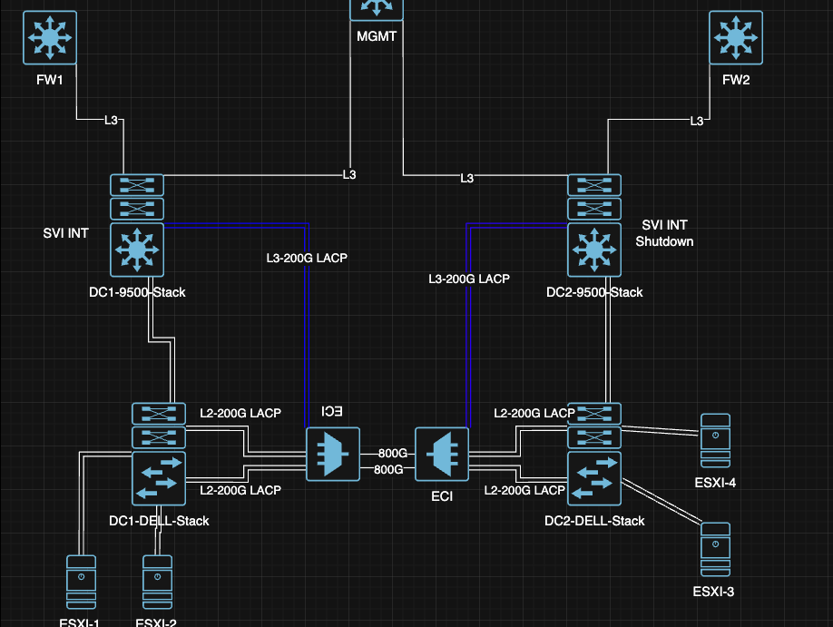
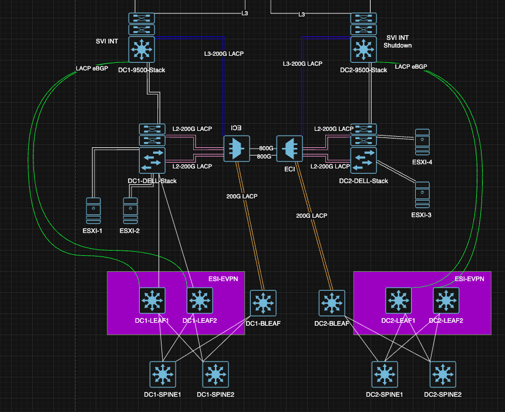
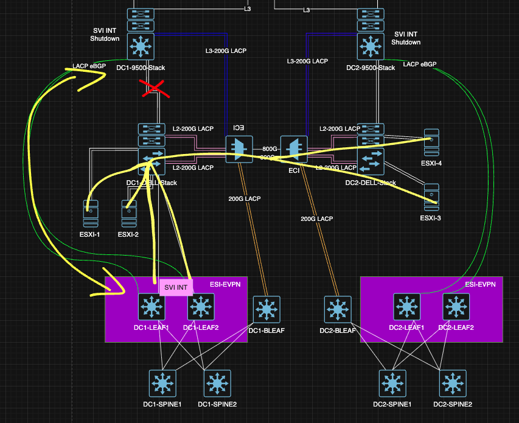
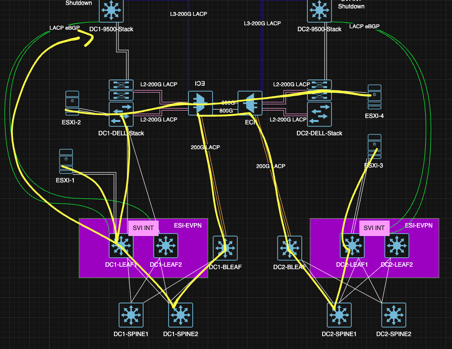
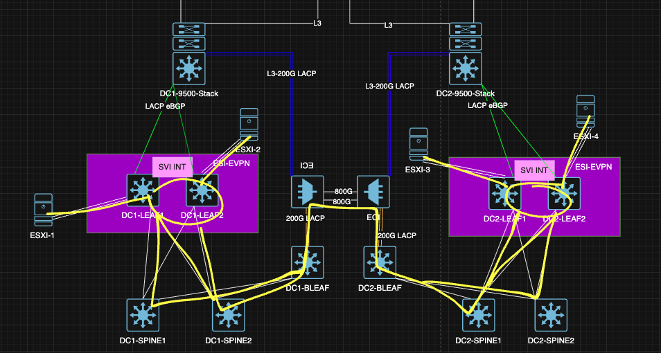

# Проектная работа 
## Проектировение распределенной сети ЦОД с применением VxLAN EVPN и бесшовный переход с растянутого L2 в EVPN фабрику
### Цели : 
- Спроектировать распределенную сеть ЦОД 
- Получить практический опыт конфигурации и использования технологий VXLAN/EVPN
- Реализовать свой подход по бесшовному переводу распеределенных мощностей 


### Исходные данные : 
- Уже используется VMWare vSphere в растянутом L2, соответственно без использования технологий NSX-T/NSX-V
- DCI осуществляется через 2 темных волокна, подключенных через 2 устройства OTN, обеспечивающие по 800G на волокно, на выходе с каждого устройства в сторону ЦОД, в котором они установлены, 8 портов 100G
- Резервирование между ЦОДами за счет разных трасс волокн, выход из строя двух волокон считаем невозможным, как и полный выход из строя одного из DC
- Резервирование активного оборудования за счет объединения Л3 коммутаторов в stack-wise, сбор портов в LACP группы с разных member'ов стаков, а так же дублирование SVI, который со стороны резервного ЦОДа выключены
- Нет возможности выключить всю фабрику и пересобрать с использованием распределенной сети ЦОД, но можем уводить нагрузку с конкретного хоста и перенести его
- Нет разделения на DMZ зоны, все SVI существуют в едином GRT, поэтому защита хостов и VM осуществляется за счет stateless ACL на конечных интерфейсах

### Схема сети : 



- Как видно из схемы - 6 портов с каждой стороны уже заняты, есть по 2 свободных порта со стороны OTN 


### Задачи : 
- Разработать решение полноценной фабрики с использованием VxLAN EVPN, это позволит проводить работы на сетевом оборудовании без вывода мощностей с площадки
- Продумать шаги для бесшовного перевода серверов на новую схему
- Разделить трафик внутри фабрики для Production VMs и хостов VMWare(VSAN, vMotion и Management)
- Уйти от растянутого L2, освободить устройства и линки

## Планирование : 
- У нас есть свободные 200G, будем их использовать под DCI для фабрики, которую сможем включить в параллель существующей схеме
- На данный момент мы уже сильно зависим от CORE устройств в стаке, поэтому считаем это допустимым нюансом, на них настраиваем eBGP пиринг в сторону VRF'ов фабрики. Трафик VRF'ов будет смешиваться на них, но и сейчас SVI существуют в едином GRT, поэтому так же считаем это допустимым нюансом. 
- В данный момент нет горячего резерва для выхода из фабрики, только холодный с переключением, при переходе на EVPN фабрику будем использовать горячий резерв, приоритетный ЦОД останется тем же, что и сейчас, реализация приоритета будет выполняться при использовании атрибутов BGP

### Топология сети :



- Построили в параллель EVPN фабрику с использованием Leaf-Spine архитектуры, разные POD в разных ЦОД, DCI через уже используемые OTN и Border Leaf в количестве 1 устройство на POD
- Не используем super spine в связи с максимальным удешевлением схемы, ограниченного количества DCI линков, VMWare Stretched Cluster так же не подразумевает более 2 сайтов
- В фабрике так же не используем vPC(MC/M- Lag), тк мы стараемся вообще не использовать L2, даже в пределах vPC пары, LEAF'ы объединены в EVPN-ESI multihoming пары для обеспечения отказоустойчивости на уровне control plane, они так же являются border-leaf'ами для выхода из фабрики через LACP в сторону стека коммутаторов уровня CORE, в них так же будут подключаться ESXi хосты через LACP агрегацию 
- Для IP связности и настройки EVPN используется связка OSPF+iBGP
- L3 связность между VRF, как и было описано выше, будет производиться на CORE устройстве 
- Используем распределенный шлюз EVPN VXLAN Anycast Gateway для доступа к VM при миграции между хостами
- Так же собрали LACP от EVPN-ESI пары в сторону legacy стака в основном ЦОДе, в резервном не собирали, тк иначе сделаем L2 петлю. На первый взгляд мы расширяем уже существующий L2 домен, но это вынужденная и временная мера для обеспечения связности между перенесенными хостами/VM и теми, что остались в legacy сети

#### IP-prefix-plan

| DC      | NETWORK       | Description     |
|---------|---------------|-----------------|
| DC1     | x.x.x.x/x     | TMP_bla         |
| DC2     | x.x.x.x/x     | TMP_bla         |

#### IP-plan 

| Hostname     | Interface         | IP/Mask        | Description                                   |
|--------------|-------------------|----------------|-----------------------------------------------|
| DC1-LEAF     | Lo1               | x.x.x.x/32     | Overlay BGP/EVPN                              |
| DC1-Spine    | Eth1              | x.x.x.x/30     | Link to SW-BLA - SW2-BLA int Eth1             |

### Перенос SVI с Stacked CORE Switches : 
- Первым шагом переносим SVI для VMWare хостов и VM в нашу новую фабрику, для этого поднимаем eBGP пиринг между ESI и Stacked CORE Switches, со стороны CORE Switches анонсируем default в оба VRF фабрики, со стороны фабрики анонсируем те же /24, что и были в SVI на CORE switches, через route-type 5, в этот же момент SVI на CORE switches переводим в статус shutdown 

### Топология сети после переноса SVI : 



После переноса SVI L2 трафик между CORE Stacked switch и Legacy stacked DELL перестает ходить(помечено красным крестом) и попадает по L2 на ESI, а оттуда L3 связность с CORE Stacked switch через eBGP, пути хождения трафика указаны желтым цветом, со стороны DC-2 так же настроен eBGP, но с меньшей метрикой, если появится крайняя необходимость, то можно выход из фабрики сделать через него, в таком случае трафик от ESI DC-1 пройдет через Border Leaf'ы в POD DC-2 и так же по eBGP выйдет из фабрики

### Топология сети после частичного переноса ESXi хостов : 



После частиного переноса хостов ESXi у нас так же остается полноценная связность по L2 между EVPN фабрикой и Legacy L2 сетью, пути расхождения трафика указаны желтым цветом

<details>
  <summary>Конфигурация устройств на данном этапе </summary>

```

Тут пока ничего нет

```

</details>

<details>
  <summary> Проверка связности между устройствами EVPN фабрики и Legacy L2 </summary>

```

Тут пока тоже нет ничего

```

</details>

### Топология сети финал : 



- После переноса всех хостов legacy L2 сегмент исключается их схемы. 
- Задачи по разработке схемы, бесшовному переносу устройств, отказу от L2 выполнены, дополнительно сделали подготовку с разделением трафика между VRF для будущего масштабирования фабрики. 