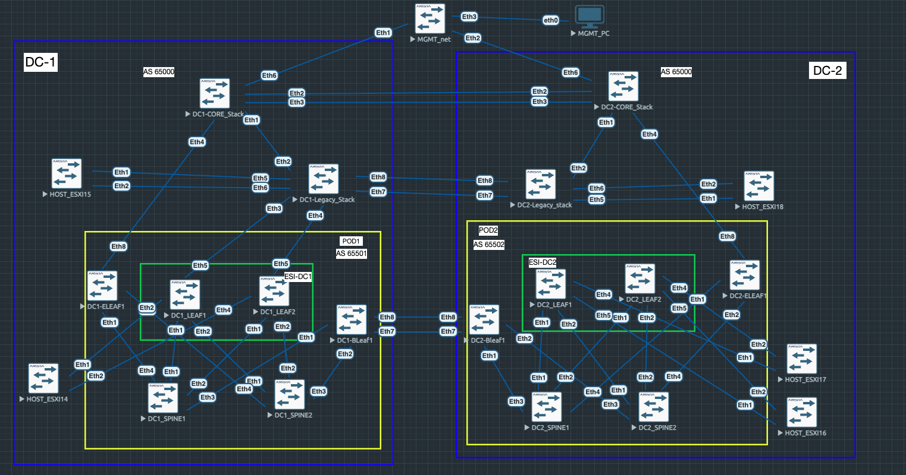

# Проектная работа 
## Проектирование распределенной сети ЦОД с применением VxLAN EVPN и бесшовный переход с растянутого L2 в EVPN фабрику
### Цели : 
- Спроектировать распределенную сеть ЦОД 
- Получить практический опыт конфигурации и использования технологий VXLAN/EVPN
- Реализовать свой подход по бесшовному переводу распределенных мощностей 


### Исходные данные : 
- Уже используется VMWare vSphere в растянутом L2, соответственно без использования технологий NSX-T/NSX-V
- DCI осуществляется через 2 темных волокна, подключенных через 2 устройства OTN, обеспечивающие по 800G на волокно, на выходе с каждого устройства в сторону ЦОД, в котором они установлены, 8 портов 100G
- Резервирование между ЦОДами за счет разных трасс волокн, выход из строя двух волокон считаем невозможным, как и полный выход из строя одного из DC
- Резервирование активного оборудования за счет объединения Л3 коммутаторов в stack-wise, сбор портов в LACP группы с разных member'ов стаков, а так же дублирование SVI, который со стороны резервного ЦОДа выключены
- Нет возможности выключить всю фабрику и пересобрать с использованием распределенной сети ЦОД, но можем уводить нагрузку с конкретного хоста и перенести его
- Нет разделения на DMZ зоны, все SVI существуют в едином GRT, поэтому защита хостов и VM осуществляется за счет stateless ACL на конечных интерфейсах

### Схема сети : 


#### IP-prefix-plan-old

| Location       | NETWORK         | Description   |
|----------------|-----------------|---------------|
| MGMT_Zone      | 10.0.0.0/24     | MGMT          |
| OSPF_PTP       | 10.255.255.0/24 | PTP orlonger  |
| OSPF_Loopbacks | 10.255.0.0/24   | /32 loopbacks |
| DCI-L2_Vlan120 | 10.120.0.0/24   | vMotion       |
| DCI-L2_Vlan121 | 10.121.0.0/24   | vSAN          |
| DCI-L2_Vlan122 | 10.122.0.0/24   | vSphere       |
| DCI-L2_Vlan150 | 10.150.0.0/24   | VM_Pool1      |
| DCI-L2_Vlan151 | 10.151.0.0/24   | VM_Pool2      |

#### IP-plan 

| Hostname          | Interface         | IP/Mask          | Description                               |
|-------------------|-------------------|------------------|-------------------------------------------|
| MGMT_PC           | eth0              | 10.0.0.2/24      | MGMT_PC_IP                                |
| MGMT-NET          | lo0               | 10.255.0.1/32    | Lo0_MGMT                                  |
| MGMT-NET          | Eth1              | 10.255.255.1/30  | OSPF_PTP_TO_DC1-CORE                      |
| MGMT-NET          | Eth2              | 10.255.255.4/30  | OSPF_PTP_TO_DC2-CORE                      |
| DC1-CORE          | lo0               | 10.255.0.2/30    | Lo0_DC1-CORE                              |
| DC1-CORE          | Eth6              | 10.255.255.2/30  | OSPF_PTP_TO_MGMT                          |
| DC1-CORE          | Eth3              | 10.255.255.9/30  | OSPF_PTP_TO_DC2-CORE                      |
| DC1-CORE          | Vlan120           | 10.120.0.1/24    | vMotion                                   |
| DC1-CORE          | Vlan121           | 10.121.0.1/24    | vSAN                                      |
| DC1-CORE          | Vlan122           | 10.122.0.1/24    | vSphere                                   |
| DC1-CORE          | Vlan150           | 10.150.0.1/24    | VM_Pool1                                  |
| DC1-CORE          | Vlan151           | 10.151.0.1/24    | VM_Pool2                                  |
| DC2-CORE          | lo0               | 10.255.0.3/30    | Lo0_DC2-CORE.                             |
| DC2-CORE          | Eth6              | 10.255.255.6/30  | OSPF_PTP_TO_MGMT                          |
| DC2-CORE          | Eth3              | 10.255.255.10/30 | OSPF_PTP_TO_DC1-CORE                      |
| DC2-CORE          | Vlan120_Shut      | 10.120.0.1/24    | vMotion                                   |
| DC2-CORE          | Vlan121_Shut      | 10.121.0.1/24    | vSAN                                      |
| DC2-CORE          | Vlan122_Shut      | 10.122.0.1/24    | vSphere                                   |
| DC2-CORE          | Vlan150_Shut      | 10.150.0.1/24    | VM_Pool1                                  |
| DC2-CORE          | Vlan151_Shut      | 10.151.0.1/24    | VM_Pool2                                  |
| ESXI15            | Vlan120           | 10.120.0.15/24   | vMotion                                   |
| ESXI15            | Vlan121           | 10.121.0.15/24   | vSAN                                      |
| ESXI15            | Vlan122           | 10.122.0.15/24   | vSphere                                   |
| ESXI15_VM1        | Vlan150           | 10.150.0.15/24   | VM_Pool1                                  |
| ESXI15_VM2        | Vlan151           | 10.151.0.15/24   | VM_Pool2                                  |
| ESXI14            | Vlan120           | 10.120.0.14/24   | vMotion                                   |
| ESXI14            | Vlan121           | 10.121.0.14/24   | vSAN                                      |
| ESXI14            | Vlan122           | 10.122.0.14/24   | vSphere                                   |
| ESXI14_VM1        | Vlan150           | 10.150.0.14/24   | VM_Pool1                                  |
| ESXI14_VM2        | Vlan151           | 10.151.0.14/24   | VM_Pool2                                  |
| ESXI16            | Vlan120           | 10.120.0.16/24   | vMotion                                   |
| ESXI16            | Vlan121           | 10.121.0.16/24   | vSAN                                      |
| ESXI16            | Vlan122           | 10.122.0.16/24   | vSphere                                   |
| ESXI16_VM1        | Vlan150           | 10.150.0.16/24   | VM_Pool1                                  |
| ESXI16_VM2        | Vlan151           | 10.151.0.16/24   | VM_Pool2                                  |
| ESXI17            | Vlan120           | 10.120.0.17/24   | vMotion                                   |
| ESXI17            | Vlan121           | 10.121.0.17/24   | vSAN                                      |
| ESXI17            | Vlan122           | 10.122.0.17/24   | vSphere                                   |
| ESXI17_VM1        | Vlan150           | 10.150.0.17/24   | VM_Pool1                                  |
| ESXI17_VM2        | Vlan151           | 10.151.0.17/24   | VM_Pool2                                  |


### Конфигурация устройств на стартовом этапе : 

<details>
  <summary> MGMT_NET.conf </summary>

```
!
vlan 99
   name mgmt
!
interface Ethernet1
   description DC1_Core
   mtu 9194
   no switchport
   ip address 10.255.255.1/30
   bfd interval 100 min-rx 100 multiplier 5
   ip ospf network point-to-point
   ip ospf area 0.0.0.0
!
interface Ethernet2
   description DC2_Core
   mtu 9194
   no switchport
   ip address 10.255.255.5/30
   bfd interval 100 min-rx 100 multiplier 5
   ip ospf network point-to-point
   ip ospf area 0.0.0.0
!
interface Ethernet3
   switchport access vlan 99
!
interface Loopback0
   ip address 10.255.0.1/32
   ip ospf area 0.0.0.0
!
interface Vlan99
   ip address 10.0.0.1/24
   ip ospf area 0.0.0.0
!
ip routing
!
router ospf 1
   router-id 10.255.0.1
   bfd default
   passive-interface default
   no passive-interface Ethernet1
   no passive-interface Ethernet2
   max-lsa 12000
!

```

</details>

<details>
  <summary> DC1-CORE.conf </summary>

```
!
hostname DC1-CORE
!
!
vlan 120
   name vMotion
!
vlan 121
   name vSAN
!
vlan 122
   name vSphere
!
vlan 150
   name VM_Pool1
!
vlan 151
   name VM_Pool2
!
interface Ethernet1
   description DC1-Legacy
   switchport trunk allowed vlan 120-122,150-151
   switchport mode trunk
!
interface Ethernet2
!
interface Ethernet3
   description DC2-CORE
   mtu 9194
   no switchport
   ip address 10.255.255.9/30
   bfd interval 100 min-rx 100 multiplier 5
   ip ospf network point-to-point
   ip ospf area 0.0.0.0
!
interface Ethernet6
   description to_MGMT
   mtu 9194
   no switchport
   ip address 10.255.255.2/30
   bfd interval 100 min-rx 100 multiplier 5
   ip ospf network point-to-point
   ip ospf area 0.0.0.0
!
interface Loopback0
   ip address 10.255.0.2/32
   ip ospf area 0.0.0.0
!
interface Vlan120
   ip address 10.120.0.1/24
   ip ospf area 0.0.0.0
!
interface Vlan121
   ip address 10.121.0.1/24
   ip ospf area 0.0.0.0
!
interface Vlan122
   ip address 10.122.0.1/24
   ip ospf area 0.0.0.0
!
interface Vlan150
   ip address 10.150.0.1/24
   ip ospf area 0.0.0.0
!
interface Vlan151
   ip address 10.151.0.1/24
   ip ospf area 0.0.0.0
!
ip routing
!
router ospf 1
   router-id 10.255.0.2
   bfd default
   passive-interface default
   no passive-interface Ethernet3
   no passive-interface Ethernet6
   max-lsa 12000
!

```

</details>

<details>
  <summary> DC2-CORE.conf </summary>

```
hostname DC2-CORE
!
vlan 120
   name vMotion
!
vlan 121
   name vSAN
!
vlan 122
   name vSphere
!
vlan 150
   name VM_Pool1
!
vlan 151
   name VM_Pool2
!
interface Ethernet1
   description DC2_legacy
   switchport trunk allowed vlan 120-122,150-151
   switchport mode trunk
!
interface Ethernet3
   description DC1-CORE
   mtu 9194
   no switchport
   ip address 10.255.255.10/30
   bfd interval 100 min-rx 100 multiplier 3
   ip ospf network point-to-point
   ip ospf area 0.0.0.0
!
interface Ethernet6
   description MGMT-NET
   mtu 9194
   no switchport
   ip address 10.255.255.6/30
   bfd interval 100 min-rx 100 multiplier 3
   ip ospf network point-to-point
   ip ospf area 0.0.0.0
!
interface Loopback0
   ip address 10.255.255.3/32
   ip ospf area 0.0.0.0
!
interface Vlan120
   shutdown
   ip address 10.120.0.1/24
   ip ospf area 0.0.0.0
!
interface Vlan121
   shutdown
   ip address 10.121.0.1/24
   ip ospf area 0.0.0.0
!
interface Vlan122
   shutdown
   ip address 10.122.0.1/24
   ip ospf area 0.0.0.0
!
interface Vlan150
   shutdown
   ip address 10.150.0.1/24
   ip ospf area 0.0.0.0
!
interface Vlan151
   shutdown
   ip address 10.151.0.1/24
   ip ospf area 0.0.0.0
!
ip routing
!
router ospf 1
   router-id 10.255.255.3
   bfd default
   passive-interface default
   no passive-interface Ethernet3
   no passive-interface Ethernet6
   max-lsa 12000

```

</details>

<details>
  <summary> DC1-Legacy.conf </summary>

```
hostname DC1-Legacy
!
vlan 120
   name vMotion
!
vlan 121
   name vSAN
!
vlan 122
   name vSphere
!
vlan 150
   name VM_Pool1
!
vlan 151
   name VM_Pool2
!
interface Port-Channel1
   description ESXI-15
   switchport trunk allowed vlan 120-122,150-151
   switchport mode trunk
!
interface Port-Channel2
   description LACP_TO_ESI_DC1
   switchport trunk allowed vlan 120-122,150-151
   switchport mode trunk
!
interface Ethernet2
   description DC1-CORE
   switchport trunk allowed vlan 120-122,150-151
   switchport mode trunk
!
interface Ethernet3
   description DC1_LEAF6
   switchport trunk allowed vlan 120-122,150-151
   switchport mode trunk
   channel-group 2 mode active
!
interface Ethernet4
   description DC1_LEAF7
   switchport trunk allowed vlan 120-122,150-151
   switchport mode trunk
   channel-group 2 mode active
!
interface Ethernet5
   description ESXI-15
   switchport trunk allowed vlan 120-122,150-151
   switchport mode trunk
   channel-group 1 mode active
!
interface Ethernet6
   description ESXI-15
   switchport trunk allowed vlan 120-122,150-151
   switchport mode trunk
   channel-group 1 mode active
!
interface Ethernet8
   description DC2-Legacy
   switchport trunk allowed vlan 120-122,150-151
   switchport mode trunk
!
```

</details>

<details>
  <summary> DC2-Legacy.conf </summary>

```
hostname DC2-Legacy
!
vlan 120
   name vMotion
!
vlan 121
   name vSAN
!
vlan 122
   name vSphere
!
vlan 150
   name VM_Pool1
!
vlan 151
   name VM_Pool2
!
interface Port-Channel1
   description ESXI-16
   switchport trunk allowed vlan 120-122,150-151
   switchport mode trunk
!
interface Ethernet2
   description DC2-CORE
   switchport trunk allowed vlan 120-122,150-151
   switchport mode trunk
!
interface Ethernet5
   description ESXI-16
   switchport trunk allowed vlan 120-122,150-151
   switchport mode trunk
   channel-group 1 mode active
!
interface Ethernet6
   description ESXI-16
   switchport trunk allowed vlan 120-122,150-151
   switchport mode trunk
   channel-group 1 mode active
!
interface Ethernet8
   description DC1-Legacy
   switchport trunk allowed vlan 120-122,150-151
   switchport mode trunk
!
```

</details>

### Задачи : 
- Разработать решение полноценной фабрики с использованием VxLAN EVPN, это позволит проводить работы на сетевом оборудовании без вывода мощностей с площадки
- Продумать шаги для бесшовного перевода серверов на новую схему
- Разделить трафик внутри фабрики для Production VMs и хостов VMWare(VSAN, vMotion и Management)
- Уйти от растянутого L2, освободить устройства и линки

## Планирование : 
- У нас есть свободные 200G, будем их использовать под DCI для фабрики, которую сможем включить в параллель существующей схеме
- На данный момент мы уже сильно зависим от CORE устройств в стаке, поэтому считаем это допустимым нюансом, на них настраиваем eBGP пиринг в сторону VRF'ов фабрики. Трафик VRF'ов будет смешиваться на них, но и сейчас SVI существуют в едином GRT, поэтому так же считаем это допустимым нюансом. 
- В данный момент нет горячего резерва для выхода из фабрики, только холодный с переключением, при переходе на EVPN фабрику будем использовать горячий резерв, приоритетный ЦОД останется тем же, что и сейчас, реализация приоритета будет выполняться при использовании атрибутов BGP


### Первый этап : Создание фабрики в параллель существующей схемы : 

* У нас есть ограничения виртуальной среды, где для создания/удаления и переноса линков необходимо выключать оборудование с двух сторон, в связи с чем для ускорения эмуляции проекта часть хостов уже переключена в EVPN фабрику, т.е. этапы 1, 2 и 3 уже отображены в нашей схеме



### Топология сети :

- Построили в параллель EVPN фабрику с использованием Leaf-Spine архитектуры, разные POD в разных ЦОД, DCI через уже используемые OTN и Border Leaf в количестве 1 устройство на POD
- Не используем super spine в связи с максимальным удешевлением схемы, ограниченного количества DCI линков, VMWare Stretched Cluster так же не подразумевает более 2 сайтов
- В фабрике так же не используем vPC(MC/M-Lag), тк мы стараемся вообще не использовать L2, даже в пределах vPC пары, LEAF'ы объединены в EVPN-ESI multihoming пары для обеспечения отказоустойчивости на уровне control plane, они так же являются border-leaf'ами для выхода из фабрики через LACP в сторону стека коммутаторов уровня CORE, в них так же будут подключаться ESXi хосты через LACP агрегацию 
- Для IP связности и настройки EVPN используется связка OSPF+iBGP
- L3 связность между VRF, как и было описано выше, будет производиться на CORE устройстве 
- Используем распределенный шлюз EVPN VXLAN Anycast Gateway для доступа к VM при миграции между хостами
- Так же собрали LACP от EVPN-ESI пары в сторону legacy стака в основном ЦОДе, в резервном не собирали, тк иначе сделаем L2 петлю
- На первый взгляд мы расширяем уже существующий L2 домен, но это вынужденная и временная мера для обеспечения связности между перенесенными хостами/VM и теми, что остались в legacy сети


#### IP-prefix-plan

| DC      | NETWORK       | Description           |
|---------|---------------|-----------------------|
| DC1     | 10.1.1.0/30   | PTP spine1-leaf1      |
| DC1     | 10.1.2.0/30   | PTP spine1-leaf2      |
| DC1     | 10.1.3.0/30   | PTP spine1-leaf3      |
| DC1     | 10.1.4.0/30   | PTP spine1-leaf4      |
| DC1     | 10.2.1.0/30   | PTP spine2-leaf1      |
| DC1     | 10.2.2.0/30   | PTP spine2-leaf2      |
| DC1     | 10.2.3.0/30   | PTP spine2-leaf3      |
| DC1     | 10.2.4.0/30   | PTP spine2-leaf4      |
| DC2     | 10.3.1.0/30   | PTP spine1-leaf1      |
| DC2     | 10.3.2.0/30   | PTP spine1-leaf2      |
| DC2     | 10.3.3.0/30   | PTP spine1-leaf3      |
| DC2     | 10.3.4.0/30   | PTP spine1-leaf4      |
| DC2     | 10.4.1.0/30   | PTP spine2-leaf1      |
| DC2     | 10.4.2.0/30   | PTP spine2-leaf2      |
| DC2     | 10.4.3.0/30   | PTP spine2-leaf3      |
| DC2     | 10.4.4.0/30   | PTP spine2-leaf4      |
| DC1+2   | 10.100.0.0/30 | PTP MultiPOD          |
| DC1     | 10.200.0.0/24 | Lo0 Spines            |
| DC2     | 10.200.0.0/24 | Lo0 Spines            |
| DC1     | 10.200.1.0/24 | Lo0 Leafs             |
| DC2     | 10.200.2.0/24 | Lo0 Leafs             |
| DC1     | 10.250.1.0/30 | Exit_VRF_VMWare       |
| DC1     | 10.250.0.0/30 | Exit_VRF_VM           |

* Без изменений остались

| Location       | NETWORK         | Description   |
|----------------|-----------------|---------------|
| DCI-L2_Vlan120 | 10.120.0.0/24   | vMotion       |
| DCI-L2_Vlan121 | 10.121.0.0/24   | vSAN          |
| DCI-L2_Vlan122 | 10.122.0.0/24   | vSphere       |
| DCI-L2_Vlan150 | 10.150.0.0/24   | VM_Pool1      |
| DCI-L2_Vlan151 | 10.151.0.0/24   | VM_Pool2      |

* Сети переезжают в EVPN фабрику, но будут использоваться как ip virtual-router address, т.е. будут одинаковые для всех LEAF 

#### IP-plan 

| Hostname     | Interface         | IP/Mask        | Description                                   |
|--------------|-------------------|----------------|-----------------------------------------------|
| DC1-CORE     | Vlan4001          | 10.250.1.1/30  | EVPN_POD1_VRF_VMWare                          |
| DC1-CORE     | Vlan4002          | 10.250.0.1/30  | EVPN_POD1_VRF_VM                              |
| DC1-ELEAF1   | Eth1              | 10.1.4.2/30    | DC1-SPINE1                                    |
| DC1-ELEAF1   | Eth2              | 10.2.4.2/30    | DC1-SPINE2                                    |
| DC1-ELEAF1   | Lo0               | 10.200.1.1/32  | Lo0_EVPN_BGP                                  |
| DC1-ELEAF1   | Vlan4001          | 10.250.1.2/30  | EXIT_VRF_VMWare                               |
| DC1-ELEAF1   | Vlan4002          | 10.250.0.2/30  | EXIT_VRF_VM                                   |
| DC1-LEAF1    | Eth1              | 10.1.1.2/30    | DC1-SPINE1                                    |
| DC1-LEAF1    | Eth2              | 10.2.1.2/30    | DC1-SPINE2                                    |
| DC1-LEAF1    | Lo0               | 10.200.1.2/32  | Lo0_EVPN_BGP                                  |
| DC1-LEAF2    | Eth1              | 10.1.2.2/30    | DC1-SPINE1                                    |
| DC1-LEAF2    | Eth2              | 10.2.2.2/30    | DC1-SPINE2                                    |
| DC1-LEAF2    | Lo0               | 10.200.1.3/32  | Lo0_EVPN_BGP                                  |
| DC1-BLEAF1   | Eth1              | 10.1.3.2/30    | DC1-SPINE1                                    |
| DC1-BLEAF1   | Eth2              | 10.2.3.2/30    | DC1-SPINE2                                    |
| DC1-BLEAF1   | Eth7              | 10.100.0.1/30  | DC2_BLEAF1                                    |
| DC1-BLEAF1   | Lo0               | 10.200.1.4/32  | Lo0_EVPN_BGP                                  |
| DC1-SPINE1   | Eth1              | 10.1.1.1/30    | DC1-LEAF1                                     |
| DC1-SPINE1   | Eth2              | 10.1.2.1/30    | DC1-LEAF2                                     |
| DC1-SPINE1   | Eth3              | 10.1.3.1/30    | DC1-BLEAF1                                    |
| DC1-SPINE1   | Eth4              | 10.1.4.1/30    | DC1-ELEAF1                                    |
| DC1-SPINE1   | Lo0               | 10.200.0.1/32  | Lo0_EVPN_BGP                                  |
| DC1-SPINE2   | Eth1              | 10.2.1.1/30    | DC1-LEAF1                                     |
| DC1-SPINE2   | Eth2              | 10.2.2.1/30    | DC1-LEAF2                                     |
| DC1-SPINE2   | Eth3              | 10.2.3.1/30    | DC1-BLEAF1                                    |
| DC1-SPINE2   | Eth4              | 10.2.4.1/30    | DC1-ELEAF1                                    |
| DC1-SPINE2   | Lo0               | 10.200.0.2/32  | Lo0_EVPN_BGP                                  |
| DC2-ELEAF1   | Eth1              | 10.3.4.2/30    | DC1-SPINE1                                    |
| DC2-ELEAF1   | Eth2              | 10.4.4.2/30    | DC1-SPINE2                                    |
| DC2-ELEAF1   | Lo0               | 10.200.2.5/32  | Lo0_EVPN_BGP                                  |
| DC2-LEAF1    | Eth1              | 10.3.1.2/30    | DC1-SPINE1                                    |
| DC2-LEAF1    | Eth2              | 10.4.1.2/30    | DC1-SPINE2                                    |
| DC2-LEAF1    | Lo0               | 10.200.2.2/32  | Lo0_EVPN_BGP                                  |
| DC2-LEAF2    | Eth1              | 10.3.2.2/30    | DC1-SPINE1                                    |
| DC2-LEAF2    | Eth2              | 10.4.2.2/30    | DC1-SPINE2                                    |
| DC2-LEAF2    | Lo0               | 10.200.1.3/32  | Lo0_EVPN_BGP                                  |
| DC2-BLEAF1   | Eth1              | 10.3.3.2/30    | DC1-SPINE1                                    |
| DC2-BLEAF1   | Eth2              | 10.4.3.2/30    | DC1-SPINE2                                    |
| DC2-BLEAF1   | Eth7              | 10.100.0.1/30  | DC2_BLEAF1                                    |
| DC2-BLEAF1   | Lo0               | 10.200.2.1/32  | Lo0_EVPN_BGP                                  |
| DC2-SPINE1   | Eth1              | 10.3.1.1/30    | DC1-LEAF1                                     |
| DC2-SPINE1   | Eth2              | 10.3.2.1/30    | DC1-LEAF2                                     |
| DC2-SPINE1   | Eth3              | 10.3.3.1/30    | DC1-BLEAF1                                    |
| DC2-SPINE1   | Eth4              | 10.3.4.1/30    | DC1-ELEAF1                                    |
| DC2-SPINE1   | Lo0               | 10.200.0.3/32  | Lo0_EVPN_BGP                                  |
| DC2-SPINE2   | Eth1              | 10.4.1.1/30    | DC1-LEAF1                                     |
| DC2-SPINE2   | Eth2              | 10.4.2.1/30    | DC1-LEAF2                                     |
| DC2-SPINE2   | Eth3              | 10.4.3.1/30    | DC1-BLEAF1                                    |
| DC2-SPINE2   | Eth4              | 10.4.4.1/30    | DC1-ELEAF1                                    |
| DC2-SPINE2   | Lo0               | 10.200.0.4/32  | Lo0_EVPN_BGP                                  |

#### IP plan ESXI Hosts 

* В качестве ESXI устройств и ВМ в лабе используются те же виртуальные Arista, для разделения трафика VRF-lite
* Симуляция условий для ESXI выглядит так : 
* Под инфраструктуру VMWare в EVPN фабрике используем vrf VMWare
* Со стороны "ESXI" хостов это GRT с vlan 120-122, дефолт через шлюз в влане 120 для связности с MGMT сетью
* Под VM в EVPN фабрике используем vrf VM
* Со стороны ESXI хостов это vrf VM1 для vlan 150 и vrf VM2 для vlan 151 со своими дефолтами через virtual address ip, для разделения трафика ВМ между друг дружкой

| Hostname     | Interface | IP/Mask          | EVPN VRF | VM VRF |
|--------------|-----------|------------------|----------|--------|
| ESXI-14      | VLAN 120  | 10.120.0.14/24   | VMWare   | GRT    |
| ESXI-14      | VLAN 121  | 10.121.0.14/24   | VMWare   | GRT    |
| ESXI-14      | VLAN 122  | 10.122.0.14/24   | VMWare   | GRT    |
| ESXI-14      | VLAN 150  | 10.150.0.14/24   | VM       | VM1    |
| ESXI-14      | VLAN 151  | 10.151.0.14/24   | VM       | VM2    |
| ESXI-15      | VLAN 120  | 10.120.0.15/24   | VMWare   | GRT    |
| ESXI-15      | VLAN 121  | 10.121.0.15/24   | VMWare   | GRT    |
| ESXI-15      | VLAN 122  | 10.122.0.15/24   | VMWare   | GRT    |
| ESXI-15      | VLAN 150  | 10.150.0.15/24   | VM       | VM1    |
| ESXI-15      | VLAN 151  | 10.151.0.15/24   | VM       | VM2    |
| ESXI-16      | VLAN 120  | 10.120.0.16/24   | VMWare   | GRT    |
| ESXI-16      | VLAN 121  | 10.121.0.16/24   | VMWare   | GRT    |
| ESXI-16      | VLAN 122  | 10.122.0.16/24   | VMWare   | GRT    |
| ESXI-16      | VLAN 150  | 10.150.0.16/24   | VM       | VM1    |
| ESXI-16      | VLAN 151  | 10.151.0.16/24   | VM       | VM2    |
| ESXI-17      | VLAN 120  | 10.120.0.17/24   | VMWare   | GRT    |
| ESXI-17      | VLAN 121  | 10.121.0.17/24   | VMWare   | GRT    |
| ESXI-17      | VLAN 122  | 10.122.0.17/24   | VMWare   | GRT    |
| ESXI-17      | VLAN 150  | 10.150.0.17/24   | VM       | VM1    |
| ESXI-17      | VLAN 151  | 10.151.0.17/24   | VM       | VM2    |
| ESXI-18      | VLAN 120  | 10.120.0.18/24   | VMWare   | GRT    |
| ESXI-18      | VLAN 121  | 10.121.0.18/24   | VMWare   | GRT    |
| ESXI-18      | VLAN 122  | 10.122.0.18/24   | VMWare   | GRT    |
| ESXI-18      | VLAN 150  | 10.150.0.18/24   | VM       | VM1    |
| ESXI-18      | VLAN 151  | 10.151.0.18/24   | VM       | VM2    |

### Второй этап : Перенос SVI с Stacked CORE Switches : 

- Переносим SVI для VMWare хостов и VM в нашу новую фабрику, для этого поднимаем eBGP пиринг между ESI и Stacked CORE Switches, со стороны Stacked CORE Switches так же редистрибутим полученные от eBGP соседа сети в общий OSPF
- Со стороны CORE Switches анонсируем default в оба VRF фабрики
- Со стороны фабрики анонсируем те же сети по /24, что были в SVI на CORE switches, но теперь получаем их через eBGP с EVPN фабрикой
- В момент включения и анонса сетей из фабрики в этот же момент SVI на CORE switches переводим в статус shutdown 

### Топология сети после переноса SVI : 

* После переноса SVI L2 трафик между CORE Stacked switch и Legacy stacked DELL перестает ходить и попадает по L2 на ESI
* ESI пара уже имеет L3 связность с CORE Stacked switch через eBGP
* Со стороны DC-2 так же настроен eBGP, но с меньшей метрикой, если появится крайняя необходимость, то можно выход из фабрики сделать через него, в таком случае трафик от ESI DC-1 пройдет через Border Leaf'ы в POD DC-2 и так же по eBGP выйдет из фабрики


### Третий этап : Частичный перенос ESXi хостов : 

* После частиного переноса хостов ESXi у нас так же остается полноценная связность по L2 между EVPN фабрикой и Legacy L2 сетью

### Конфигурация устройств 

<details>
  <summary> DC1-CORE </summary>

```
!
hostname DC1-CORE
!
!
vlan 120
   name vMotion
!
vlan 121
   name vSAN
!
vlan 122
   name vSphere
!
vlan 150
   name VM_Pool1
!
vlan 151
   name VM_Pool2
!
vlan 4001
   name EVPN_POD1_VRF_VMWare
!
vlan 4002
   name EVPN_POD1_VRF_VM
!
interface Ethernet1
   description DC1-Legacy
   switchport trunk allowed vlan 120-122,150-151
   switchport mode trunk
!
interface Ethernet3
   description DC2-CORE
   mtu 9194
   no switchport
   ip address 10.255.255.9/30
   bfd interval 100 min-rx 100 multiplier 5
   ip ospf network point-to-point
   ip ospf area 0.0.0.0
!
interface Ethernet4
   description DC1-ELEAF1
   switchport trunk allowed vlan 4001-4002
   switchport mode trunk
   bfd interval 100 min-rx 100 multiplier 3
!
interface Ethernet6
   description to_MGMT
   mtu 9194
   no switchport
   ip address 10.255.255.2/30
   bfd interval 100 min-rx 100 multiplier 5
   ip ospf network point-to-point
   ip ospf area 0.0.0.0
!
!
interface Loopback0
   ip address 10.255.0.2/32
   ip ospf area 0.0.0.0
!
interface Vlan120
   shutdown
   ip address 10.120.0.1/24
   ip ospf area 0.0.0.0
!
interface Vlan121
   shutdown
   ip address 10.121.0.1/24
   ip ospf area 0.0.0.0
!
interface Vlan122
   shutdown
   ip address 10.122.0.1/24
   ip ospf area 0.0.0.0
!
interface Vlan150
   shutdown
   ip address 10.150.0.1/24
   ip ospf area 0.0.0.0
!
interface Vlan151
   shutdown
   ip address 10.151.0.1/24
   ip ospf area 0.0.0.0
!
interface Vlan4001
   ip address 10.250.1.1/30
!
interface Vlan4002
   ip address 10.250.0.1/30
!
ip routing
!
ip prefix-list VMWare_IN
   seq 10 permit 10.120.0.0/24
   seq 20 permit 10.121.0.0/24
   seq 30 permit 10.122.0.0/24
!
ip prefix-list VM_IN
   seq 10 permit 10.150.0.0/24
   seq 20 permit 10.151.0.0/24
!
route-map BGP_TO_OSPF permit 10
   match ip address prefix-list VMWare_IN
   set metric 100
!
route-map BGP_TO_OSPF permit 20
   match ip address prefix-list VM_IN
   set metric 100
!
route-map EVPN_IN permit 10
   match ip address prefix-list VMWare_IN
!
route-map EVPN_IN permit 20
   match ip address prefix-list VM_IN
!
router bgp 65000
   neighbor 10.250.0.2 remote-as 65501
   neighbor 10.250.0.2 bfd
   neighbor 10.250.0.2 bfd interval 100 min-rx 100 multiplier 5
   neighbor 10.250.1.2 remote-as 65501
   neighbor 10.250.1.2 bfd
   neighbor 10.250.1.2 bfd interval 100 min-rx 100 multiplier 5
   !
   address-family ipv4
      neighbor 10.250.0.2 activate
      neighbor 10.250.0.2 route-map EVPN_IN in
      neighbor 10.250.0.2 default-originate
      neighbor 10.250.1.2 activate
      neighbor 10.250.1.2 route-map EVPN_IN in
      neighbor 10.250.1.2 default-originate
!
router ospf 1
   router-id 10.255.0.2
   bfd default
   passive-interface default
   no passive-interface Ethernet3
   no passive-interface Ethernet6
   redistribute bgp route-map BGP_TO_OSPF
   max-lsa 12000
!

```

</details>

<details>
  <summary> DC1-ELEAF1 </summary>

```
!
hostname DC1-ELEAF1
!
vlan 4001
   name Exit_VRF_VMWare
!
vlan 4002
   name Exit_VRF_VM
!
vrf instance VM
!
vrf instance VMWare
!
interface Ethernet1
   description DC1-SPINE1
   mtu 9194
   no switchport
   ip address 10.1.4.2/30
   bfd interval 100 min-rx 100 multiplier 3
   ip ospf network point-to-point
   ip ospf area 0.0.0.0
!
interface Ethernet2
   description DC1-SPINE2
   mtu 9194
   no switchport
   ip address 10.2.4.2/30
   bfd interval 100 min-rx 100 multiplier 3
   ip ospf network point-to-point
   ip ospf area 0.0.0.0
!
interface Ethernet8
   description DC1-CORE
   switchport trunk allowed vlan 4001-4002
   switchport mode trunk
   bfd interval 100 min-rx 100 multiplier 3
!
interface Loopback0
   ip address 10.200.1.1/32
   ip ospf area 0.0.0.0
!
!
interface Vlan4001
   description Exit_VRF_VMWare
   vrf VMWare
   ip address 10.250.1.2/30
!
interface Vlan4002
   description Exit_VRF_VM
   vrf VM
   ip address 10.250.0.2/30
!
interface Vxlan1
   vxlan source-interface Loopback0
   vxlan udp-port 4789
   vxlan vrf VM vni 2000002
   vxlan vrf VMWare vni 2000001
   vxlan learn-restrict any
!
ip routing
ip routing vrf VM
ip routing vrf VMWare
!
ip prefix-list DEF_IN
   seq 10 permit 0.0.0.0/0
!
ip prefix-list VMWare_out
   seq 10 permit 10.120.0.0/24
   seq 20 permit 10.121.0.0/24
   seq 30 permit 10.122.0.0/24
!
ip prefix-list VM_out
   seq 10 permit 10.150.0.0/24
   seq 20 permit 10.151.0.0/24
!
route-map VRF_VMWare_IN permit 10
   match ip address prefix-list DEF_IN
   set metric 50
!
route-map VRF_VMWare_OUT permit 10
   match ip address prefix-list VMWare_out
!
route-map VRF_VM_IN permit 10
   match ip address prefix-list DEF_IN
   set metric 50
!
route-map VRF_VM_OUT permit 10
   match ip address prefix-list VM_out
!
router bgp 65501
   router-id 10.200.1.1
   neighbor SPINE peer group
   neighbor SPINE remote-as 65501
   neighbor SPINE update-source Loopback0
   neighbor SPINE bfd
   neighbor SPINE send-community extended
   neighbor 10.200.0.1 peer group SPINE
   neighbor 10.200.0.2 peer group SPINE
   !
   address-family evpn
      neighbor SPINE activate
   !
   address-family ipv4
      neighbor 10.250.0.1 activate
      neighbor 10.250.1.1 activate
   !
   vrf VM
      rd 10.200.1.1:10001
      route-target import evpn 65501:10001
      route-target export evpn 65501:10001
      neighbor 10.250.0.1 remote-as 65000
      neighbor 10.250.0.1 bfd
      neighbor 10.250.0.1 route-map VRF_VM_IN in
      neighbor 10.250.0.1 route-map VRF_VM_OUT out
      redistribute connected
   !
   vrf VMWare
      rd 10.200.1.1:10000
      route-target import evpn 65501:10000
      route-target export evpn 65501:10000
      neighbor 10.250.1.1 remote-as 65000
      neighbor 10.250.1.1 bfd
      neighbor 10.250.1.1 route-map VRF_VMWare_IN in
      neighbor 10.250.1.1 route-map VRF_VMWare_OUT out
      redistribute connected
!
router ospf 1
   router-id 10.200.1.1
   bfd default
   passive-interface default
   no passive-interface Ethernet1
   no passive-interface Ethernet2
   max-lsa 12000

```

</details>

<details>
  <summary> DC1-LEAF1 </summary>

```
hostname DC1-LEAF1
!
vlan 120
   name vMotion
!
vlan 121
   name vSAN
!
vlan 122
   name vSphere
!
vlan 150
   name VM_Pool1
!
vlan 151
   name VM_Pool2
!
vrf instance VM
!
vrf instance VMWare
!
interface Port-Channel4
   description ESXI14
   switchport trunk allowed vlan 120-122,150-151
   switchport mode trunk
   !
   evpn ethernet-segment
      identifier auto lacp
      designated-forwarder election algorithm preference 100
      route-target import 00:04:00:04:00:04
   lacp system-id 0004.0004.0004
!
interface Port-Channel5
   description DC1-Legacy
   switchport trunk allowed vlan 120-122,150-151
   switchport mode trunk
   !
   evpn ethernet-segment
      identifier auto lacp
      designated-forwarder election algorithm preference 100
      route-target import 00:05:00:05:00:05
   lacp system-id 0005.0005.0005
!
interface Ethernet1
   description DC1-SPINE1
   mtu 9194
   no switchport
   ip address 10.1.1.2/30
   bfd interval 100 min-rx 100 multiplier 3
   ip ospf network point-to-point
   ip ospf area 0.0.0.0
!
interface Ethernet2
   description DC1-SPINE2
   mtu 9194
   no switchport
   ip address 10.2.1.2/30
   bfd interval 100 min-rx 100 multiplier 3
   ip ospf network point-to-point
   ip ospf area 0.0.0.0
!
interface Ethernet4
   description ESXI14
   channel-group 4 mode active
!
interface Ethernet5
   description DC1-Legacy
   channel-group 5 mode active
!
interface Loopback0
   ip address 10.200.1.2/32
   ip ospf area 0.0.0.0
!
interface Vlan120
   description vMotion
   vrf VMWare
   ip address 10.120.0.2/24
   ip virtual-router address 10.120.0.1/24
!
interface Vlan121
   description vSAN
   vrf VMWare
   ip address 10.121.0.2/24
   ip virtual-router address 10.121.0.1/24
!
interface Vlan122
   description vSphere
   vrf VMWare
   ip address 10.122.0.2/24
   ip virtual-router address 10.122.0.1/24
!
interface Vlan150
   description VM_Pool1
   vrf VM
   ip address 10.150.0.2/24
   ip virtual-router address 10.150.0.1/24
!
interface Vlan151
   description VM_Pool2
   vrf VM
   ip address 10.151.0.2/24
   ip virtual-router address 10.151.0.1/24
!
interface Vxlan1
   vxlan source-interface Loopback0
   vxlan udp-port 4789
   vxlan vlan 120 vni 1000120
   vxlan vlan 121 vni 1000121
   vxlan vlan 122 vni 1000122
   vxlan vlan 150 vni 1000150
   vxlan vlan 151 vni 1000151
   vxlan vrf VM vni 2000002
   vxlan vrf VMWare vni 2000001
   vxlan learn-restrict any
!
ip virtual-router mac-address de:ad:be:ef:00:01
!
ip routing
ip routing vrf VM
ip routing vrf VMWare
!
router bgp 65501
   router-id 10.200.1.2
   neighbor SPINE peer group
   neighbor SPINE remote-as 65501
   neighbor SPINE update-source Loopback0
   neighbor SPINE bfd
   neighbor SPINE send-community extended
   neighbor 10.200.0.1 peer group SPINE
   neighbor 10.200.0.2 peer group SPINE
   !
   vlan 120
      rd 10.200.1.2:120
      route-target both 65501:10120
      redistribute learned
   !
   vlan 121
      rd 10.200.1.2:121
      route-target both 65501:10121
      redistribute learned
   !
   vlan 122
      rd 10.200.1.2:122
      route-target both 65501:10122
      redistribute learned
   !
   vlan 150
      rd 10.200.1.2:150
      route-target both 65501:10150
      redistribute learned
   !
   vlan 151
      rd 10.200.1.2:151
      route-target both 65501:10151
      redistribute learned
   !
   address-family evpn
      neighbor SPINE activate
   !
   vrf VM
      rd 10.200.1.2:10001
      route-target import evpn 65501:10001
      route-target export evpn 65501:10001
      redistribute connected
   !
   vrf VMWare
      rd 10.200.1.2:10000
      route-target import evpn 65501:10000
      route-target export evpn 65501:10000
      redistribute connected
!
router multicast
   ipv4
      software-forwarding kernel
   !
   ipv6
      software-forwarding kernel
!
router ospf 1
   router-id 10.200.1.2
   bfd default
   passive-interface default
   no passive-interface Ethernet1
   no passive-interface Ethernet2
   max-lsa 12000
!
```

</details>

<details>
  <summary> DC1-LEAF2 </summary>

```
hostname DC1-LEAF2
!
vlan 120
   name vMotion
!
vlan 121
   name vSAN
!
vlan 122
   name vSphere
!
vlan 150
   name VM_Pool1
!
vlan 151
   name VM_Pool2
!
vrf instance VM
!
vrf instance VMWare
!
interface Port-Channel4
   description ESXI14
   switchport trunk allowed vlan 120-122,150-151
   switchport mode trunk
   !
   evpn ethernet-segment
      identifier auto lacp
      designated-forwarder election algorithm preference 100
      route-target import 00:04:00:04:00:04
   lacp system-id 0004.0004.0004
!
interface Port-Channel5
   description DC1-Legacy
   switchport trunk allowed vlan 120-122,150-151
   switchport mode trunk
   !
   evpn ethernet-segment
      identifier auto lacp
      designated-forwarder election algorithm preference 100
      route-target import 00:05:00:05:00:05
   lacp system-id 0005.0005.0005
!
interface Ethernet1
   description DC1-SPINE1
   mtu 9194
   no switchport
   ip address 10.1.2.2/30
   bfd interval 100 min-rx 100 multiplier 3
   ip ospf network point-to-point
   ip ospf area 0.0.0.0
!
interface Ethernet2
   description DC1-SPINE2
   mtu 9194
   no switchport
   ip address 10.2.2.2/30
   bfd interval 100 min-rx 100 multiplier 3
   ip ospf network point-to-point
   ip ospf area 0.0.0.0
!
interface Ethernet4
   description ESXI14
   channel-group 4 mode active
!
interface Ethernet5
   description DC1-Legacy
   channel-group 5 mode active
!
interface Loopback0
   ip address 10.200.1.3/32
   ip ospf area 0.0.0.0
!
interface Vlan120
   description vMotion
   vrf VMWare
   ip address 10.120.0.3/24
   ip virtual-router address 10.120.0.1/24
!
interface Vlan121
   description vSAN
   vrf VMWare
   ip address 10.121.0.3/24
   ip virtual-router address 10.121.0.1/24
!
interface Vlan122
   description vSphere
   vrf VMWare
   ip address 10.122.0.3/24
   ip virtual-router address 10.122.0.1/24
!
interface Vlan150
   description VM_Pool1
   vrf VM
   ip address 10.150.0.3/24
   ip virtual-router address 10.150.0.1/24
!
interface Vlan151
   description VM_Pool2
   vrf VM
   ip address 10.151.0.3/24
   ip virtual-router address 10.151.0.1/24
!
interface Vxlan1
   vxlan source-interface Loopback0
   vxlan udp-port 4789
   vxlan vlan 120 vni 1000120
   vxlan vlan 121 vni 1000121
   vxlan vlan 122 vni 1000122
   vxlan vlan 150 vni 1000150
   vxlan vlan 151 vni 1000151
   vxlan vrf VM vni 2000002
   vxlan vrf VMWare vni 2000001
   vxlan learn-restrict any
!
ip virtual-router mac-address de:ad:be:ef:00:01
!
ip routing
ip routing vrf VM
ip routing vrf VMWare
!
router bgp 65501
   router-id 10.200.1.3
   neighbor SPINE peer group
   neighbor SPINE remote-as 65501
   neighbor SPINE update-source Loopback0
   neighbor SPINE bfd
   neighbor SPINE send-community extended
   neighbor 10.200.0.1 peer group SPINE
   neighbor 10.200.0.2 peer group SPINE
   !
   vlan 120
      rd 10.200.1.3:120
      route-target both 65501:10120
      redistribute learned
   !
   vlan 121
      rd 10.200.1.3:121
      route-target both 65501:10121
      redistribute learned
   !
   vlan 122
      rd 10.200.1.3:122
      route-target both 65501:10122
      redistribute learned
   !
   vlan 150
      rd 10.200.1.3:150
      route-target both 65501:10150
      redistribute learned
   !
   vlan 151
      rd 10.200.1.3:151
      route-target both 65501:10151
      redistribute learned
   !
   address-family evpn
      neighbor SPINE activate
   !
   vrf VM
      rd 10.200.1.3:10001
      route-target import evpn 65501:10001
      route-target export evpn 65501:10001
      redistribute connected
   !
   vrf VMWare
      rd 10.200.1.3:10000
      route-target import evpn 65501:10000
      route-target export evpn 65501:10000
      redistribute connected
!
router multicast
   ipv4
      software-forwarding kernel
   !
   ipv6
      software-forwarding kernel
!
router ospf 1
   router-id 10.200.1.3
   bfd default
   passive-interface default
   no passive-interface Ethernet1
   no passive-interface Ethernet2
   max-lsa 12000

```

</details>

<details>
  <summary> DC1-BLeaf1 </summary>

```
hostname DC1-BLeaf1
!
interface Ethernet1
   description DC1-SPINE1
   mtu 9194
   no switchport
   ip address 10.1.3.2/30
   bfd interval 100 min-rx 100 multiplier 3
   ip ospf network point-to-point
   ip ospf area 0.0.0.0
!
interface Ethernet2
   description DC1-SPINE2
   mtu 9194
   no switchport
   ip address 10.2.3.2/30
   bfd interval 100 min-rx 100 multiplier 3
   ip ospf network point-to-point
   ip ospf area 0.0.0.0
!
interface Ethernet7
   description DC2-BLeaf1
   mtu 9194
   no switchport
   ip address 10.100.0.1/30
   bfd interval 100 min-rx 100 multiplier 3
   ip ospf network point-to-point
   ip ospf area 0.0.0.0
!
interface Loopback0
   ip address 10.200.1.4/32
   ip ospf area 0.0.0.0
!
ip routing
!
route-map NEXTHOP_xPOD permit 10
   set ip next-hop unchanged
!
router bgp 65501
   router-id 10.200.1.4
   neighbor SPINE peer group
   neighbor SPINE remote-as 65501
   neighbor SPINE update-source Loopback0
   neighbor SPINE bfd
   neighbor SPINE send-community extended
   neighbor 10.200.0.1 peer group SPINE
   neighbor 10.200.0.2 peer group SPINE
   neighbor 10.200.2.1 remote-as 65502
   neighbor 10.200.2.1 update-source Loopback0
   neighbor 10.200.2.1 ebgp-multihop
   neighbor 10.200.2.1 send-community extended
   !
   address-family evpn
      neighbor SPINE activate
      neighbor 10.200.2.1 activate
      neighbor 10.200.2.1 route-map NEXTHOP_xPOD out
!
router ospf 1
   router-id 10.200.1.4
   bfd default
   passive-interface default
   no passive-interface Ethernet1
   no passive-interface Ethernet2
   no passive-interface Ethernet7
   max-lsa 12000
!

```

</details>

<details>
  <summary> DC1-SPINE1 </summary>

```
hostname DC1-SPINE1
!
interface Ethernet1
   description DC1-LEAF1
   mtu 9194
   no switchport
   ip address 10.1.1.1/30
   bfd interval 100 min-rx 100 multiplier 3
   ip ospf network point-to-point
   ip ospf area 0.0.0.0
!
interface Ethernet2
   description DC1-LEAF2
   mtu 9194
   no switchport
   ip address 10.1.2.1/30
   bfd interval 100 min-rx 100 multiplier 3
   ip ospf network point-to-point
   ip ospf area 0.0.0.0
!
interface Ethernet3
   description DC1-BLEAF1
   mtu 9194
   no switchport
   ip address 10.1.3.1/30
   bfd interval 100 min-rx 100 multiplier 3
   ip ospf network point-to-point
   ip ospf area 0.0.0.0
!
interface Ethernet4
   description DC1-ELEAF1
   mtu 9194
   no switchport
   ip address 10.1.4.1/30
   bfd interval 100 min-rx 100 multiplier 3
   ip ospf network point-to-point
   ip ospf area 0.0.0.0
!
interface Loopback0
   ip address 10.200.0.1/32
   ip ospf area 0.0.0.0
!
ip routing
!
route-map NEXTHOP permit 10
   set ip next-hop unchanged
!
router bgp 65501
   router-id 10.200.0.1
   bgp cluster-id 0.0.0.1
   bgp listen range 10.200.1.0/24 peer-group LEAF remote-as 65501
   neighbor LEAF peer group
   neighbor LEAF remote-as 65501
   neighbor LEAF update-source Loopback0
   neighbor LEAF bfd
   neighbor LEAF route-reflector-client
   neighbor LEAF send-community extended
   !
   address-family evpn
      neighbor LEAF activate
!
router multicast
   ipv4
      software-forwarding kernel
   !
   ipv6
      software-forwarding kernel
!
router ospf 1
   router-id 10.200.0.1
   bfd default
   passive-interface default
   no passive-interface Ethernet1
   no passive-interface Ethernet2
   no passive-interface Ethernet3
   no passive-interface Ethernet4
   max-lsa 12000
```

</details>

<details>
  <summary> DC1-SPINE2 </summary>

```
hostname DC1-SPINE2
!
interface Ethernet1
   description DC1-LEAF1
   mtu 9194
   no switchport
   ip address 10.2.1.1/30
   bfd interval 100 min-rx 100 multiplier 3
   ip ospf network point-to-point
   ip ospf area 0.0.0.0
!
interface Ethernet2
   description DC1-LEAF2
   mtu 9194
   no switchport
   ip address 10.2.2.1/30
   bfd interval 100 min-rx 100 multiplier 3
   ip ospf network point-to-point
   ip ospf area 0.0.0.0
!
interface Ethernet3
   description DC1-BLEAF1
   mtu 9194
   no switchport
   ip address 10.2.3.1/30
   bfd interval 100 min-rx 100 multiplier 3
   ip ospf network point-to-point
   ip ospf area 0.0.0.0
!
interface Ethernet4
   description DC1-ELEAF1
   mtu 9194
   no switchport
   ip address 10.2.4.1/30
   bfd interval 100 min-rx 100 multiplier 3
   ip ospf network point-to-point
   ip ospf area 0.0.0.0
!
interface Loopback0
   ip address 10.200.0.2/32
   ip ospf area 0.0.0.0
!
ip routing
!
router bgp 65501
   router-id 10.200.0.2
   bgp cluster-id 0.0.0.1
   bgp listen range 10.200.1.0/24 peer-group LEAF remote-as 65501
   neighbor LEAF peer group
   neighbor LEAF remote-as 65501
   neighbor LEAF update-source Loopback0
   neighbor LEAF bfd
   neighbor LEAF route-reflector-client
   neighbor LEAF send-community extended
   !
   address-family evpn
      neighbor LEAF activate
!
router multicast
   ipv4
      software-forwarding kernel
   !
   ipv6
      software-forwarding kernel
!
router ospf 1
   router-id 10.200.0.2
   bfd default
   passive-interface default
   no passive-interface Ethernet1
   no passive-interface Ethernet2
   no passive-interface Ethernet3
   no passive-interface Ethernet4
   max-lsa 12000
!
```

</details>

<details>
  <summary> DC2-CORE </summary>

```

hostname DC2-CORE
!
vlan 120
   name vMotion
!
vlan 121
   name vSAN
!
vlan 122
   name vSphere
!
vlan 150
   name VM_Pool1
!
vlan 151
   name VM_Pool2
!
vlan 4001
   name EVPN_POD1_VRF_VMWare
!
vlan 4002
   name EVPN_POD1_VRF_VM
!
interface Ethernet1
   description DC2_legacy
   switchport trunk allowed vlan 120-122,150-151
   switchport mode trunk
!
interface Ethernet3
   description DC1-CORE
   mtu 9194
   no switchport
   ip address 10.255.255.10/30
   bfd interval 100 min-rx 100 multiplier 3
   ip ospf network point-to-point
   ip ospf area 0.0.0.0
!
interface Ethernet4
   description DC2-ELEAF1
   switchport trunk allowed vlan 4001-4002
   switchport mode trunk
   bfd interval 100 min-rx 100 multiplier 3
!
interface Ethernet6
   description MGMT-NET
   mtu 9194
   no switchport
   ip address 10.255.255.6/30
   bfd interval 100 min-rx 100 multiplier 3
   ip ospf network point-to-point
   ip ospf area 0.0.0.0
!
interface Loopback0
   ip address 10.255.255.3/32
   ip ospf area 0.0.0.0
!
interface Vlan120
   shutdown
   ip address 10.120.0.1/24
   ip ospf area 0.0.0.0
!
interface Vlan121
   shutdown
   ip address 10.121.0.1/24
   ip ospf area 0.0.0.0
!
interface Vlan122
   shutdown
   ip address 10.122.0.1/24
   ip ospf area 0.0.0.0
!
interface Vlan150
   shutdown
   ip address 10.150.0.1/24
   ip ospf area 0.0.0.0
!
interface Vlan151
   shutdown
   ip address 10.151.0.1/24
   ip ospf area 0.0.0.0
!
interface Vlan4001
   ip address 10.250.1.5/30
!
interface Vlan4002
   ip address 10.250.0.5/30
!
ip routing
!
ip prefix-list VMWare_IN
   seq 10 permit 10.120.0.0/24
   seq 20 permit 10.121.0.0/24
   seq 30 permit 10.122.0.0/24
!
ip prefix-list VM_IN
   seq 10 permit 10.150.0.0/24
   seq 20 permit 10.151.0.0/24
!
route-map BGP_TO_OSPF permit 10
   match ip address prefix-list VMWare_IN
   set metric 200
!
route-map BGP_TO_OSPF permit 20
   match ip address prefix-list VM_IN
   set metric 200
!
route-map EVPN_IN permit 10
   match ip address prefix-list VMWare_IN
!
route-map EVPN_IN permit 20
   match ip address prefix-list VM_IN
!
route-map EVPN_OUT permit 10
   set as-path prepend 65000 repeat 3
!
router bgp 65000
   neighbor 10.250.0.6 remote-as 65502
   neighbor 10.250.0.6 bfd
   neighbor 10.250.0.6 bfd interval 100 min-rx 100 multiplier 5
   neighbor 10.250.1.6 remote-as 65502
   neighbor 10.250.1.6 bfd
   neighbor 10.250.1.6 bfd interval 100 min-rx 100 multiplier 5
   !
   address-family ipv4
      neighbor 10.250.0.6 activate
      neighbor 10.250.0.6 route-map EVPN_IN in
      neighbor 10.250.0.6 default-originate route-map EVPN_OUT
      neighbor 10.250.1.6 activate
      neighbor 10.250.1.6 route-map EVPN_IN in
      neighbor 10.250.1.6 default-originate route-map EVPN_OUT 
!
router ospf 1
   router-id 10.255.255.3
   bfd default
   passive-interface default
   no passive-interface Ethernet3
   no passive-interface Ethernet6
   redistribute bgp route-map BGP_TO_OSPF
   max-lsa 12000

```

</details>

<details>
  <summary> DC2-BLEAF1 </summary>

```

hostname DC2-BLEAF1
!
interface Ethernet1
   description DC2-SPINE1
   mtu 9194
   no switchport
   ip address 10.3.3.2/30
   bfd interval 100 min-rx 100 multiplier 3
   ip ospf network point-to-point
   ip ospf area 0.0.0.0
!
interface Ethernet2
   description DC2-SPINE2
   mtu 9194
   no switchport
   ip address 10.4.3.2/30
   bfd interval 100 min-rx 100 multiplier 3
   ip ospf network point-to-point
   ip ospf area 0.0.0.0
!
interface Ethernet7
   description DC1-BLeaf1
   mtu 9194
   no switchport
   ip address 10.100.0.2/30
   bfd interval 100 min-rx 100 multiplier 3
   ip ospf network point-to-point
   ip ospf area 0.0.0.0
!
interface Loopback0
   ip address 10.200.2.1/32
   ip ospf area 0.0.0.0
!
ip routing
!
route-map NEXTHOP_xPOD permit 10
   set ip next-hop unchanged
!
router bgp 65502
   router-id 10.200.2.1
   neighbor SPINE peer group
   neighbor SPINE remote-as 65502
   neighbor SPINE update-source Loopback0
   neighbor SPINE bfd
   neighbor SPINE send-community extended
   neighbor 10.200.0.3 peer group SPINE
   neighbor 10.200.0.4 peer group SPINE
   neighbor 10.200.1.4 remote-as 65501
   neighbor 10.200.1.4 update-source Loopback0
   neighbor 10.200.1.4 ebgp-multihop
   neighbor 10.200.1.4 send-community extended
   !
   address-family evpn
      neighbor SPINE activate
      neighbor 10.200.1.4 activate
      neighbor 10.200.1.4 route-map NEXTHOP_xPOD out
!
router ospf 1
   router-id 10.200.2.1
   bfd default
   passive-interface default
   no passive-interface Ethernet1
   no passive-interface Ethernet2
   no passive-interface Ethernet7
   max-lsa 12000
!

```

</details>


<details>
  <summary> DC2-LEAF1 </summary>

```
hostname DC2-LEAF1
!
!
vlan 120
   name vMotion
!
vlan 121
   name vSAN
!
vlan 122
   name vSphere
!
vlan 150
   name VM_Pool1
!
vlan 151
   name VM_Pool2
!
vrf instance VM
!
vrf instance VMWare
!
interface Port-Channel4
   description ESXI17
   switchport trunk allowed vlan 120-122,150-151
   switchport mode trunk
   !
   evpn ethernet-segment
      identifier auto lacp
      designated-forwarder election algorithm preference 100
      route-target import 00:04:00:04:00:04
   lacp system-id 0004.0004.0004
!
interface Port-Channel5
   description ESXI16
   switchport trunk allowed vlan 120-122,150-151
   switchport mode trunk
   !
   evpn ethernet-segment
      identifier auto lacp
      designated-forwarder election algorithm preference 100
      route-target import 00:05:00:05:00:05
   lacp system-id 0005.0005.0005
!
interface Ethernet1
   description DC2-SPINE1
   mtu 9194
   no switchport
   ip address 10.3.1.2/30
   bfd interval 100 min-rx 100 multiplier 3
   ip ospf network point-to-point
   ip ospf area 0.0.0.0
!
interface Ethernet2
   description DC2-SPINE2
   mtu 9194
   no switchport
   ip address 10.4.1.2/30
   bfd interval 100 min-rx 100 multiplier 3
   ip ospf network point-to-point
   ip ospf area 0.0.0.0
!
interface Ethernet4
   description ESXI17
   channel-group 4 mode active
!
interface Ethernet5
   description ESXI16
   channel-group 5 mode active
!
interface Loopback0
   ip address 10.200.2.2/32
   ip ospf area 0.0.0.0
!
!
interface Vlan120
   description vMotion
   vrf VMWare
   ip address 10.120.0.3/24
   ip virtual-router address 10.120.0.1/24
!
interface Vlan121
   description vSAN
   vrf VMWare
   ip address 10.121.0.3/24
   ip virtual-router address 10.121.0.1/24
!
interface Vlan122
   description vSphere
   vrf VMWare
   ip address 10.122.0.3/24
   ip virtual-router address 10.122.0.1/24
!
interface Vlan150
   description VM_Pool1
   vrf VM
   ip address 10.150.0.3/24
   ip virtual-router address 10.150.0.1/24
!
interface Vlan151
   description VM_Pool2
   vrf VM
   ip address 10.151.0.3/24
   ip virtual-router address 10.151.0.1/24
!
interface Vxlan1
   vxlan source-interface Loopback0
   vxlan udp-port 4789
   vxlan vlan 120 vni 1000120
   vxlan vlan 121 vni 1000121
   vxlan vlan 122 vni 1000122
   vxlan vlan 150 vni 1000150
   vxlan vlan 151 vni 1000151
   vxlan vrf VM vni 2000002
   vxlan vrf VMWare vni 2000001
   vxlan learn-restrict any
!
ip virtual-router mac-address de:ad:be:ef:00:01
!
ip routing
ip routing vrf VM
ip routing vrf VMWare
!
router bgp 65502
   router-id 10.200.2.2
   neighbor SPINE peer group
   neighbor SPINE remote-as 65502
   neighbor SPINE update-source Loopback0
   neighbor SPINE bfd
   neighbor SPINE send-community extended
   neighbor 10.200.0.3 peer group SPINE
   neighbor 10.200.0.4 peer group SPINE
   !
   vlan 120
      rd 10.200.2.2:120
      route-target both 65501:10120
      redistribute learned
   !
   vlan 121
      rd 10.200.2.2:121
      route-target both 65501:10121
      redistribute learned
   !
   vlan 122
      rd 10.200.2.2:122
      route-target both 65501:10122
      redistribute learned
   !
   vlan 150
      rd 10.200.2.2:150
      route-target both 65501:10150
      redistribute learned
   !
   vlan 151
      rd 10.200.2.2:151
      route-target both 65501:10151
      redistribute learned
   !
   address-family evpn
      neighbor SPINE activate
   !
   vrf VM
      rd 10.200.2.2:10001
      route-target import evpn 65501:10001
      route-target export evpn 65501:10001
      redistribute connected
   !
   vrf VMWare
      rd 10.200.2.2:10000
      route-target import evpn 65501:10000
      route-target export evpn 65501:10000
      redistribute connected
!
router ospf 1
   router-id 10.200.2.2
   bfd default
   passive-interface default
   no passive-interface Ethernet1
   no passive-interface Ethernet2
   max-lsa 12000
```

</details>


<details>
  <summary> DC2-LEAF2 </summary>

```
hostname DC2-LEAF2
!
vlan 120
   name vMotion
!
vlan 121
   name vSAN
!
vlan 122
   name vSphere
!
vlan 150
   name VM_Pool1
!
vlan 151
   name VM_Pool2
!
vrf instance VM
!
vrf instance VMWare
!
interface Port-Channel4
   description ESXI17
   switchport trunk allowed vlan 120-122,150-151
   switchport mode trunk
   !
   evpn ethernet-segment
      identifier auto lacp
      designated-forwarder election algorithm preference 100
      route-target import 00:04:00:04:00:04
   lacp system-id 0004.0004.0004
!
interface Port-Channel5
   description ESXI16
   switchport trunk allowed vlan 120-122,150-151
   switchport mode trunk
   !
   evpn ethernet-segment
      identifier auto lacp
      designated-forwarder election algorithm preference 100
      route-target import 00:05:00:05:00:05
   lacp system-id 0005.0005.0005
!
interface Ethernet1
   description DC2-SPINE1
   mtu 9194
   no switchport
   ip address 10.3.2.2/30
   bfd interval 100 min-rx 100 multiplier 3
   ip ospf network point-to-point
   ip ospf area 0.0.0.0
!
interface Ethernet2
   description DC2-SPINE2
   mtu 9194
   no switchport
   ip address 10.4.2.2/30
   bfd interval 100 min-rx 100 multiplier 3
   ip ospf network point-to-point
   ip ospf area 0.0.0.0
!
!
interface Ethernet4
   description ESXI17
   channel-group 4 mode active
!
interface Ethernet5
   description ESXI16
   channel-group 5 mode active
!
interface Loopback0
   ip address 10.200.2.3/32
   ip ospf area 0.0.0.0
!
interface Vlan120
   description vMotion
   vrf VMWare
   ip address 10.120.0.4/24
   ip virtual-router address 10.120.0.1/24
!
interface Vlan121
   description vSAN
   vrf VMWare
   ip address 10.121.0.4/24
   ip virtual-router address 10.121.0.1/24
!
interface Vlan122
   description vSphere
   vrf VMWare
   ip address 10.122.0.4/24
   ip virtual-router address 10.122.0.1/24
!
interface Vlan150
   description VM_Pool1
   vrf VM
   ip address 10.150.0.4/24
   ip virtual-router address 10.150.0.1/24
!
interface Vlan151
   description VM_Pool2
   vrf VM
   ip address 10.151.0.4/24
   ip virtual-router address 10.151.0.1/24
!
interface Vxlan1
   vxlan source-interface Loopback0
   vxlan udp-port 4789
   vxlan vlan 120 vni 1000120
   vxlan vlan 121 vni 1000121
   vxlan vlan 122 vni 1000122
   vxlan vlan 150 vni 1000150
   vxlan vlan 151 vni 1000151
   vxlan vrf VM vni 2000002
   vxlan vrf VMWare vni 2000001
   vxlan learn-restrict any
!
ip virtual-router mac-address de:ad:be:ef:00:01
!
ip routing
ip routing vrf VM
ip routing vrf VMWare
!
router bgp 65502
   router-id 10.200.2.3
   neighbor SPINE peer group
   neighbor SPINE remote-as 65502
   neighbor SPINE update-source Loopback0
   neighbor SPINE bfd
   neighbor SPINE send-community extended
   neighbor 10.200.0.3 peer group SPINE
   neighbor 10.200.0.4 peer group SPINE
   !
   vlan 120
      rd 10.200.2.3:120
      route-target both 65501:10120
      redistribute learned
   !
   vlan 121
      rd 10.200.2.3:121
      route-target both 65501:10121
      redistribute learned
   !
   vlan 122
      rd 10.200.2.3:122
      route-target both 65501:10122
      redistribute learned
   !
   vlan 150
      rd 10.200.2.3:150
      route-target both 65501:10150
      redistribute learned
   !
   vlan 151
      rd 10.200.2.3:151
      route-target both 65501:10151
      redistribute learned
   !
   address-family evpn
      neighbor SPINE activate
   !
   vrf VM
      rd 10.200.2.3:10001
      route-target import evpn 65501:10001
      route-target export evpn 65501:10001
      redistribute connected
   !
   vrf VMWare
      rd 10.200.2.3:10000
      route-target import evpn 65501:10000
      route-target export evpn 65501:10000
      redistribute connected
!
router ospf 1
   router-id 10.200.2.3
   bfd default
   passive-interface default
   no passive-interface Ethernet1
   no passive-interface Ethernet2
   max-lsa 12000
```

</details>

<details>
  <summary> DC2-ELEAF1 </summary>

```
hostname DC2-ELEAF1
!
vlan 4001
   name Exit_VRF_VMWare
!
vlan 4002
   name Exit_VRF_VM
!
vrf instance VM
!
vrf instance VMWare
!
interface Ethernet1
   description DC2-SPINE1
   mtu 9194
   no switchport
   ip address 10.3.4.2/30
   bfd interval 100 min-rx 100 multiplier 3
   ip ospf network point-to-point
   ip ospf area 0.0.0.0
!
interface Ethernet2
   description DC2-SPINE2
   mtu 9194
   no switchport
   ip address 10.4.4.2/30
   bfd interval 100 min-rx 100 multiplier 3
   ip ospf network point-to-point
   ip ospf area 0.0.0.0
!
interface Ethernet8
   description DC2-CORE
   switchport trunk allowed vlan 4001-4002
   switchport mode trunk
   bfd interval 100 min-rx 100 multiplier 3
!
interface Loopback0
   ip address 10.200.2.4/32
   ip ospf area 0.0.0.0
!
interface Vlan4001
   description Exit_VRF_VMWare
   vrf VMWare
   ip address 10.250.1.6/30
!
interface Vlan4002
   description Exit_VRF_VM
   vrf VM
   ip address 10.250.0.6/30
!
interface Vxlan1
   vxlan source-interface Loopback0
   vxlan udp-port 4789
   vxlan vrf VM vni 2000002
   vxlan vrf VMWare vni 2000001
   vxlan learn-restrict any
!
ip routing
ip routing vrf VM
ip routing vrf VMWare
!
ip routing
!
!
ip prefix-list DEF_IN
   seq 10 permit 0.0.0.0/0
!
ip prefix-list VMWare_out
   seq 10 permit 10.120.0.0/24
   seq 20 permit 10.121.0.0/24
   seq 30 permit 10.122.0.0/24
!
ip prefix-list VM_out
   seq 10 permit 10.150.0.0/24
   seq 20 permit 10.151.0.0/24
!
route-map VRF_VMWare_IN permit 10
   match ip address prefix-list DEF_IN
   set metric 100
!
route-map VRF_VMWare_OUT permit 10
   match ip address prefix-list VMWare_out
!
route-map VRF_VM_IN permit 10
   match ip address prefix-list DEF_IN
   set metric 100
!
route-map VRF_VM_OUT permit 10
   match ip address prefix-list VM_out
!
router bgp 65502
   router-id 10.200.2.4
   neighbor SPINE peer group
   neighbor SPINE remote-as 65502
   neighbor SPINE update-source Loopback0
   neighbor SPINE bfd
   neighbor SPINE send-community extended
   neighbor 10.200.0.1 peer group SPINE
   neighbor 10.200.0.2 peer group SPINE
   !
   address-family evpn
      neighbor SPINE activate
   !
   address-family ipv4
      neighbor 10.250.0.5 activate
      neighbor 10.250.1.5 activate
   !
   vrf VM
      rd 10.200.2.4:10001
      route-target import evpn 65501:10001
      route-target export evpn 65501:10001
      neighbor 10.250.0.1 remote-as 65000
      neighbor 10.250.0.1 bfd
      neighbor 10.250.0.1 route-map VRF_VM_IN in
      neighbor 10.250.0.1 route-map VRF_VM_OUT out
      redistribute connected
   !
   vrf VMWare
      rd 10.200.2.4:10000
      route-target import evpn 65501:10000
      route-target export evpn 65501:10000
      neighbor 10.250.1.1 remote-as 65000
      neighbor 10.250.1.1 bfd
      neighbor 10.250.1.1 route-map VRF_VMWare_IN in
      neighbor 10.250.1.1 route-map VRF_VMWare_OUT out
      redistribute connected
!
router ospf 1
   router-id 10.200.2.4
   bfd default
   passive-interface default
   no passive-interface Ethernet1
   no passive-interface Ethernet2
   max-lsa 12000
!
```

</details>

<details>
  <summary> DC2-SPINE1 </summary>

```
hostname DC2-SPINE1
!
interface Ethernet1
   description DC2-LEAF1
   mtu 9194
   no switchport
   ip address 10.3.1.1/30
   bfd interval 100 min-rx 100 multiplier 3
   ip ospf network point-to-point
   ip ospf area 0.0.0.0
!
interface Ethernet2
   description DC2-LEAF2
   mtu 9194
   no switchport
   ip address 10.3.2.1/30
   bfd interval 100 min-rx 100 multiplier 3
   ip ospf network point-to-point
   ip ospf area 0.0.0.0
!
interface Ethernet3
   description DC2-BLEAF1
   mtu 9194
   no switchport
   ip address 10.3.3.1/30
   bfd interval 100 min-rx 100 multiplier 3
   ip ospf network point-to-point
   ip ospf area 0.0.0.0
!
interface Ethernet4
   description DC2-ELEAF1
   mtu 9194
   no switchport
   ip address 10.3.4.1/30
   bfd interval 100 min-rx 100 multiplier 3
   ip ospf network point-to-point
   ip ospf area 0.0.0.0
!
interface Loopback0
   ip address 10.200.0.3/32
   ip ospf area 0.0.0.0
!
router bgp 65502
   router-id 10.200.0.3
   bgp cluster-id 0.0.0.1
   bgp listen range 10.200.2.0/24 peer-group LEAF remote-as 65502
   neighbor LEAF peer group
   neighbor LEAF remote-as 65502
   neighbor LEAF update-source Loopback0
   neighbor LEAF bfd
   neighbor LEAF route-reflector-client
   neighbor LEAF send-community extended
   !
   address-family evpn
      neighbor LEAF activate
!
router ospf 1
   router-id 10.200.0.3
   bfd default
   passive-interface default
   no passive-interface Ethernet1
   no passive-interface Ethernet2
   no passive-interface Ethernet3
   no passive-interface Ethernet4
   max-lsa 12000
```

</details>

<details>
  <summary> DC2-SPINE2 </summary>

```
hostname DC2-SPINE2
!
interface Ethernet1
   description DC2-LEAF1
   mtu 9194
   no switchport
   ip address 10.4.1.1/30
   bfd interval 100 min-rx 100 multiplier 3
   ip ospf network point-to-point
   ip ospf area 0.0.0.0
!
interface Ethernet2
   description DC2-LEAF2
   mtu 9194
   no switchport
   ip address 10.4.2.1/30
   bfd interval 100 min-rx 100 multiplier 3
   ip ospf network point-to-point
   ip ospf area 0.0.0.0
!
interface Ethernet3
   description DC2-BLEAF1
   mtu 9194
   no switchport
   ip address 10.4.3.1/30
   bfd interval 100 min-rx 100 multiplier 3
   ip ospf network point-to-point
   ip ospf area 0.0.0.0
!
interface Ethernet4
   description DC2-ELEAF1
   mtu 9194
   no switchport
   ip address 10.4.4.1/30
   bfd interval 100 min-rx 100 multiplier 3
   ip ospf network point-to-point
   ip ospf area 0.0.0.0
!
interface Loopback0
   ip address 10.200.0.4/32
   ip ospf area 0.0.0.0
!
ip routing
!
router bgp 65502
   router-id 10.200.0.4
   bgp cluster-id 0.0.0.1
   bgp listen range 10.200.2.0/24 peer-group LEAF remote-as 65502
   neighbor LEAF peer group
   neighbor LEAF remote-as 65502
   neighbor LEAF update-source Loopback0
   neighbor LEAF bfd
   neighbor LEAF route-reflector-client
   neighbor LEAF send-community extended
   !
   address-family evpn
      neighbor LEAF activate
!
router ospf 1
   router-id 10.200.0.4
   bfd default
   passive-interface default
   no passive-interface Ethernet1
   no passive-interface Ethernet2
   no passive-interface Ethernet3
   no passive-interface Ethernet4
   max-lsa 12000
```
</details>

<details>
  <summary> ESXI14 </summary>

```
hostname ESXI14
!
!
vlan 120
   name vMotion
!
vlan 121
   name vSAN
!
vlan 122
   name vSphere
!
vlan 150
   name VM_Pool1
!
vlan 151
   name VM_Pool2
!
vrf instance VM1
!
vrf instance VM2
!
interface Port-Channel1
   description DC1-ESI_POD1
   switchport trunk allowed vlan 120-122,150-151
   switchport mode trunk
!
interface Ethernet1
   channel-group 1 mode active
!
interface Ethernet2
   channel-group 1 mode active
!
!
interface Vlan120
   ip address 10.120.0.14/24
!
interface Vlan121
   ip address 10.121.0.14/24
!
interface Vlan122
   ip address 10.122.0.14/24
!
interface Vlan150
   vrf VM1
   ip address 10.150.0.14/24
!
interface Vlan151
   vrf VM2
   ip address 10.151.0.14/24
!
ip routing
ip routing vrf VM1
ip routing vrf VM2
!
ip route 0.0.0.0/0 10.120.0.1
ip route vrf VM1 0.0.0.0/0 10.150.0.1
ip route vrf VM2 0.0.0.0/0 10.151.0.1
!

```

</details>


<details>
  <summary> EXSI15 </summary>

```
hostname EXSI15
!
vlan 120
   name vMotion
!
vlan 121
   name vSAN
!
vlan 122
   name vSphere
!
vlan 150
   name VM_Pool1
!
vlan 151
   name VM_Pool2
!
vrf instance VM1
!
vrf instance VM2
!
interface Port-Channel1
   description DC1-Legacy
   switchport trunk allowed vlan 120-122,150-151
   switchport mode trunk
!
interface Ethernet1
   channel-group 1 mode active
!
interface Ethernet2
   channel-group 1 mode active
!
interface Vlan120
   ip address 10.120.0.15/24
!
interface Vlan121
   ip address 10.121.0.15/24
!
interface Vlan122
   ip address 10.122.0.15/24
!
interface Vlan150
   vrf VM1
   ip address 10.150.0.15/24
!
interface Vlan151
   vrf VM2
   ip address 10.151.0.15/24
!
ip routing
ip routing vrf VM1
ip routing vrf VM2
!
ip route 0.0.0.0/0 10.120.0.1
ip route vrf VM1 0.0.0.0/0 10.150.0.1
ip route vrf VM2 0.0.0.0/0 10.151.0.1
!
```

</details>


<details>
  <summary> ESXI16 </summary>

```
hostname ESXI16
!
vlan 120
   name vMotion
!
vlan 121
   name vSAN
!
vlan 122
   name vSphere
!
vlan 150
   name VM_Pool1
!
vlan 151
   name VM_Pool2
!
vrf instance VM1
!
vrf instance VM2
!
interface Port-Channel1
   description DC1-ESI_POD1
   switchport trunk allowed vlan 120-122,150-151
   switchport mode trunk
!
interface Ethernet1
   channel-group 1 mode active
!
interface Ethernet2
   channel-group 1 mode active
!
interface Vlan120
   ip address 10.120.0.16/24
!
interface Vlan121
   ip address 10.121.0.16/24
!
interface Vlan122
   ip address 10.122.0.16/24
!
interface Vlan150
   vrf VM1
   ip address 10.150.0.16/24
!
interface Vlan151
   vrf VM2
   ip address 10.151.0.16/24
!
ip routing
ip routing vrf VM1
ip routing vrf VM2
!
ip route 0.0.0.0/0 10.120.0.1
ip route vrf VM1 0.0.0.0/0 10.150.0.1
ip route vrf VM2 0.0.0.0/0 10.151.0.1

```

</details>

<details>
  <summary> ESXI17 </summary>

```
hostname ESXI17
!
vlan 120
   name vMotion
!
vlan 121
   name vSAN
!
vlan 122
   name vSphere
!
vlan 150
   name VM_Pool1
!
vlan 151
   name VM_Pool2
!
vrf instance VM1
!
vrf instance VM2
!
interface Port-Channel1
   description DC1-ESI_POD1
   switchport trunk allowed vlan 120-122,150-151
   switchport mode trunk
!
interface Ethernet1
   channel-group 1 mode active
!
interface Ethernet2
   channel-group 1 mode active
!
interface Vlan120
   ip address 10.120.0.17/24
!
interface Vlan121
   ip address 10.121.0.17/24
!
interface Vlan122
   ip address 10.122.0.17/24
!
interface Vlan150
   vrf VM1
   ip address 10.150.0.17/24
!
interface Vlan151
   vrf VM2
   ip address 10.151.0.17/24
!
ip routing
ip routing vrf VM1
ip routing vrf VM2
!
ip route 0.0.0.0/0 10.120.0.1
ip route vrf VM1 0.0.0.0/0 10.150.0.1
ip route vrf VM2 0.0.0.0/0 10.151.0.1
```

</details>


<details>
  <summary> ESXI18 </summary>

```
hostname ESXI18
!
vlan 120
   name vMotion
!
vlan 121
   name vSAN
!
vlan 122
   name vSphere
!
vlan 150
   name VM_Pool1
!
vlan 151
   name VM_Pool2
!
vrf instance VM1
!
vrf instance VM2
!
interface Port-Channel1
   description DC1-Legacy
   switchport trunk allowed vlan 120-122,150-151
   switchport mode trunk
!
interface Ethernet1
   channel-group 1 mode active
!
interface Ethernet2
   channel-group 1 mode active
!
interface Vlan120
   ip address 10.120.0.18/24
!
interface Vlan121
   ip address 10.121.0.18/24
!
interface Vlan122
   ip address 10.122.0.18/24
!
interface Vlan150
   vrf VM1
   ip address 10.150.0.18/24
!
interface Vlan151
   vrf VM2
   ip address 10.151.0.18/24
!
ip routing
ip routing vrf VM1
ip routing vrf VM2
!
ip route 0.0.0.0/0 10.120.0.1
ip route vrf VM1 0.0.0.0/0 10.150.0.1
ip route vrf VM2 0.0.0.0/0 10.151.0.1
!
```

</details>

### Проверка связности между устройствами EVPN фабрики, Legacy L2 и MGMT сетью

#### L3 связность с хостами ESXI и VM на них со стороны MGMT-PC
<details>
  <summary> MGMT-PC host ESXI14 </summary>

```
MGMT_PC> ping 10.120.0.14

84 bytes from 10.120.0.14 icmp_seq=1 ttl=60 time=32.923 ms

```
```
MGMT_PC> ping 10.121.0.14

84 bytes from 10.121.0.14 icmp_seq=1 ttl=60 time=21.598 ms
```
```
MGMT_PC> ping 10.122.0.14

84 bytes from 10.122.0.14 icmp_seq=1 ttl=60 time=17.612 ms
```
```
MGMT_PC> ping 10.150.0.14

84 bytes from 10.150.0.14 icmp_seq=1 ttl=60 time=18.421 ms
```
```
MGMT_PC> ping 10.151.0.14

84 bytes from 10.151.0.14 icmp_seq=1 ttl=60 time=18.966 ms
```
</details>


<details>
  <summary> MGMT-PC host ESXI15 </summary>

```
MGMT_PC> ping 10.120.0.15

84 bytes from 10.120.0.15 icmp_seq=1 ttl=60 time=21.199 ms
```
```
MGMT_PC> ping 10.121.0.15

84 bytes from 10.121.0.15 icmp_seq=1 ttl=60 time=20.961 ms
```
```
MGMT_PC> ping 10.122.0.15

84 bytes from 10.122.0.15 icmp_seq=1 ttl=60 time=30.856 ms
```
```
MGMT_PC> ping 10.150.0.15

84 bytes from 10.150.0.15 icmp_seq=1 ttl=60 time=20.442 ms
```
```
MGMT_PC> ping 10.151.0.15

84 bytes from 10.151.0.15 icmp_seq=1 ttl=60 time=21.948 ms
```
</details>

<details>
  <summary> MGMT-PC host ESXI16 </summary>

```
MGMT_PC> ping 10.120.0.16

84 bytes from 10.120.0.16 icmp_seq=1 ttl=60 time=32.235 ms
```
```
MGMT_PC> ping 10.121.0.16

84 bytes from 10.121.0.16 icmp_seq=1 ttl=60 time=84.310 ms
```
```
MGMT_PC> ping 10.122.0.16

84 bytes from 10.122.0.16 icmp_seq=1 ttl=60 time=39.977 ms
```
```
MGMT_PC> ping 10.150.0.16

84 bytes from 10.150.0.16 icmp_seq=1 ttl=60 time=28.768 ms
```
```
MGMT_PC> ping 10.151.0.16

84 bytes from 10.151.0.16 icmp_seq=1 ttl=60 time=30.043 ms
```
</details>

<details>
  <summary> MGMT-PC host ESXI17 </summary>

```
MGMT_PC> ping 10.120.0.17

84 bytes from 10.120.0.17 icmp_seq=1 ttl=60 time=26.506 ms
```
```
MGMT_PC> ping 10.121.0.17

84 bytes from 10.121.0.17 icmp_seq=1 ttl=60 time=89.226 ms
```
```
MGMT_PC> ping 10.122.0.17

84 bytes from 10.122.0.17 icmp_seq=1 ttl=60 time=44.975 ms
```
```
MGMT_PC> ping 10.150.0.17

84 bytes from 10.150.0.17 icmp_seq=1 ttl=60 time=30.143 ms
```
```
MGMT_PC> ping 10.151.0.17

84 bytes from 10.151.0.17 icmp_seq=1 ttl=60 time=31.144 ms
```

</details>

<details>
  <summary> MGMT-PC host ESXI18 </summary>

```
MGMT_PC> ping 10.120.0.18

84 bytes from 10.120.0.18 icmp_seq=1 ttl=60 time=31.738 ms
```
```
MGMT_PC> ping 10.121.0.18

84 bytes from 10.121.0.18 icmp_seq=1 ttl=60 time=43.470 ms
```
```
MGMT_PC> ping 10.122.0.18

84 bytes from 10.122.0.18 icmp_seq=1 ttl=60 time=26.833 ms
```
```
MGMT_PC> ping 10.150.0.18

84 bytes from 10.150.0.18 icmp_seq=1 ttl=60 time=24.449 ms
```
```
MGMT_PC> ping 10.151.0.18

84 bytes from 10.151.0.18 icmp_seq=1 ttl=60 time=30.303 ms
```

</details>

#### Связность внутри фабрики 

<details>
  <summary> DC1-ELEAF1 </summary>

```
DC1-ELEAF1#sh ip route vrf VM

VRF: VM
Source Codes:
       C - connected, S - static, K - kernel,
       O - OSPF, IA - OSPF inter area, E1 - OSPF external type 1,
       E2 - OSPF external type 2, N1 - OSPF NSSA external type 1,
       N2 - OSPF NSSA external type2, B - Other BGP Routes,
       B I - iBGP, B E - eBGP, R - RIP, I L1 - IS-IS level 1,
       I L2 - IS-IS level 2, O3 - OSPFv3, A B - BGP Aggregate,
       A O - OSPF Summary, NG - Nexthop Group Static Route,
       V - VXLAN Control Service, M - Martian,
       DH - DHCP client installed default route,
       DP - Dynamic Policy Route, L - VRF Leaked,
       G  - gRIBI, RC - Route Cache Route,
       CL - CBF Leaked Route

Gateway of last resort:
 B E      0.0.0.0/0 [200/0]
           via 10.250.0.1, Vlan4002

 B I      10.150.0.14/32 [200/0]
           via VTEP 10.200.1.2 VNI 2000002 router-mac 50:00:00:72:8b:31 local-interface Vxlan1
 B I      10.150.0.15/32 [200/0]
           via VTEP 10.200.1.2 VNI 2000002 router-mac 50:00:00:72:8b:31 local-interface Vxlan1
 B I      10.150.0.16/32 [200/0]
           via VTEP 10.200.2.3 VNI 2000002 router-mac 50:00:00:6b:2e:70 local-interface Vxlan1
 B I      10.150.0.17/32 [200/0]
           via VTEP 10.200.2.2 VNI 2000002 router-mac 50:00:00:1b:5e:8d local-interface Vxlan1
 B I      10.150.0.18/32 [200/0]
           via VTEP 10.200.1.2 VNI 2000002 router-mac 50:00:00:72:8b:31 local-interface Vxlan1
 B I      10.150.0.0/24 [200/0]
           via VTEP 10.200.1.2 VNI 2000002 router-mac 50:00:00:72:8b:31 local-interface Vxlan1
 B I      10.151.0.14/32 [200/0]
           via VTEP 10.200.1.2 VNI 2000002 router-mac 50:00:00:72:8b:31 local-interface Vxlan1
 B I      10.151.0.15/32 [200/0]
           via VTEP 10.200.1.2 VNI 2000002 router-mac 50:00:00:72:8b:31 local-interface Vxlan1
 B I      10.151.0.16/32 [200/0]
           via VTEP 10.200.2.3 VNI 2000002 router-mac 50:00:00:6b:2e:70 local-interface Vxlan1
 B I      10.151.0.17/32 [200/0]
           via VTEP 10.200.2.2 VNI 2000002 router-mac 50:00:00:1b:5e:8d local-interface Vxlan1
 B I      10.151.0.18/32 [200/0]
           via VTEP 10.200.1.2 VNI 2000002 router-mac 50:00:00:72:8b:31 local-interface Vxlan1
 B I      10.151.0.0/24 [200/0]
           via VTEP 10.200.1.2 VNI 2000002 router-mac 50:00:00:72:8b:31 local-interface Vxlan1
 C        10.250.0.0/30
           directly connected, Vlan4002

```
```
DC1-ELEAF1#sh ip route vrf VMWare

VRF: VMWare
Source Codes:
       C - connected, S - static, K - kernel,
       O - OSPF, IA - OSPF inter area, E1 - OSPF external type 1,
       E2 - OSPF external type 2, N1 - OSPF NSSA external type 1,
       N2 - OSPF NSSA external type2, B - Other BGP Routes,
       B I - iBGP, B E - eBGP, R - RIP, I L1 - IS-IS level 1,
       I L2 - IS-IS level 2, O3 - OSPFv3, A B - BGP Aggregate,
       A O - OSPF Summary, NG - Nexthop Group Static Route,
       V - VXLAN Control Service, M - Martian,
       DH - DHCP client installed default route,
       DP - Dynamic Policy Route, L - VRF Leaked,
       G  - gRIBI, RC - Route Cache Route,
       CL - CBF Leaked Route

Gateway of last resort:
 B E      0.0.0.0/0 [200/0]
           via 10.250.1.1, Vlan4001

 B I      10.120.0.14/32 [200/0]
           via VTEP 10.200.1.2 VNI 2000001 router-mac 50:00:00:72:8b:31 local-interface Vxlan1
 B I      10.120.0.15/32 [200/0]
           via VTEP 10.200.1.2 VNI 2000001 router-mac 50:00:00:72:8b:31 local-interface Vxlan1
 B I      10.120.0.16/32 [200/0]
           via VTEP 10.200.2.3 VNI 2000001 router-mac 50:00:00:6b:2e:70 local-interface Vxlan1
 B I      10.120.0.17/32 [200/0]
           via VTEP 10.200.2.2 VNI 2000001 router-mac 50:00:00:1b:5e:8d local-interface Vxlan1
 B I      10.120.0.18/32 [200/0]
           via VTEP 10.200.1.2 VNI 2000001 router-mac 50:00:00:72:8b:31 local-interface Vxlan1
 B I      10.120.0.254/32 [200/0]
           via VTEP 10.200.1.2 VNI 2000001 router-mac 50:00:00:72:8b:31 local-interface Vxlan1
 B I      10.120.0.0/24 [200/0]
           via VTEP 10.200.1.2 VNI 2000001 router-mac 50:00:00:72:8b:31 local-interface Vxlan1
 B I      10.121.0.14/32 [200/0]
           via VTEP 10.200.1.2 VNI 2000001 router-mac 50:00:00:72:8b:31 local-interface Vxlan1
 B I      10.121.0.15/32 [200/0]
           via VTEP 10.200.1.2 VNI 2000001 router-mac 50:00:00:72:8b:31 local-interface Vxlan1
 B I      10.121.0.18/32 [200/0]
           via VTEP 10.200.1.2 VNI 2000001 router-mac 50:00:00:72:8b:31 local-interface Vxlan1
 B I      10.121.0.0/24 [200/0]
           via VTEP 10.200.1.2 VNI 2000001 router-mac 50:00:00:72:8b:31 local-interface Vxlan1
 B I      10.122.0.14/32 [200/0]
           via VTEP 10.200.1.2 VNI 2000001 router-mac 50:00:00:72:8b:31 local-interface Vxlan1
 B I      10.122.0.15/32 [200/0]
           via VTEP 10.200.1.2 VNI 2000001 router-mac 50:00:00:72:8b:31 local-interface Vxlan1
 B I      10.122.0.18/32 [200/0]
           via VTEP 10.200.1.2 VNI 2000001 router-mac 50:00:00:72:8b:31 local-interface Vxlan1
 B I      10.122.0.0/24 [200/0]
           via VTEP 10.200.1.2 VNI 2000001 router-mac 50:00:00:72:8b:31 local-interface Vxlan1
 C        10.250.1.0/30
           directly connected, Vlan4001

```
```
DC1-ELEAF1#show bgp evpn route-type ethernet-segment
BGP routing table information for VRF default
Router identifier 10.200.1.1, local AS number 65501
Route status codes: * - valid, > - active, S - Stale, E - ECMP head, e - ECMP
                    c - Contributing to ECMP, % - Pending best path selection
Origin codes: i - IGP, e - EGP, ? - incomplete
AS Path Attributes: Or-ID - Originator ID, C-LST - Cluster List, LL Nexthop - Link Local Nexthop

          Network                Next Hop              Metric  LocPref Weight  Path
 * >Ec    RD: 10.200.1.2:1 ethernet-segment 0150:0000:2fd8:fe00:0100 10.200.1.2
                                 10.200.1.2            -       100     0       i Or-ID: 10.200.1.2 C-LST: 0.0.0.1
 *  ec    RD: 10.200.1.2:1 ethernet-segment 0150:0000:2fd8:fe00:0100 10.200.1.2
                                 10.200.1.2            -       100     0       i Or-ID: 10.200.1.2 C-LST: 0.0.0.1
 * >Ec    RD: 10.200.1.3:1 ethernet-segment 0150:0000:2fd8:fe00:0100 10.200.1.3
                                 10.200.1.3            -       100     0       i Or-ID: 10.200.1.3 C-LST: 0.0.0.1
 *  ec    RD: 10.200.1.3:1 ethernet-segment 0150:0000:2fd8:fe00:0100 10.200.1.3
                                 10.200.1.3            -       100     0       i Or-ID: 10.200.1.3 C-LST: 0.0.0.1
 * >Ec    RD: 10.200.2.2:1 ethernet-segment 0150:0000:4340:cf00:0100 10.200.2.2
                                 10.200.2.2            -       100     0       65502 i Or-ID: 10.200.1.4 C-LST: 0.0.0.1
 *  ec    RD: 10.200.2.2:1 ethernet-segment 0150:0000:4340:cf00:0100 10.200.2.2
                                 10.200.2.2            -       100     0       65502 i Or-ID: 10.200.1.4 C-LST: 0.0.0.1
 * >Ec    RD: 10.200.2.3:1 ethernet-segment 0150:0000:4340:cf00:0100 10.200.2.3
                                 10.200.2.3            -       100     0       65502 i Or-ID: 10.200.1.4 C-LST: 0.0.0.1
 *  ec    RD: 10.200.2.3:1 ethernet-segment 0150:0000:4340:cf00:0100 10.200.2.3
                                 10.200.2.3            -       100     0       65502 i Or-ID: 10.200.1.4 C-LST: 0.0.0.1
 * >Ec    RD: 10.200.1.2:1 ethernet-segment 0150:0000:d7ee:0b00:0200 10.200.1.2
                                 10.200.1.2            -       100     0       i Or-ID: 10.200.1.2 C-LST: 0.0.0.1
 *  ec    RD: 10.200.1.2:1 ethernet-segment 0150:0000:d7ee:0b00:0200 10.200.1.2
                                 10.200.1.2            -       100     0       i Or-ID: 10.200.1.2 C-LST: 0.0.0.1
 * >Ec    RD: 10.200.1.3:1 ethernet-segment 0150:0000:d7ee:0b00:0200 10.200.1.3
                                 10.200.1.3            -       100     0       i Or-ID: 10.200.1.3 C-LST: 0.0.0.1
 *  ec    RD: 10.200.1.3:1 ethernet-segment 0150:0000:d7ee:0b00:0200 10.200.1.3
                                 10.200.1.3            -       100     0       i Or-ID: 10.200.1.3 C-LST: 0.0.0.1
 * >Ec    RD: 10.200.2.2:1 ethernet-segment 0150:0000:d8ac:1900:0100 10.200.2.2
                                 10.200.2.2            -       100     0       65502 i Or-ID: 10.200.1.4 C-LST: 0.0.0.1
 *  ec    RD: 10.200.2.2:1 ethernet-segment 0150:0000:d8ac:1900:0100 10.200.2.2
                                 10.200.2.2            -       100     0       65502 i Or-ID: 10.200.1.4 C-LST: 0.0.0.1
 * >Ec    RD: 10.200.2.3:1 ethernet-segment 0150:0000:d8ac:1900:0100 10.200.2.3
                                 10.200.2.3            -       100     0       65502 i Or-ID: 10.200.1.4 C-LST: 0.0.0.1
 *  ec    RD: 10.200.2.3:1 ethernet-segment 0150:0000:d8ac:1900:0100 10.200.2.3
                                 10.200.2.3            -       100     0       65502 i Or-ID: 10.200.1.4 C-LST: 0.0.0.1
```
```
DC1-ELEAF1#show bgp evpn route-type ip-prefix ipv4
BGP routing table information for VRF default
Router identifier 10.200.1.1, local AS number 65501
Route status codes: * - valid, > - active, S - Stale, E - ECMP head, e - ECMP
                    c - Contributing to ECMP, % - Pending best path selection
Origin codes: i - IGP, e - EGP, ? - incomplete
AS Path Attributes: Or-ID - Originator ID, C-LST - Cluster List, LL Nexthop - Link Local Nexthop

          Network                Next Hop              Metric  LocPref Weight  Path
 * >      RD: 10.200.1.1:10000 ip-prefix 0.0.0.0/0
                                 -                     -       100     0       65000 ?
 * >      RD: 10.200.1.1:10001 ip-prefix 0.0.0.0/0
                                 -                     -       100     0       65000 ?
 * >      RD: 10.200.2.4:10000 ip-prefix 0.0.0.0/0
                                 10.200.2.4            -       100     0       65502 65000 65000 65000 65000 ? Or-ID: 10.200.1.4 C-LST: 0.0.0.1
 *        RD: 10.200.2.4:10000 ip-prefix 0.0.0.0/0
                                 10.200.2.4            -       100     0       65502 65000 65000 65000 65000 ? Or-ID: 10.200.1.4 C-LST: 0.0.0.1
 * >      RD: 10.200.2.4:10001 ip-prefix 0.0.0.0/0
                                 10.200.2.4            -       100     0       65502 65000 65000 65000 65000 ? Or-ID: 10.200.1.4 C-LST: 0.0.0.1
 *        RD: 10.200.2.4:10001 ip-prefix 0.0.0.0/0
                                 10.200.2.4            -       100     0       65502 65000 65000 65000 65000 ? Or-ID: 10.200.1.4 C-LST: 0.0.0.1
 * >      RD: 10.200.1.2:10000 ip-prefix 10.120.0.0/24
                                 10.200.1.2            -       100     0       i Or-ID: 10.200.1.2 C-LST: 0.0.0.1
 *        RD: 10.200.1.2:10000 ip-prefix 10.120.0.0/24
                                 10.200.1.2            -       100     0       i Or-ID: 10.200.1.2 C-LST: 0.0.0.1
 * >      RD: 10.200.1.3:10000 ip-prefix 10.120.0.0/24
                                 10.200.1.3            -       100     0       i Or-ID: 10.200.1.3 C-LST: 0.0.0.1
 *        RD: 10.200.1.3:10000 ip-prefix 10.120.0.0/24
                                 10.200.1.3            -       100     0       i Or-ID: 10.200.1.3 C-LST: 0.0.0.1
 * >      RD: 10.200.2.2:10000 ip-prefix 10.120.0.0/24
                                 10.200.2.2  0       65502 i Or-ID: 10.200.1.4 C-LST: 0.0.0.1
 *        RD: 10.200.2.2:10000 ip-prefix 10.120.0.0/24
                                 10.200.2.2            -       100     0       65502 i Or-ID: 10.200.1.4 C-LST: 0.0.0.1
 * >      RD: 10.200.2.3:10000 ip-prefix 10.120.0.0/24
                                 10.200.2.3            -       100     0       65502 i Or-ID: 10.200.1.4 C-LST: 0.0.0.1
 *        RD: 10.200.2.3:10000 ip-prefix 10.120.0.0/24
                                 10.200.2.3            -       100     0       65502 i Or-ID: 10.200.1.4 C-LST: 0.0.0.1
 * >      RD: 10.200.1.2:10000 ip-prefix 10.121.0.0/24
                                 10.200.1.2            -       100     0       i Or-ID: 10.200.1.2 C-LST: 0.0.0.1
 *     p-prefix 10.121.0.0/24
                                 10.200.1.2            -       100     0       i Or-ID: 10.200.1.2 C-LST: 0.0.0.1
 * >      RD: 10.200.1.3:10000 ip-prefix 10.121.0.0/24
                                 10.200.1.3            -       100     0       i Or-ID: 10.200.1.3 C-LST: 0.0.0.1
 *        RD: 10.200.1.3:10000 ip-prefix 10.121.0.0/24
                                 10.200.1.3            -       100     0       i Or-ID: 10.200.1.3 C-LST: 0.0.0.1
 * >      RD: 10.200.2.2:10000 ip-prefix 10.121.0.0/24
                                 10.200.2.2            -       100     0       65502 i Or-ID: 10.200.1.4 C-LST: 0.0.0.1
 *        RD: 10.200.2.2:10000 ip-prefix 10.121.0.0/24
                                 10.200.2.2            -       100     0       65502 i Or-ID: 10.200.1.4 C-LST: 0.0.0.1
 * >      RD: 10.200.2.3:10000 ip-prefix 10.121.0.0/24
                                 10.200.2.3            -       100     0       65502 i Or-ID: 10.200.1.4 C-LST: 0.0.0.1
 *        RD: 10.200.2.3:10000 ip-prefix 10.121.0.0/24
                                 10.200.2.3            -       100     0       65502 i Or-ID: 10.200.1.4 C-LST: 0.0.0.1
 * >      RD: 10.200.1.2:10000 ip-prefix 10.122.0.0/24
                                 10.200.1.2            -       100     0       i Or-ID: 10.200.1.2 C-LST: 0.0.0.1
 *        RD: 10.200.1.2:10000 ip-prefix 10.122.0.0/24
                                 10.200.1.2            -       100     0       i Or-ID: 10.200.1.2 C-LST: 0.0.0.1
 * >      RD: 10.200.1.3:10000 ip-prefix 10.122.0.0/24
                                 10.200.1.3            -       100     0       i Or-ID: 10.200.1.3 C-LST: 0.0.0.1
 *        RD: 10.200.1.3:10000 ip-prefix 10.122.0.0/24
                                 10.200.1.3            -       100     0       i Or-ID: 10.200.1.3 C-LST: 0.0.0.1
 * >      RD: 10.200.2.2:10000 ip-prefix 10.122.0.0/24
                                 10.200.2.2            -       100     0       65502 i Or-ID: 10.200.1.4 C-LST: 0.0.0.1
 *        RD: 10.200.2.2:10000 ip-prefix 10.122.0.0/24
                                 10.200.2.2            -       100     0       65502 i Or-ID: 10.200.1.4 C-LST: 0.0.0.1
 * >      RD: 10.200.2.3:10000 ip-prefix 10.122.0.0/24
                                 10.200.2.3            -       100     0       65502 i Or-ID: 10.200.1.4 C-LST: 0.0.0.1
 *        RD: 10.200.2.3:10000 ip-prefix 10.122.0.0/24
                                 10.200.2.3            -       100     0       65502 i Or-ID: 10.200.1.4 C-LST: 0.0.0.1
 * >      RD: 10.200.1.2:10001 ip-prefix 10.150.0.0/24
                                 10.200.1.2            -       100     0       i Or-ID: 10.200.1.2 C-LST: 0.0.0.1
 *        RD: 10.200.1.2:10001 ip-prefix 10.150.0.0/24
                                 10.200.1.2            -       100     0       i Or-ID: 10.200.1.2 C-LST: 0.0.0.1
 * >      RD: 10.200.1.3:10001 ip-prefix 10.150.0.0/24
                                 10.200.1        -       100     0       i Or-ID: 10.200.1.3 C-LST: 0.0.0.1
 *        RD: 10.200.1.3:10001 ip-prefix 10.150.0.0/24
                                 10.200.1.3            -       100     0       i Or-ID: 10.200.1.3 C-LST: 0.0.0.1
 * >      RD: 10.200.2.2:10001 ip-prefix 10.150.0.0/24
                                 10.200.2.2            -       100     0       65502 i Or-ID: 10.200.1.4 C-LST: 0.0.0.1
 *        RD: 10.200.2.2:10001 ip-prefix 10.150.0.0/24
                                 10.200.2.2            -       100     0       65502 i Or-ID: 10.200.1.4 C-LST: 0.0.0.1
 * >      RD: 10.200.2.3:10001 ip-prefix 10.150.0.0/24
                                 10.200.2.3            -       100     0       65502 i Or-ID: 10.200.1.4 C-LST: 0.0.0.1
 *        RD: 10.200.2.3:10001 ip-prefix 10.150.0.0/24
                                 10.200.2.3            -       100     0       65502 i Or-ID: 10.200.1.4 C-LST: 0.0.0.1
 * >      RD: 10.200.1.2:10001 ip-prefix 10.151.0.0/24
                                 10.200.1.2            -       100     0       i Or-ID: 10.200.1.2 C-LST: 0.0.0.1
 *        RD: 10.200.1.2:10001 ip-prefix 10.151.0.0/24
                                 10.200.1.2            -       100     0       i Or-ID: 10.200.1.2 C-LST: 0.0.0.1
 * >      RD: 10.200.1.3:10001 ip-prefix 10.151.0.0/24
                                 10.200.1.3            -       100     0       i Or-ID: 10.200.1.3 C-LST: 0.0.0.1
 *        RD: 10.200.1.3:10001 ip-prefix 10.151.0.0/24
                                 10.200.1.3            -       100     0       i Or-ID: 10.200.1.3 C-LST: 0.0.0.1
 * >      RD: 10.200.2.2:10001 ip-prefix 10.151.0.0/24
                                 10.200.2.2            -       100     0       65502 i Or-ID: 10.200.1.4 C-LST: 0.0.0.1
 *        RD: 10.200.2.2:10001 ip-prefix 10.151.0.0/24
                                 10.200.2.2            -       100     0       65502 i Or-ID: 10.200.1.4 C-LST: 0.0.0.1
 * >      RD: 10.200.2.3:10001 ip-prefix 10.151.0.0/24
                                 10.200.2.3            -       100     0       65502 i Or-ID: 10.200.1.4 C-LST: 0.0.0.1
 *        RD: 10.200.2.3:10001 ip-prefix 10.151.0.0/24
                    100     0       65502 i Or-ID: 10.200.1.4 C-LST: 0.0.0.1
 * >      RD: 10.200.1.1:10001 ip-prefix 10.250.0.0/30
                                 -                     -       -       0       i
 * >      RD: 10.200.2.4:10001 ip-prefix 10.250.0.4/30
                                 10.200.2.4            -       100     0       65502 i Or-ID: 10.200.1.4 C-LST: 0.0.0.1
 *        RD: 10.200.2.4:10001 ip-prefix 10.250.0.4/30
                                 10.200.2.4            -       100     0       65502 i Or-ID: 10.200.1.4 C-LST: 0.0.0.1
 * >      RD: 10.200.1.1:10000 ip-prefix 10.250.1.0/30
                                 -                     -       -       0       i
 * >      RD: 10.200.2.4:10000 ip-prefix 10.250.1.4/30
                                 10.200.2.4            -       100     0       65502 i Or-ID: 10.200.1.4 C-LST: 0.0.0.1
 *        RD: 10.200.2.4:10000 ip-prefix 10.250.1.4/30
                                 10.200.2.4            -       100     0       65502 i Or-ID: 10.200.1.4 C-LST: 0.0.0.1
```
```
DC1-ELEAF1#show bgp evpn route-type mac-ip
BGP routing table information for VRF default
Router identifier 10.200.1.1, local AS number 65501
Route status codes: * - valid, > - active, S - Stale, E - ECMP head, e - ECMP
                    c - Contributing to ECMP, % - Pending best path selection
Origin codes: i - IGP, e - EGP, ? - incomplete
AS Path Attributes: Or-ID - Originator ID, C-LST - Cluster List, LL Nexthop - Link Local Nexthop

          Network                Next Hop              Metric  LocPref Weight  Path
 * >Ec    RD: 10.200.1.3:120 mac-ip 5000.002f.d8fe
                                 10.200.1.3            -       100     0       i Or-ID: 10.200.1.3 C-LST: 0.0.0.1
 *  ec    RD: 10.200.1.3:120 mac-ip 5000.002f.d8fe
                                 10.200.1.3            -       100     0       i Or-ID: 10.200.1.3 C-LST: 0.0.0.1
 * >Ec    RD: 10.200.1.3:121 mac-ip 5000.002f.d8fe
                                 10.200.1.3            -       100     0       i Or-ID: 10.200.1.3 C-LST: 0.0.0.1
 *  ec    RD: 10.200.1.3:121 mac-ip 5000.002f.d8fe
                                 10.200.1.3            -       100     0       i Or-ID: 10.200.1.3 C-LST: 0.0.0.1
 * >Ec    RD: 10.200.1.3:122 mac-ip 5000.002f.d8fe
                                 10.200.1.3            -       100     0       i Or-ID: 10.200.1.3 C-LST: 0.0.0.1
 *  ec    RD: 10.200.1.3:122 mac-ip 5000.002f.d8fe
                                 10.200.1.3            -       100     0       i Or-ID: 10.200.1.3 C-LST: 0.0.0.1
 * >Ec    RD: 10.200.1.3:150 mac-ip 5000.002f.d8fe
                                 10.200.1.3            -       100     0       i Or-ID: 10.200.1.3 C-LST: 0.0.0.1
 *  ec    RD: 10.200.1.3:150 mac-ip 5000.002f.d8fe
                                 10.200.1.3            -       100     0       i Or-ID: 10.200.1.3 C-LST: 0.0.0.1
 * >Ec    RD: 10.200.1.3:151 mac-ip 5000.002f.d8fe
                                 10.200.1.3            -       100     0       i Or-ID: 10.200.1.3 C-LST: 0.0.0.1
 *  ec    RD: 10.200.1.3:151 mac-ip 5000.002f.d8fe
                                 10.200.1.3            -       100     0       i Or-ID: 10.200.1.3 C-LST: 0.0.0.1
 * >Ec    RD: 10.200.1.2:120 mac-ip 5000.002f.d8fe 10.120.0.14
                                 10.200.1.2            -       100     0       i Or-ID: 10.200.1.2 C-LST: 0.0.0.1
 *  ec    RD: 10.200.1.2:120 mac-ip 5000.002f.d8fe 10.120.0.14
                                 10.200.1.2            -       100     0       i Or-ID: 10.200.1.2 C-LST: 0.0.0.1
 * >Ec    RD: 10.200.1.3:120 mac-ip 5000.002f.d8fe 10.120.0.14
                                 10.200.1.3            -       100     0       i Or-ID: 10.200.1.3 C-LST: 0.0.0.1
 *  ec    RD: 10.200.1.3:120 mac-ip 5000.002f.d8fe 10.120.0.14
                                 10.200.1.3            -       100     0       i Or-ID: 10.200.1.3 C-LST: 0.0.0.1
 * >Ec    RD: 10.200.1.2:121 mac-ip 5000.002f.d8fe 10.121.0.14
                                 10.200.1.2            -       100     0       i Or-ID: 10.200.1.2 C-LST: 0.0.0.1
 *  ec    RD: 10.200.1.2:121 mac-ip 5000.002f.d8fe 10.121.0.14
                                 10.200.1.2            -       100     0       i Or-ID: 10.200.1.2 C-LST: 0.0.0.1
 * >Ec    RD: 10.200.1.3:121 mac-ip 5000.002f.d8fe 10.121.0.14
                                 10.200.1.3            -       100     0       i Or-ID: 10.200.1.3 C-LST: 0.0.0.1
 *  ec    RD: 10.200.1.3:121 mac-ip 5000.002f.d8fe 10.121.0.14
                                 10.200.1.3            -       100     0       i Or-ID: 10.200.1.3 C-LST: 0.0.0.1
 * >Ec    RD: 10.200.1.2:122 mac-ip 5000.002f.d8fe 10.122.0.14
                                 10.200.1.2            -       100     0       i Or-ID: 10.200.1.2 C-LST: 0.0.0.1
 *  ec    RD: 10.200.1.2:122 mac-ip 5000.002f.d8fe 10.122.0.14
                                 10.200.1.2            -       100     0       i Or-ID: 10.200.1.2 C-LST: 0.0.0.1
 * >Ec    RD: 10.200.1.3:122 mac-ip 5000.002f.d8fe 10.122.0.14
                                 10.200.1.3            -       100     0       i Or-ID: 10.200.1.3 C-LST: 0.0.0.1
 *  ec    RD: 10.200.1.3:122 mac-ip 5000.002f.d8fe 10.122.0.14
                                 10.200.1.3            -       100     0       i Or-ID: 10.200.1.3 C-LST: 0.0.0.1
 * >Ec    RD: 10.200.1.2:150 mac-ip 5000.002f.d8fe 10.150.0.14
                                 10.200.1.2            -       100     0       i Or-ID: 10.200.1.2 C-LST: 0.0.0.1
 *  ec    RD: 10.200.1.2:150 mac-ip 5000.002f.d8fe 10.150.0.14
                                 10.200.1.2            -       100     0       i Or-ID: 10.200.1.2 C-LST: 0.0.0.1
 * >Ec    RD: 10.200.1.3:150 mac-ip 5000.002f.d8fe 10.150.0.14
                                 10.200.1.3            -       100     0       i Or-ID: 10.200.1.3 C-LST: 0.0.0.1
 *  ec    RD: 10.200.1.3:150 mac-ip 5000.002f.d8fe 10.150.0.14
                                 10.200.1.3            -       100     0       i Or-ID: 10.200.1.3 C-LST: 0.0.0.1
 * >Ec    RD: 10.200.1.2:151 mac-ip 5000.002f.d8fe 10.151.0.14
                                 10.200.1.2            -       100     0       i Or-ID: 10.200.1.2 C-LST: 0.0.0.1
 *  ec    RD: 10.200.1.2:151 mac-ip 5000.002f.d8fe 10.151.0.14
                                 10.200.1.2            -       100     0       i Or-ID: 10.200.1.2 C-LST: 0.0.0.1
 * >Ec    RD: 10.200.1.3:151 mac-ip 5000.002f.d8fe 10.151.0.14
                                 10.200.1.3            -       100     0       i Or-ID: 10.200.1.3 C-LST: 0.0.0.1
 *  ec    RD: 10.200.1.3:151 mac-ip 5000.002f.d8fe 10.151.0.14
                                 10.200.1.3            -       100     0       i Or-ID: 10.200.1.3 C-LST: 0.0.0.1
 * >Ec    RD: 10.200.2.3:120 mac-ip 5000.0043.40cf
                                 10.200.2.3            -       100     0       65502 i Or-ID: 10.200.1.4 C-LST: 0.0.0.1
 *  ec    RD: 10.200.2.3:120 mac-ip 5000.0043.40cf
                                 10.200.2.3            -       100     0       65502 i Or-ID: 10.200.1.4 C-LST: 0.0.0.1
 * >Ec    RD: 10.200.2.3:150 mac-ip 5000.0043.40cf
                                 10.200.2.3            -       100     0       65502 i Or-ID: 10.200.1.4 C-LST: 0.0.0.1
 *  ec    RD: 10.200.2.3:150 mac-ip 5000.0043.40cf
                                 10.200.2.3            -       100     0       65502 i Or-ID: 10.200.1.4 C-LST: 0.0.0.1
 * >Ec    RD: 10.200.2.3:151 mac-ip 5000.0043.40cf
                                 10.200.2.3            -       100     0       65502 i Or-ID: 10.200.1.4 C-LST: 0.0.0.1
 *  ec    RD: 10.200.2.3:151 mac-ip 5000.0043.40cf
                                 10.200.2.3            -       100     0       65502 i Or-ID: 10.200.1.4 C-LST: 0.0.0.1
 * >Ec    RD: 10.200.2.2:120 mac-ip 5000.0043.40cf 10.120.0.17
                                 10.200.2.2            -       100     0       65502 i Or-ID: 10.200.1.4 C-LST: 0.0.0.1
 *  ec    RD: 10.200.2.2:120 mac-ip 5000.0043.40cf 10.120.0.17
                                 10.200.2.2            -       100     0       65502 i Or-ID: 10.200.1.4 C-LST: 0.0.0.1
 * >Ec    RD: 10.200.2.3:120 mac-ip 5000.0043.40cf 10.120.0.17
                                 10.200.2.3            -       100     0       65502 i Or-ID: 10.200.1.4 C-LST: 0.0.0.1
 *  ec    RD: 10.200.2.3:120 mac-ip 5000.0043.40cf 10.120.0.17
                                 10.200.2.3            -       100     0       65502 i Or-ID: 10.200.1.4 C-LST: 0.0.0.1
 * >Ec    RD: 10.200.2.2:150 mac-ip 5000.0043.40cf 10.150.0.17
                                 10.200.2.2            -       100     0       65502 i Or-ID: 10.200.1.4 C-LST: 0.0.0.1
 *  ec    RD: 10.200.2.2:150 mac-ip 5000.0043.40cf 10.150.0.17
                                 10.200.2.2            -       100     0       65502 i Or-ID: 10.200.1.4 C-LST: 0.0.0.1
 * >Ec    RD: 10.200.2.3:150 mac-ip 5000.0043.40cf 10.150.0.17
                                 10.200.2.3            -       100     0       65502 i Or-ID: 10.200.1.4 C-LST: 0.0.0.1
 *  ec    RD: 10.200.2.3:150 mac-ip 5000.0043.40cf 10.150.0.17
                                 10.200.2.3            -       100     0       65502 i Or-ID: 10.200.1.4 C-LST: 0.0.0.1
 * >Ec    RD: 10.200.2.2:151 mac-ip 5000.0043.40cf 10.151.0.17
                                 10.200.2.2            -       100     0       65502 i Or-ID: 10.200.1.4 C-LST: 0.0.0.1
 *  ec    RD: 10.200.2.2:151 mac-ip 5000.0043.40cf 10.151.0.17
                                 10.200.2.2            -       100     0       65502 i Or-ID: 10.200.1.4 C-LST: 0.0.0.1
 * >Ec    RD: 10.200.2.3:151 mac-ip 5000.0043.40cf 10.151.0.17
                                 10.200.2.3            -       100     0       65502 i Or-ID: 10.200.1.4 C-LST: 0.0.0.1
 *  ec    RD: 10.200.2.3:151 mac-ip 5000.0043.40cf 10.151.0.17
                                 10.200.2.3            -       100     0       65502 i Or-ID: 10.200.1.4 C-LST: 0.0.0.1
 * >Ec    RD: 10.200.1.3:120 mac-ip 5000.00a1.331a
                                 10.200.1.3            -       100     0       i Or-ID: 10.200.1.3 C-LST: 0.0.0.1
 *  ec    RD: 10.200.1.3:120 mac-ip 5000.00a1.331a
                                 10.200.1.3            -       100     0       i Or-ID: 10.200.1.3 C-LST: 0.0.0.1
 * >Ec    RD: 10.200.1.3:121 mac-ip 5000.00a1.331a
                                 10.200.1.3            -       100     0       i Or-ID: 10.200.1.3 C-LST: 0.0.0.1
 *  ec    RD: 10.200.1.3:121 mac-ip 5000.00a1.331a
                                 10.200.1.3            -       100     0       i Or-ID: 10.200.1.3 C-LST: 0.0.0.1
 * >Ec    RD: 10.200.1.3:122 mac-ip 5000.00a1.331a
                                 10.200.1.3            -       100     0       i Or-ID: 10.200.1.3 C-LST: 0.0.0.1
 *  ec    RD: 10.200.1.3:122 mac-ip 5000.00a1.331a
                                 10.200.1.3            -       100     0       i Or-ID: 10.200.1.3 C-LST: 0.0.0.1
 * >Ec    RD: 10.200.1.3:150 mac-ip 5000.00a1.331a
                                 10.200.1.3            -       100     0       i Or-ID: 10.200.1.3 C-LST: 0.0.0.1
 *  ec    RD: 10.200.1.3:150 mac-ip 5000.00a1.331a
                                 10.200.1.3            -       100     0       i Or-ID: 10.200.1.3 C-LST: 0.0.0.1
 * >Ec    RD: 10.200.1.3:151 mac-ip 5000.00a1.331a
                                 10.200.1.3            -       100     0       i Or-ID: 10.200.1.3 C-LST: 0.0.0.1
 *  ec    RD: 10.200.1.3:151 mac-ip 5000.00a1.331a
                                 10.200.1.3            -       100     0       i Or-ID: 10.200.1.3 C-LST: 0.0.0.1
 * >Ec    RD: 10.200.1.2:120 mac-ip 5000.00a1.331a 10.120.0.18
                                 10.200.1.2            -       100     0       i Or-ID: 10.200.1.2 C-LST: 0.0.0.1
 *  ec    RD: 10.200.1.2:120 mac-ip 5000.00a1.331a 10.120.0.18
                                 10.200.1.2            -       100     0       i Or-ID: 10.200.1.2 C-LST: 0.0.0.1
 * >Ec    RD: 10.200.1.3:120 mac-ip 5000.00a1.331a 10.120.0.18
                                 10.200.1.3            -       100     0       i Or-ID: 10.200.1.3 C-LST: 0.0.0.1
 *  ec    RD: 10.200.1.3:120 mac-ip 5000.00a1.331a 10.120.0.18
                                 10.200.1.3            -       100     0       i Or-ID: 10.200.1.3 C-LST: 0.0.0.1
 * >Ec    RD: 10.200.1.2:121 mac-ip 5000.00a1.331a 10.121.0.18
                                 10.200.1.2            -       100     0       i Or-ID: 10.200.1.2 C-LST: 0.0.0.1
 *  ec    RD: 10.200.1.2:121 mac-ip 5000.00a1.331a 10.121.0.18
                                 10.200.1.2            -       100     0       i Or-ID: 10.200.1.2 C-LST: 0.0.0.1
 * >Ec    RD: 10.200.1.3:121 mac-ip 5000.00a1.331a 10.121.0.18
                                 10.200.1.3            -       100     0       i Or-ID: 10.200.1.3 C-LST: 0.0.0.1
 *  ec    RD: 10.200.1.3:121 mac-ip 5000.00a1.331a 10.121.0.18
                                 10.200.1.3            -       100     0       i Or-ID: 10.200.1.3 C-LST: 0.0.0.1
 * >Ec    RD: 10.200.1.2:122 mac-ip 5000.00a1.331a 10.122.0.18
                                 10.200.1.2            -       100     0       i Or-ID: 10.200.1.2 C-LST: 0.0.0.1
 *  ec    RD: 10.200.1.2:122 mac-ip 5000.00a1.331a 10.122.0.18
                                 10.200.1.2            -       100     0       i Or-ID: 10.200.1.2 C-LST: 0.0.0.1
 * >Ec    RD: 10.200.1.3:122 mac-ip 5000.00a1.331a 10.122.0.18
                                 10.200.1.3            -       100     0       i Or-ID: 10.200.1.3 C-LST: 0.0.0.1
 *  ec    RD: 10.200.1.3:122 mac-ip 5000.00a1.331a 10.122.0.18
                                 10.200.1.3            -       100     0       i Or-ID: 10.200.1.3 C-LST: 0.0.0.1
 * >Ec    RD: 10.200.1.2:150 mac-ip 5000.00a1.331a 10.150.0.18
                                 10.200.1.2            -       100     0       i Or-ID: 10.200.1.2 C-LST: 0.0.0.1
 *  ec    RD: 10.200.1.2:150 mac-ip 5000.00a1.331a 10.150.0.18
                                 10.200.1.2            -       100     0       i Or-ID: 10.200.1.2 C-LST: 0.0.0.1
 * >Ec    RD: 10.200.1.3:150 mac-ip 5000.00a1.331a 10.150.0.18
                                 10.200.1.3            -       100     0       i Or-ID: 10.200.1.3 C-LST: 0.0.0.1
 *  ec    RD: 10.200.1.3:150 mac-ip 5000.00a1.331a 10.150.0.18
                                 10.200.1.3            -       100     0       i Or-ID: 10.200.1.3 C-LST: 0.0.0.1
 * >Ec    RD: 10.200.1.2:151 mac-ip 5000.00a1.331a 10.151.0.18
                                 10.200.1.2            -       100     0       i Or-ID: 10.200.1.2 C-LST: 0.0.0.1
 *  ec    RD: 10.200.1.2:151 mac-ip 5000.00a1.331a 10.151.0.18
                                 10.200.1.2            -       100     0       i Or-ID: 10.200.1.2 C-LST: 0.0.0.1
 * >Ec    RD: 10.200.1.3:151 mac-ip 5000.00a1.331a 10.151.0.18
                                 10.200.1.3            -       100     0       i Or-ID: 10.200.1.3 C-LST: 0.0.0.1
 *  ec    RD: 10.200.1.3:151 mac-ip 5000.00a1.331a 10.151.0.18
                                 10.200.1.3            -       100     0       i Or-ID: 10.200.1.3 C-LST: 0.0.0.1
 * >Ec    RD: 10.200.1.2:120 mac-ip 5000.00ba.c6f8
                                 10.200.1.2            -       100     0       i Or-ID: 10.200.1.2 C-LST: 0.0.0.1
 *  ec    RD: 10.200.1.2:120 mac-ip 5000.00ba.c6f8
                                 10.200.1.2            -       100     0       i Or-ID: 10.200.1.2 C-LST: 0.0.0.1
 * >Ec    RD: 10.200.1.3:120 mac-ip 5000.00ba.c6f8
                                 10.200.1.3            -       100     0       i Or-ID: 10.200.1.3 C-LST: 0.0.0.1
 *  ec    RD: 10.200.1.3:120 mac-ip 5000.00ba.c6f8
                                 10.200.1.3            -       100     0       i Or-ID: 10.200.1.3 C-LST: 0.0.0.1
 * >Ec    RD: 10.200.1.3:121 mac-ip 5000.00ba.c6f8
                                 10.200.1.3            -       100     0       i Or-ID: 10.200.1.3 C-LST: 0.0.0.1
 *  ec    RD: 10.200.1.3:121 mac-ip 5000.00ba.c6f8
                                 10.200.1.3            -       100     0       i Or-ID: 10.200.1.3 C-LST: 0.0.0.1
 * >Ec    RD: 10.200.1.3:122 mac-ip 5000.00ba.c6f8
                                 10.200.1.3            -       100     0       i Or-ID: 10.200.1.3 C-LST: 0.0.0.1
 *  ec    RD: 10.200.1.3:122 mac-ip 5000.00ba.c6f8
                                 10.200.1.3            -       100     0       i Or-ID: 10.200.1.3 C-LST: 0.0.0.1
 * >Ec    RD: 10.200.1.3:150 mac-ip 5000.00ba.c6f8
                                 10.200.1.3            -       100     0       i Or-ID: 10.200.1.3 C-LST: 0.0.0.1
 *  ec    RD: 10.200.1.3:150 mac-ip 5000.00ba.c6f8
                                 10.200.1.3            -       100     0       i Or-ID: 10.200.1.3 C-LST: 0.0.0.1
 * >Ec    RD: 10.200.1.3:151 mac-ip 5000.00ba.c6f8
                                 10.200.1.3            -       100     0       i Or-ID: 10.200.1.3 C-LST: 0.0.0.1
 *  ec    RD: 10.200.1.3:151 mac-ip 5000.00ba.c6f8
                                 10.200.1.3            -       100     0       i Or-ID: 10.200.1.3 C-LST: 0.0.0.1
 * >Ec    RD: 10.200.1.2:120 mac-ip 5000.00ba.c6f8 10.120.0.15
                                 10.200.1.2            -       100     0       i Or-ID: 10.200.1.2 C-LST: 0.0.0.1
 *  ec    RD: 10.200.1.2:120 mac-ip 5000.00ba.c6f8 10.120.0.15
                                 10.200.1.2            -       100     0       i Or-ID: 10.200.1.2 C-LST: 0.0.0.1
 * >Ec    RD: 10.200.1.3:120 mac-ip 5000.00ba.c6f8 10.120.0.15
                                 10.200.1.3            -       100     0       i Or-ID: 10.200.1.3 C-LST: 0.0.0.1
 *  ec    RD: 10.200.1.3:120 mac-ip 5000.00ba.c6f8 10.120.0.15
                                 10.200.1.3            -       100     0       i Or-ID: 10.200.1.3 C-LST: 0.0.0.1
 * >Ec    RD: 10.200.1.2:121 mac-ip 5000.00ba.c6f8 10.121.0.15
                                 10.200.1.2            -       100     0       i Or-ID: 10.200.1.2 C-LST: 0.0.0.1
 *  ec    RD: 10.200.1.2:121 mac-ip 5000.00ba.c6f8 10.121.0.15
                                 10.200.1.2            -       100     0       i Or-ID: 10.200.1.2 C-LST: 0.0.0.1
 * >Ec    RD: 10.200.1.3:121 mac-ip 5000.00ba.c6f8 10.121.0.15
                                 10.200.1.3            -       100     0       i Or-ID: 10.200.1.3 C-LST: 0.0.0.1
 *  ec    RD: 10.200.1.3:121 mac-ip 5000.00ba.c6f8 10.121.0.15
                                 10.200.1.3            -       100     0       i Or-ID: 10.200.1.3 C-LST: 0.0.0.1
 * >Ec    RD: 10.200.1.2:122 mac-ip 5000.00ba.c6f8 10.122.0.15
                                 10.200.1.2            -       100     0       i Or-ID: 10.200.1.2 C-LST: 0.0.0.1
 *  ec    RD: 10.200.1.2:122 mac-ip 5000.00ba.c6f8 10.122.0.15
                                 10.200.1.2            -       100     0       i Or-ID: 10.200.1.2 C-LST: 0.0.0.1
 * >Ec    RD: 10.200.1.3:122 mac-ip 5000.00ba.c6f8 10.122.0.15
                                 10.200.1.3            -       100     0       i Or-ID: 10.200.1.3 C-LST: 0.0.0.1
 *  ec    RD: 10.200.1.3:122 mac-ip 5000.00ba.c6f8 10.122.0.15
                                 10.200.1.3            -       100     0       i Or-ID: 10.200.1.3 C-LST: 0.0.0.1
 * >Ec    RD: 10.200.1.2:150 mac-ip 5000.00ba.c6f8 10.150.0.15
                                 10.200.1.2            -       100     0       i Or-ID: 10.200.1.2 C-LST: 0.0.0.1
 *  ec    RD: 10.200.1.2:150 mac-ip 5000.00ba.c6f8 10.150.0.15
                                 10.200.1.2            -       100     0       i Or-ID: 10.200.1.2 C-LST: 0.0.0.1
 * >Ec    RD: 10.200.1.3:150 mac-ip 5000.00ba.c6f8 10.150.0.15
                                 10.200.1.3            -       100     0       i Or-ID: 10.200.1.3 C-LST: 0.0.0.1
 *  ec    RD: 10.200.1.3:150 mac-ip 5000.00ba.c6f8 10.150.0.15
                                 10.200.1.3            -       100     0       i Or-ID: 10.200.1.3 C-LST: 0.0.0.1
 * >Ec    RD: 10.200.1.2:151 mac-ip 5000.00ba.c6f8 10.151.0.15
                                 10.200.1.2            -       100     0       i Or-ID: 10.200.1.2 C-LST: 0.0.0.1
 *  ec    RD: 10.200.1.2:151 mac-ip 5000.00ba.c6f8 10.151.0.15
                                 10.200.1.2            -       100     0       i Or-ID: 10.200.1.2 C-LST: 0.0.0.1
 * >Ec    RD: 10.200.1.3:151 mac-ip 5000.00ba.c6f8 10.151.0.15
                                 10.200.1.3            -       100     0       i Or-ID: 10.200.1.3 C-LST: 0.0.0.1
 *  ec    RD: 10.200.1.3:151 mac-ip 5000.00ba.c6f8 10.151.0.15
                                 10.200.1.3            -       100     0       i Or-ID: 10.200.1.3 C-LST: 0.0.0.1
 * >Ec    RD: 10.200.1.2:120 mac-ip 5000.00cb.38c2
                                 10.200.1.2            -       100     0       i Or-ID: 10.200.1.2 C-LST: 0.0.0.1
 *  ec    RD: 10.200.1.2:120 mac-ip 5000.00cb.38c2
                                 10.200.1.2            -       100     0       i Or-ID: 10.200.1.2 C-LST: 0.0.0.1
 * >Ec    RD: 10.200.1.2:120 mac-ip 5000.00cb.38c2 10.120.0.254
                                 10.200.1.2            -       100     0       i Or-ID: 10.200.1.2 C-LST: 0.0.0.1
 *  ec    RD: 10.200.1.2:120 mac-ip 5000.00cb.38c2 10.120.0.254
                                 10.200.1.2            -       100     0       i Or-ID: 10.200.1.2 C-LST: 0.0.0.1
 * >Ec    RD: 10.200.1.3:120 mac-ip 5000.00cb.38c2 10.120.0.254
                                 10.200.1.3            -       100     0       i Or-ID: 10.200.1.3 C-LST: 0.0.0.1
 *  ec    RD: 10.200.1.3:120 mac-ip 5000.00cb.38c2 10.120.0.254
                                 10.200.1.3            -       100     0       i Or-ID: 10.200.1.3 C-LST: 0.0.0.1
 * >Ec    RD: 10.200.2.2:120 mac-ip 5000.00d8.ac19
                                 10.200.2.2            -       100     0       65502 i Or-ID: 10.200.1.4 C-LST: 0.0.0.1
 *  ec    RD: 10.200.2.2:120 mac-ip 5000.00d8.ac19
                                 10.200.2.2            -       100     0       65502 i Or-ID: 10.200.1.4 C-LST: 0.0.0.1
 * >Ec    RD: 10.200.2.2:150 mac-ip 5000.00d8.ac19
                                 10.200.2.2            -       100     0       65502 i Or-ID: 10.200.1.4 C-LST: 0.0.0.1
 *  ec    RD: 10.200.2.2:150 mac-ip 5000.00d8.ac19
                                 10.200.2.2            -       100     0       65502 i Or-ID: 10.200.1.4 C-LST: 0.0.0.1
 * >Ec    RD: 10.200.2.2:151 mac-ip 5000.00d8.ac19
                                 10.200.2.2            -       100     0       65502 i Or-ID: 10.200.1.4 C-LST: 0.0.0.1
 *  ec    RD: 10.200.2.2:151 mac-ip 5000.00d8.ac19
                                 10.200.2.2            -       100     0       65502 i Or-ID: 10.200.1.4 C-LST: 0.0.0.1
 * >Ec    RD: 10.200.2.2:120 mac-ip 5000.00d8.ac19 10.120.0.16
                                 10.200.2.2            -       100     0       65502 i Or-ID: 10.200.1.4 C-LST: 0.0.0.1
 *  ec    RD: 10.200.2.2:120 mac-ip 5000.00d8.ac19 10.120.0.16
                                 10.200.2.2            -       100     0       65502 i Or-ID: 10.200.1.4 C-LST: 0.0.0.1
 * >Ec    RD: 10.200.2.3:120 mac-ip 5000.00d8.ac19 10.120.0.16
                                 10.200.2.3            -       100     0       65502 i Or-ID: 10.200.1.4 C-LST: 0.0.0.1
 *  ec    RD: 10.200.2.3:120 mac-ip 5000.00d8.ac19 10.120.0.16
                                 10.200.2.3            -       100     0       65502 i Or-ID: 10.200.1.4 C-LST: 0.0.0.1
 * >Ec    RD: 10.200.2.2:150 mac-ip 5000.00d8.ac19 10.150.0.16
                                 10.200.2.2            -       100     0       65502 i Or-ID: 10.200.1.4 C-LST: 0.0.0.1
 *  ec    RD: 10.200.2.2:150 mac-ip 5000.00d8.ac19 10.150.0.16
                                 10.200.2.2            -       100     0       65502 i Or-ID: 10.200.1.4 C-LST: 0.0.0.1
 * >Ec    RD: 10.200.2.3:150 mac-ip 5000.00d8.ac19 10.150.0.16
                                 10.200.2.3            -       100     0       65502 i Or-ID: 10.200.1.4 C-LST: 0.0.0.1
 *  ec    RD: 10.200.2.3:150 mac-ip 5000.00d8.ac19 10.150.0.16
                                 10.200.2.3            -       100     0       65502 i Or-ID: 10.200.1.4 C-LST: 0.0.0.1
 * >Ec    RD: 10.200.2.2:151 mac-ip 5000.00d8.ac19 10.151.0.16
                                 10.200.2.2            -       100     0       65502 i Or-ID: 10.200.1.4 C-LST: 0.0.0.1
 *  ec    RD: 10.200.2.2:151 mac-ip 5000.00d8.ac19 10.151.0.16
                                 10.200.2.2            -       100     0       65502 i Or-ID: 10.200.1.4 C-LST: 0.0.0.1
 * >Ec    RD: 10.200.2.3:151 mac-ip 5000.00d8.ac19 10.151.0.16
                                 10.200.2.3            -       100     0       65502 i Or-ID: 10.200.1.4 C-LST: 0.0.0.1
 *  ec    RD: 10.200.2.3:151 mac-ip 5000.00d8.ac19 10.151.0.16
                                 10.200.2.3            -       100     0       65502 i Or-ID: 10.200.1.4 C-LST: 0.0.0.1
```
</details>

<details>
  <summary> DC2-ELEAF1 </summary>

```
DC2-ELEAF1#sh ip route vrf VM

VRF: VM
Source Codes:
       C - connected, S - static, K - kernel,
       O - OSPF, IA - OSPF inter area, E1 - OSPF external type 1,
       E2 - OSPF external type 2, N1 - OSPF NSSA external type 1,
       N2 - OSPF NSSA external type2, B - Other BGP Routes,
       B I - iBGP, B E - eBGP, R - RIP, I L1 - IS-IS level 1,
       I L2 - IS-IS level 2, O3 - OSPFv3, A B - BGP Aggregate,
       A O - OSPF Summary, NG - Nexthop Group Static Route,
       V - VXLAN Control Service, M - Martian,
       DH - DHCP client installed default route,
       DP - Dynamic Policy Route, L - VRF Leaked,
       G  - gRIBI, RC - Route Cache Route,
       CL - CBF Leaked Route

Gateway of last resort:
 B I      0.0.0.0/0 [200/0]
           via VTEP 10.200.1.1 VNI 2000002 router-mac 50:00:00:88:2f:f3 local-interface Vxlan1

 B I      10.150.0.14/32 [200/0]
           via VTEP 10.200.1.2 VNI 2000002 router-mac 50:00:00:72:8b:31 local-interface Vxlan1
 B I      10.150.0.15/32 [200/0]
           via VTEP 10.200.1.2 VNI 2000002 router-mac 50:00:00:72:8b:31 local-interface Vxlan1
 B I      10.150.0.16/32 [200/0]
           via VTEP 10.200.2.2 VNI 2000002 router-mac 50:00:00:1b:5e:8d local-interface Vxlan1
 B I      10.150.0.17/32 [200/0]
           via VTEP 10.200.2.2 VNI 2000002 router-mac 50:00:00:1b:5e:8d local-interface Vxlan1
 B I      10.150.0.18/32 [200/0]
           via VTEP 10.200.1.2 VNI 2000002 router-mac 50:00:00:72:8b:31 local-interface Vxlan1
 B I      10.150.0.0/24 [200/0]
           via VTEP 10.200.2.2 VNI 2000002 router-mac 50:00:00:1b:5e:8d local-interface Vxlan1
 B I      10.151.0.14/32 [200/0]
           via VTEP 10.200.1.2 VNI 2000002 router-mac 50:00:00:72:8b:31 local-interface Vxlan1
 B I      10.151.0.15/32 [200/0]
           via VTEP 10.200.1.2 VNI 2000002 router-mac 50:00:00:72:8b:31 local-interface Vxlan1
 B I      10.151.0.16/32 [200/0]
           via VTEP 10.200.2.2 VNI 2000002 router-mac 50:00:00:1b:5e:8d local-interface Vxlan1
 B I      10.151.0.17/32 [200/0]
           via VTEP 10.200.2.2 VNI 2000002 router-mac 50:00:00:1b:5e:8d local-interface Vxlan1
 B I      10.151.0.18/32 [200/0]
           via VTEP 10.200.1.2 VNI 2000002 router-mac 50:00:00:72:8b:31 local-interface Vxlan1
 B I      10.151.0.0/24 [200/0]
           via VTEP 10.200.2.2 VNI 2000002 router-mac 50:00:00:1b:5e:8d local-interface Vxlan1
 B I      10.250.0.0/30 [200/0]
           via VTEP 10.200.1.1 VNI 2000002 router-mac 50:00:00:88:2f:f3 local-interface Vxlan1
 C        10.250.0.4/30
           directly connected, Vlan4002

```
```
DC2-ELEAF1#sh ip route vrf VMWare

VRF: VMWare
Source Codes:
       C - connected, S - static, K - kernel,
       O - OSPF, IA - OSPF inter area, E1 - OSPF external type 1,
       E2 - OSPF external type 2, N1 - OSPF NSSA external type 1,
       N2 - OSPF NSSA external type2, B - Other BGP Routes,
       B I - iBGP, B E - eBGP, R - RIP, I L1 - IS-IS level 1,
       I L2 - IS-IS level 2, O3 - OSPFv3, A B - BGP Aggregate,
       A O - OSPF Summary, NG - Nexthop Group Static Route,
       V - VXLAN Control Service, M - Martian,
       DH - DHCP client installed default route,
       DP - Dynamic Policy Route, L - VRF Leaked,
       G  - gRIBI, RC - Route Cache Route,
       CL - CBF Leaked Route

Gateway of last resort:
 B I      0.0.0.0/0 [200/0]
           via VTEP 10.200.1.1 VNI 2000001 router-mac 50:00:00:88:2f:f3 local-interface Vxlan1

 B I      10.120.0.14/32 [200/0]
           via VTEP 10.200.1.2 VNI 2000001 router-mac 50:00:00:72:8b:31 local-interface Vxlan1
 B I      10.120.0.15/32 [200/0]
           via VTEP 10.200.1.2 VNI 2000001 router-mac 50:00:00:72:8b:31 local-interface Vxlan1
 B I      10.120.0.16/32 [200/0]
           via VTEP 10.200.2.2 VNI 2000001 router-mac 50:00:00:1b:5e:8d local-interface Vxlan1
 B I      10.120.0.17/32 [200/0]
           via VTEP 10.200.2.2 VNI 2000001 router-mac 50:00:00:1b:5e:8d local-interface Vxlan1
 B I      10.120.0.18/32 [200/0]
           via VTEP 10.200.1.2 VNI 2000001 router-mac 50:00:00:72:8b:31 local-interface Vxlan1
 B I      10.120.0.254/32 [200/0]
           via VTEP 10.200.1.3 VNI 2000001 router-mac 50:00:00:f6:ad:37 local-interface Vxlan1
 B I      10.120.0.0/24 [200/0]
           via VTEP 10.200.2.2 VNI 2000001 router-mac 50:00:00:1b:5e:8d local-interface Vxlan1
 B I      10.121.0.14/32 [200/0]
           via VTEP 10.200.1.2 VNI 2000001 router-mac 50:00:00:72:8b:31 local-interface Vxlan1
 B I      10.121.0.15/32 [200/0]
           via VTEP 10.200.1.2 VNI 2000001 router-mac 50:00:00:72:8b:31 local-interface Vxlan1
 B I      10.121.0.18/32 [200/0]
           via VTEP 10.200.1.2 VNI 2000001 router-mac 50:00:00:72:8b:31 local-interface Vxlan1
 B I      10.121.0.0/24 [200/0]
           via VTEP 10.200.2.2 VNI 2000001 router-mac 50:00:00:1b:5e:8d local-interface Vxlan1
 B I      10.122.0.14/32 [200/0]
           via VTEP 10.200.1.2 VNI 2000001 router-mac 50:00:00:72:8b:31 local-interface Vxlan1
 B I      10.122.0.15/32 [200/0]
           via VTEP 10.200.1.2 VNI 2000001 router-mac 50:00:00:72:8b:31 local-interface Vxlan1
 B I      10.122.0.18/32 [200/0]
           via VTEP 10.200.1.2 VNI 2000001 router-mac 50:00:00:72:8b:31 local-interface Vxlan1
 B I      10.122.0.0/24 [200/0]
           via VTEP 10.200.2.2 VNI 2000001 router-mac 50:00:00:1b:5e:8d local-interface Vxlan1
 B I      10.250.1.0/30 [200/0]
           via VTEP 10.200.1.1 VNI 2000001 router-mac 50:00:00:88:2f:f3 local-interface Vxlan1
 C        10.250.1.4/30
           directly connected, Vlan4001

```
```
DC2-ELEAF1#show bgp evpn route-type ethernet-segment
BGP routing table information for VRF default
Router identifier 10.200.2.4, local AS number 65502
Route status codes: * - valid, > - active, S - Stale, E - ECMP head, e - ECMP
                    c - Contributing to ECMP, % - Pending best path selection
Origin codes: i - IGP, e - EGP, ? - incomplete
AS Path Attributes: Or-ID - Originator ID, C-LST - Cluster List, LL Nexthop - Link Local Nexthop

          Network                Next Hop              Metric  LocPref Weight  Path
 * >Ec    RD: 10.200.1.2:1 ethernet-segment 0150:0000:2fd8:fe00:0100 10.200.1.2
                                 10.200.1.2            -       100     0       65501 i Or-ID: 10.200.2.1 C-LST: 0.0.0.1
 *  ec    RD: 10.200.1.2:1 ethernet-segment 0150:0000:2fd8:fe00:0100 10.200.1.2
                                 10.200.1.2            -       100     0       65501 i Or-ID: 10.200.2.1 C-LST: 0.0.0.1
 * >Ec    RD: 10.200.1.3:1 ethernet-segment 0150:0000:2fd8:fe00:0100 10.200.1.3
                                 10.200.1.3            -       100     0       65501 i Or-ID: 10.200.2.1 C-LST: 0.0.0.1
 *  ec    RD: 10.200.1.3:1 ethernet-segment 0150:0000:2fd8:fe00:0100 10.200.1.3
                                 10.200.1.3            -       100     0       65501 i Or-ID: 10.200.2.1 C-LST: 0.0.0.1
 * >Ec    RD: 10.200.2.2:1 ethernet-segment 0150:0000:4340:cf00:0100 10.200.2.2
                                 10.200.2.2            -       100     0       i Or-ID: 10.200.2.2 C-LST: 0.0.0.1
 *  ec    RD: 10.200.2.2:1 ethernet-segment 0150:0000:4340:cf00:0100 10.200.2.2
                                 10.200.2.2            -       100     0       i Or-ID: 10.200.2.2 C-LST: 0.0.0.1
 * >Ec    RD: 10.200.2.3:1 ethernet-segment 0150:0000:4340:cf00:0100 10.200.2.3
                                 10.200.2.3            -       100     0       i Or-ID: 10.200.2.3 C-LST: 0.0.0.1
 *  ec    RD: 10.200.2.3:1 ethernet-segment 0150:0000:4340:cf00:0100 10.200.2.3
                                 10.200.2.3            -       100     0       i Or-ID: 10.200.2.3 C-LST: 0.0.0.1
 * >Ec    RD: 10.200.1.2:1 ethernet-segment 0150:0000:d7ee:0b00:0200 10.200.1.2
                                 10.200.1.2            -       100     0       65501 i Or-ID: 10.200.2.1 C-LST: 0.0.0.1
 *  ec    RD: 10.200.1.2:1 ethernet-segment 0150:0000:d7ee:0b00:0200 10.200.1.2
                                 10.200.1.2            -       100     0       65501 i Or-ID: 10.200.2.1 C-LST: 0.0.0.1
 * >Ec    RD: 10.200.1.3:1 ethernet-segment 0150:0000:d7ee:0b00:0200 10.200.1.3
                                 10.200.1.3            -       100     0       65501 i Or-ID: 10.200.2.1 C-LST: 0.0.0.1
 *  ec    RD: 10.200.1.3:1 ethernet-segment 0150:0000:d7ee:0b00:0200 10.200.1.3
                                 10.200.1.3            -       100     0       65501 i Or-ID: 10.200.2.1 C-LST: 0.0.0.1
 * >Ec    RD: 10.200.2.2:1 ethernet-segment 0150:0000:d8ac:1900:0100 10.200.2.2
                                 10.200.2.2            -       100     0       i Or-ID: 10.200.2.2 C-LST: 0.0.0.1
 *  ec    RD: 10.200.2.2:1 ethernet-segment 0150:0000:d8ac:1900:0100 10.200.2.2
                                 10.200.2.2            -       100     0       i Or-ID: 10.200.2.2 C-LST: 0.0.0.1
 * >Ec    RD: 10.200.2.3:1 ethernet-segment 0150:0000:d8ac:1900:0100 10.200.2.3
                                 10.200.2.3            -       100     0       i Or-ID: 10.200.2.3 C-LST: 0.0.0.1
 *  ec    RD: 10.200.2.3:1 ethernet-segment 0150:0000:d8ac:1900:0100 10.200.2.3
                                 10.200.2.3            -       100     0       i Or-ID: 10.200.2.3 C-LST: 0.0.0.1
```
```
DC2-ELEAF1#show bgp evpn route-type ip-prefix ipv4
BGP routing table information for VRF default
Router identifier 10.200.2.4, local AS number 65502
Route status codes: * - valid, > - active, S - Stale, E - ECMP head, e - ECMP
                    c - Contributing to ECMP, % - Pending best path selection
Origin codes: i - IGP, e - EGP, ? - incomplete
AS Path Attributes: Or-ID - Originator ID, C-LST - Cluster List, LL Nexthop - Link Local Nexthop

          Network                Next Hop              Metric  LocPref Weight  Path
 * >      RD: 10.200.1.1:10000 ip-prefix 0.0.0.0/0
                                 10.200.1.1            -       100     0       65501 65000 ? Or-ID: 10.200.2.1 C-LST: 0.0.0.1
 *        RD: 10.200.1.1:10000 ip-prefix 0.0.0.0/0
                                 10.200.1.1            -       100     0       65501 65000 ? Or-ID: 10.200.2.1 C-LST: 0.0.0.1
 * >      RD: 10.200.1.1:10001 ip-prefix 0.0.0.0/0
                                 10.200.1.1            -       100     0       65501 65000 ? Or-ID: 10.200.2.1 C-LST: 0.0.0.1
 *        RD: 10.200.1.1:10001 ip-prefix 0.0.0.0/0
                                 10.200.1.1            -       100     0       65501 65000 ? Or-ID: 10.200.2.1 C-LST: 0.0.0.1
 * >      RD: 10.200.2.4:10000 ip-prefix 0.0.0.0/0
                                 -                     100     100     0       65000 65000 65000 65000 ?
 * >      RD: 10.200.2.4:10001 ip-prefix 0.0.0.0/0
                                 -                     100     100     0       65000 65000 65000 65000 ?
 * >      RD: 10.200.1.2:10000 ip-prefix 10.120.0.0/24
                                 10.200.1.2            -       100     0       65501 i Or-ID: 10.200.2.1 C-LST: 0.0.0.1
 *        RD: 10.200.1.2:10000 ip-prefix 10.120.0.0/24
                                 10.200.1.2            -       100     0       65501 i Or-ID: 10.200.2.1 C-LST: 0.0.0.1
 * >      RD: 10.200.1.3:10000 ip-prefix 10.120.0.0/24
                                 10.200.1.3            -       100     0       65501 i Or-ID: 10.200.2.1 C-LST: 0.0.0.1
 *        RD: 10.200.1.3:10000 ip-prefix 10.120.0.0/24
                                 10.200.1.3            -       100     0       65501 i Or-ID: 10.200.2.1 C-LST: 0.0.0.1
 * >      RD: 10.200.2.2:10000 ip-prefix 10.120.0.0/24
                                 10.200.2.2            -       100     0       i Or-ID: 10.200.2.2 C-LST: 0.0.0.1
 *        RD: 10.200.2.2:10000 ip-prefix 10.120.0.0/24
                                 10.200.2.2            -       100     0       i Or-ID: 10.200.2.2 C-LST: 0.0.0.1
 * >      RD: 10.200.2.3:10000 ip-prefix 10.120.0.0/24
                                 10.200.2.3            -       100     0       i Or-ID: 10.200.2.3 C-LST: 0.0.0.1
 *        RD: 10.200.2.3:10000 ip-prefix 10.120.0.0/24
                                 10.200.2.3            -       100     0       i Or-ID: 10.200.2.3 C-LST: 0.0.0.1
 * >      RD: 10.200.1.2:10000 ip-prefix 10.121.0.0/24
                                 10.200.1.2            -       100     0       65501 i Or-ID: 10.200.2.1 C-LST: 0.0.0.1
 *        RD: 10.200.1.2:10000 ip-prefix 10.121.0.0/24
                                 10.200.1.2            -       100     0       65501 i Or-ID: 10.200.2.1 C-LST: 0.0.0.1
 * >      RD: 10.200.1.3:10000 ip-prefix 10.121.0.0/24
                                 10.200.1.3            -       100     0       65501 i Or-ID: 10.200.2.1 C-LST: 0.0.0.1
 *        RD: 10.200.1.3:10000 ip-prefix 10.121.0.0/24
                                 10.200.1.3            -       100     0       65501 i Or-ID: 10.200.2.1 C-LST: 0.0.0.1
 * >      RD: 10.200.2.2:10000 ip-prefix 10.121.0.0/24
                                 10.200.2.2            -       100     0       i Or-ID: 10.200.2.2 C-LST: 0.0.0.1
 *        RD: 10.200.2.2:10000 ip-prefix 10.121.0.0/24
                                 10.200.2.2            -       100     0       i Or-ID: 10.200.2.2 C-LST: 0.0.0.1
 * >      RD: 10.200.2.3:10000 ip-prefix 10.121.0.0/24
                                 10.200.2.3            -       100     0       i Or-ID: 10.200.2.3 C-LST: 0.0.0.1
 *        RD: 10.200.2.3:10000 ip-prefix 10.121.0.0/24
                                 10.200.2.3            -       100     0       i Or-ID: 10.200.2.3 C-LST: 0.0.0.1
 * >      RD: 10.200.1.2:10000 ip-prefix 10.122.0.0/24
                                 10.200.1.2            -       100     0       65501 i Or-ID: 10.200.2.1 C-LST: 0.0.0.1
 *        RD: 10.200.1.2:10000 ip-prefix 10.122.0.0/24
                                 10.200.1.2            -       100     0       65501 i Or-ID: 10.200.2.1 C-LST: 0.0.0.1
 * >      RD: 10.200.1.3:10000 ip-prefix 10.122.0.0/24
                                 10.200.1.3            -       100     0       65501 i Or-ID: 10.200.2.1 C-LST: 0.0.0.1
 *        RD: 10.200.1.3:10000 ip-prefix 10.122.0.0/24
                                 10.200.1.3            -       100     0       65501 i Or-ID: 10.200.2.1 C-LST: 0.0.0.1
 * >      RD: 10.200.2.2:10000 ip-prefix 10.122.0.0/24
                                 10.200.2.2            -       100     0       i Or-ID: 10.200.2.2 C-LST: 0.0.0.1
 *        RD: 10.200.2.2:10000 ip-prefix 10.122.0.0/24
                                 10.200.2.2            -       100     0       i Or-ID: 10.200.2.2 C-LST: 0.0.0.1
 * >      RD: 10.200.2.3:10000 ip-prefix 10.122.0.0/24
                                 10.200.2.3            -       100     0       i Or-ID: 10.200.2.3 C-LST: 0.0.0.1
 *        RD: 10.200.2.3:10000 ip-prefix 10.122.0.0/24
                                 10.200.2.3            -       100     0       i Or-ID: 10.200.2.3 C-LST: 0.0.0.1
 * >      RD: 10.200.1.2:10001 ip-prefix 10.150.0.0/24
                                 10.200.1.2            -       100     0       65501 i Or-ID: 10.200.2.1 C-LST: 0.0.0.1
 *        RD: 10.200.1.2:10001 ip-prefix 10.150.0.0/24
                                 10.200.1.2            -       100     0       65501 i Or-ID: 10.200.2.1 C-LST: 0.0.0.1
 * >      RD: 10.200.1.3:10001 ip-prefix 10.150.0.0/24
                                 10.200.1.3            -       100     0       65501 i Or-ID: 10.200.2.1 C-LST: 0.0.0.1
 *        RD: 10.200.1.3:10001 ip-prefix 10.150.0.0/24
                                 10.200.1.3            -       100     0       65501 i Or-ID: 10.200.2.1 C-LST: 0.0.0.1
 * >      RD: 10.200.2.2:10001 ip-prefix 10.150.0.0/24
                                 10.200.2.2            -       100     0       i Or-ID: 10.200.2.2 C-LST: 0.0.0.1
 *        RD: 10.200.2.2:10001 ip-prefix 10.150.0.0/24
                                 10.200.2.2            -       100     0       i Or-ID: 10.200.2.2 C-LST: 0.0.0.1
 * >      RD: 10.200.2.3:10001 ip-prefix 10.150.0.0/24
                                 10.200.2.3            -       100     0       i Or-ID: 10.200.2.3 C-LST: 0.0.0.1
 *        RD: 10.200.2.3:10001 ip-prefix 10.150.0.0/24
                                 10.200.2.3            -       100     0       i Or-ID: 10.200.2.3 C-LST: 0.0.0.1
 * >      RD: 10.200.1.2:10001 ip-prefix 10.151.0.0/24
                                 10.200.1.2            -       100     0       65501 i Or-ID: 10.200.2.1 C-LST: 0.0.0.1
 *        RD: 10.200.1.2:10001 ip-prefix 10.151.0.0/24
                                 10.200.1.2            -       100     0       65501 i Or-ID: 10.200.2.1 C-LST: 0.0.0.1
 * >      RD: 10.200.1.3:10001 ip-prefix 10.151.0.0/24
                                 10.200.1.3            -       100     0       65501 i Or-ID: 10.200.2.1 C-LST: 0.0.0.1
 *        RD: 10.200.1.3:10001 ip-prefix 10.151.0.0/24
                                 10.200.1.3            -       100     0       65501 i Or-ID: 10.200.2.1 C-LST: 0.0.0.1
 * >      RD: 10.200.2.2:10001 ip-prefix 10.151.0.0/24
                                 10.200.2.2            -       100     0       i Or-ID: 10.200.2.2 C-LST: 0.0.0.1
 *        RD: 10.200.2.2:10001 ip-prefix 10.151.0.0/24
                                 10.200.2.2            -       100     0       i Or-ID: 10.200.2.2 C-LST: 0.0.0.1
 * >      RD: 10.200.2.3:10001 ip-prefix 10.151.0.0/24
                                 10.200.2.3            -       100     0       i Or-ID: 10.200.2.3 C-LST: 0.0.0.1
 *        RD: 10.200.2.3:10001 ip-prefix 10.151.0.0/24
                                 10.200.2.3            -       100     0       i Or-ID: 10.200.2.3 C-LST: 0.0.0.1
 * >      RD: 10.200.1.1:10001 ip-prefix 10.250.0.0/30
                                 10.200.1.1            -       100     0       65501 i Or-ID: 10.200.2.1 C-LST: 0.0.0.1
 *        RD: 10.200.1.1:10001 ip-prefix 10.250.0.0/30
                                 10.200.1.1            -       100     0       65501 i Or-ID: 10.200.2.1 C-LST: 0.0.0.1
 * >      RD: 10.200.2.4:10001 ip-prefix 10.250.0.4/30
                                 -                     -       -       0       i
 * >      RD: 10.200.1.1:10000 ip-prefix 10.250.1.0/30
                                 10.200.1.1            -       100     0       65501 i Or-ID: 10.200.2.1 C-LST: 0.0.0.1
 *        RD: 10.200.1.1:10000 ip-prefix 10.250.1.0/30
                                 10.200.1.1            -       100     0       65501 i Or-ID: 10.200.2.1 C-LST: 0.0.0.1
 * >      RD: 10.200.2.4:10000 ip-prefix 10.250.1.4/30
                                 -                     -       -       0       i
```
```
DC2-ELEAF1#show bgp evpn route-type mac-ip
BGP routing table information for VRF default
Router identifier 10.200.2.4, local AS number 65502
Route status codes: * - valid, > - active, S - Stale, E - ECMP head, e - ECMP
                    c - Contributing to ECMP, % - Pending best path selection
Origin codes: i - IGP, e - EGP, ? - incomplete
AS Path Attributes: Or-ID - Originator ID, C-LST - Cluster List, LL Nexthop - Link Local Nexthop

          Network                Next Hop              Metric  LocPref Weight  Path
 * >Ec    RD: 10.200.1.2:120 mac-ip 5000.002f.d8fe
                                 10.200.1.2            -       100     0       65501 i Or-ID: 10.200.2.1 C-LST: 0.0.0.1
 *  ec    RD: 10.200.1.2:120 mac-ip 5000.002f.d8fe
                                 10.200.1.2            -       100     0       65501 i Or-ID: 10.200.2.1 C-LST: 0.0.0.1
 * >Ec    RD: 10.200.1.3:120 mac-ip 5000.002f.d8fe
                                 10.200.1.3            -       100     0       65501 i Or-ID: 10.200.2.1 C-LST: 0.0.0.1
 *  ec    RD: 10.200.1.3:120 mac-ip 5000.002f.d8fe
                                 10.200.1.3            -       100     0       65501 i Or-ID: 10.200.2.1 C-LST: 0.0.0.1
 * >Ec    RD: 10.200.1.3:121 mac-ip 5000.002f.d8fe
                                 10.200.1.3            -       100     0       65501 i Or-ID: 10.200.2.1 C-LST: 0.0.0.1
 *  ec    RD: 10.200.1.3:121 mac-ip 5000.002f.d8fe
                                 10.200.1.3            -       100     0       65501 i Or-ID: 10.200.2.1 C-LST: 0.0.0.1
 * >Ec    RD: 10.200.1.3:122 mac-ip 5000.002f.d8fe
                                 10.200.1.3            -       100     0       65501 i Or-ID: 10.200.2.1 C-LST: 0.0.0.1
 *  ec    RD: 10.200.1.3:122 mac-ip 5000.002f.d8fe
                                 10.200.1.3            -       100     0       65501 i Or-ID: 10.200.2.1 C-LST: 0.0.0.1
 * >Ec    RD: 10.200.1.3:150 mac-ip 5000.002f.d8fe
                                 10.200.1.3            -       100     0       65501 i Or-ID: 10.200.2.1 C-LST: 0.0.0.1
 *  ec    RD: 10.200.1.3:150 mac-ip 5000.002f.d8fe
                                 10.200.1.3            -       100     0       65501 i Or-ID: 10.200.2.1 C-LST: 0.0.0.1
 * >Ec    RD: 10.200.1.3:151 mac-ip 5000.002f.d8fe
                                 10.200.1.3            -       100     0       65501 i Or-ID: 10.200.2.1 C-LST: 0.0.0.1
 *  ec    RD: 10.200.1.3:151 mac-ip 5000.002f.d8fe
                                 10.200.1.3            -       100     0       65501 i Or-ID: 10.200.2.1 C-LST: 0.0.0.1
 * >Ec    RD: 10.200.1.2:120 mac-ip 5000.002f.d8fe 10.120.0.14
                                 10.200.1.2            -       100     0       65501 i Or-ID: 10.200.2.1 C-LST: 0.0.0.1
 *  ec    RD: 10.200.1.2:120 mac-ip 5000.002f.d8fe 10.120.0.14
                                 10.200.1.2            -       100     0       65501 i Or-ID: 10.200.2.1 C-LST: 0.0.0.1
 * >Ec    RD: 10.200.1.3:120 mac-ip 5000.002f.d8fe 10.120.0.14
                                 10.200.1.3            -       100     0       65501 i Or-ID: 10.200.2.1 C-LST: 0.0.0.1
 *  ec    RD: 10.200.1.3:120 mac-ip 5000.002f.d8fe 10.120.0.14
                                 10.200.1.3            -       100     0       65501 i Or-ID: 10.200.2.1 C-LST: 0.0.0.1
 * >Ec    RD: 10.200.1.2:121 mac-ip 5000.002f.d8fe 10.121.0.14
                                 10.200.1.2            -       100     0       65501 i Or-ID: 10.200.2.1 C-LST: 0.0.0.1
 *  ec    RD: 10.200.1.2:121 mac-ip 5000.002f.d8fe 10.121.0.14
                                 10.200.1.2            -       100     0       65501 i Or-ID: 10.200.2.1 C-LST: 0.0.0.1
 * >Ec    RD: 10.200.1.3:121 mac-ip 5000.002f.d8fe 10.121.0.14
                                 10.200.1.3            -       100     0       65501 i Or-ID: 10.200.2.1 C-LST: 0.0.0.1
 *  ec    RD: 10.200.1.3:121 mac-ip 5000.002f.d8fe 10.121.0.14
                                 10.200.1.3            -       100     0       65501 i Or-ID: 10.200.2.1 C-LST: 0.0.0.1
 * >Ec    RD: 10.200.1.2:122 mac-ip 5000.002f.d8fe 10.122.0.14
                                 10.200.1.2            -       100     0       65501 i Or-ID: 10.200.2.1 C-LST: 0.0.0.1
 *  ec    RD: 10.200.1.2:122 mac-ip 5000.002f.d8fe 10.122.0.14
                                 10.200.1.2            -       100     0       65501 i Or-ID: 10.200.2.1 C-LST: 0.0.0.1
 * >Ec    RD: 10.200.1.3:122 mac-ip 5000.002f.d8fe 10.122.0.14
                                 10.200.1.3            -       100     0       65501 i Or-ID: 10.200.2.1 C-LST: 0.0.0.1
 *  ec    RD: 10.200.1.3:122 mac-ip 5000.002f.d8fe 10.122.0.14
                                 10.200.1.3            -       100     0       65501 i Or-ID: 10.200.2.1 C-LST: 0.0.0.1
 * >Ec    RD: 10.200.1.2:150 mac-ip 5000.002f.d8fe 10.150.0.14
                                 10.200.1.2            -       100     0       65501 i Or-ID: 10.200.2.1 C-LST: 0.0.0.1
 *  ec    RD: 10.200.1.2:150 mac-ip 5000.002f.d8fe 10.150.0.14
                                 10.200.1.2            -       100     0       65501 i Or-ID: 10.200.2.1 C-LST: 0.0.0.1
 * >Ec    RD: 10.200.1.3:150 mac-ip 5000.002f.d8fe 10.150.0.14
                                 10.200.1.3            -       100     0       65501 i Or-ID: 10.200.2.1 C-LST: 0.0.0.1
 *  ec    RD: 10.200.1.3:150 mac-ip 5000.002f.d8fe 10.150.0.14
                                 10.200.1.3            -       100     0       65501 i Or-ID: 10.200.2.1 C-LST: 0.0.0.1
 * >Ec    RD: 10.200.1.2:151 mac-ip 5000.002f.d8fe 10.151.0.14
                                 10.200.1.2            -       100     0       65501 i Or-ID: 10.200.2.1 C-LST: 0.0.0.1
 *  ec    RD: 10.200.1.2:151 mac-ip 5000.002f.d8fe 10.151.0.14
                                 10.200.1.2            -       100     0       65501 i Or-ID: 10.200.2.1 C-LST: 0.0.0.1
 * >Ec    RD: 10.200.1.3:151 mac-ip 5000.002f.d8fe 10.151.0.14
                                 10.200.1.3            -       100     0       65501 i Or-ID: 10.200.2.1 C-LST: 0.0.0.1
 *  ec    RD: 10.200.1.3:151 mac-ip 5000.002f.d8fe 10.151.0.14
                                 10.200.1.3            -       100     0       65501 i Or-ID: 10.200.2.1 C-LST: 0.0.0.1
 * >Ec    RD: 10.200.2.3:120 mac-ip 5000.0043.40cf
                                 10.200.2.3            -       100     0       i Or-ID: 10.200.2.3 C-LST: 0.0.0.1
 *  ec    RD: 10.200.2.3:120 mac-ip 5000.0043.40cf
                                 10.200.2.3            -       100     0       i Or-ID: 10.200.2.3 C-LST: 0.0.0.1
 * >Ec    RD: 10.200.2.3:150 mac-ip 5000.0043.40cf
                                 10.200.2.3            -       100     0       i Or-ID: 10.200.2.3 C-LST: 0.0.0.1
 *  ec    RD: 10.200.2.3:150 mac-ip 5000.0043.40cf
                                 10.200.2.3            -       100     0       i Or-ID: 10.200.2.3 C-LST: 0.0.0.1
 * >Ec    RD: 10.200.2.3:151 mac-ip 5000.0043.40cf
                                 10.200.2.3            -       100     0       i Or-ID: 10.200.2.3 C-LST: 0.0.0.1
 *  ec    RD: 10.200.2.3:151 mac-ip 5000.0043.40cf
                                 10.200.2.3            -       100     0       i Or-ID: 10.200.2.3 C-LST: 0.0.0.1
 * >Ec    RD: 10.200.2.2:120 mac-ip 5000.0043.40cf 10.120.0.17
                                 10.200.2.2            -       100     0       i Or-ID: 10.200.2.2 C-LST: 0.0.0.1
 *  ec    RD: 10.200.2.2:120 mac-ip 5000.0043.40cf 10.120.0.17
                                 10.200.2.2            -       100     0       i Or-ID: 10.200.2.2 C-LST: 0.0.0.1
 * >Ec    RD: 10.200.2.3:120 mac-ip 5000.0043.40cf 10.120.0.17
                                 10.200.2.3            -       100     0       i Or-ID: 10.200.2.3 C-LST: 0.0.0.1
 *  ec    RD: 10.200.2.3:120 mac-ip 5000.0043.40cf 10.120.0.17
                                 10.200.2.3            -       100     0       i Or-ID: 10.200.2.3 C-LST: 0.0.0.1
 * >Ec    RD: 10.200.2.2:150 mac-ip 5000.0043.40cf 10.150.0.17
                                 10.200.2.2            -       100     0       i Or-ID: 10.200.2.2 C-LST: 0.0.0.1
 *  ec    RD: 10.200.2.2:150 mac-ip 5000.0043.40cf 10.150.0.17
                                 10.200.2.2            -       100     0       i Or-ID: 10.200.2.2 C-LST: 0.0.0.1
 * >Ec    RD: 10.200.2.3:150 mac-ip 5000.0043.40cf 10.150.0.17
                                 10.200.2.3            -       100     0       i Or-ID: 10.200.2.3 C-LST: 0.0.0.1
 *  ec    RD: 10.200.2.3:150 mac-ip 5000.0043.40cf 10.150.0.17
                                 10.200.2.3            -       100     0       i Or-ID: 10.200.2.3 C-LST: 0.0.0.1
 * >Ec    RD: 10.200.2.2:151 mac-ip 5000.0043.40cf 10.151.0.17
                                 10.200.2.2            -       100     0       i Or-ID: 10.200.2.2 C-LST: 0.0.0.1
 *  ec    RD: 10.200.2.2:151 mac-ip 5000.0043.40cf 10.151.0.17
                                 10.200.2.2            -       100     0       i Or-ID: 10.200.2.2 C-LST: 0.0.0.1
 * >Ec    RD: 10.200.2.3:151 mac-ip 5000.0043.40cf 10.151.0.17
                                 10.200.2.3            -       100     0       i Or-ID: 10.200.2.3 C-LST: 0.0.0.1
 *  ec    RD: 10.200.2.3:151 mac-ip 5000.0043.40cf 10.151.0.17
                                 10.200.2.3            -       100     0       i Or-ID: 10.200.2.3 C-LST: 0.0.0.1
 * >Ec    RD: 10.200.1.2:120 mac-ip 5000.00a1.331a
                                 10.200.1.2            -       100     0       65501 i Or-ID: 10.200.2.1 C-LST: 0.0.0.1
 *  ec    RD: 10.200.1.2:120 mac-ip 5000.00a1.331a
                                 10.200.1.2            -       100     0       65501 i Or-ID: 10.200.2.1 C-LST: 0.0.0.1
 * >Ec    RD: 10.200.1.3:120 mac-ip 5000.00a1.331a
                                 10.200.1.3            -       100     0       65501 i Or-ID: 10.200.2.1 C-LST: 0.0.0.1
 *  ec    RD: 10.200.1.3:120 mac-ip 5000.00a1.331a
                                 10.200.1.3            -       100     0       65501 i Or-ID: 10.200.2.1 C-LST: 0.0.0.1
 * >Ec    RD: 10.200.1.3:121 mac-ip 5000.00a1.331a
                                 10.200.1.3            -       100     0       65501 i Or-ID: 10.200.2.1 C-LST: 0.0.0.1
 *  ec    RD: 10.200.1.3:121 mac-ip 5000.00a1.331a
                                 10.200.1.3            -       100     0       65501 i Or-ID: 10.200.2.1 C-LST: 0.0.0.1
 * >Ec    RD: 10.200.1.3:122 mac-ip 5000.00a1.331a
                                 10.200.1.3            -       100     0       65501 i Or-ID: 10.200.2.1 C-LST: 0.0.0.1
 *  ec    RD: 10.200.1.3:122 mac-ip 5000.00a1.331a
                                 10.200.1.3            -       100     0       65501 i Or-ID: 10.200.2.1 C-LST: 0.0.0.1
 * >Ec    RD: 10.200.1.3:150 mac-ip 5000.00a1.331a
                                 10.200.1.3            -       100     0       65501 i Or-ID: 10.200.2.1 C-LST: 0.0.0.1
 *  ec    RD: 10.200.1.3:150 mac-ip 5000.00a1.331a
                                 10.200.1.3            -       100     0       65501 i Or-ID: 10.200.2.1 C-LST: 0.0.0.1
 * >Ec    RD: 10.200.1.3:151 mac-ip 5000.00a1.331a
                                 10.200.1.3            -       100     0       65501 i Or-ID: 10.200.2.1 C-LST: 0.0.0.1
 *  ec    RD: 10.200.1.3:151 mac-ip 5000.00a1.331a
                                 10.200.1.3            -       100     0       65501 i Or-ID: 10.200.2.1 C-LST: 0.0.0.1
 * >Ec    RD: 10.200.1.2:120 mac-ip 5000.00a1.331a 10.120.0.18
                                 10.200.1.2            -       100     0       65501 i Or-ID: 10.200.2.1 C-LST: 0.0.0.1
 *  ec    RD: 10.200.1.2:120 mac-ip 5000.00a1.331a 10.120.0.18
                                 10.200.1.2            -       100     0       65501 i Or-ID: 10.200.2.1 C-LST: 0.0.0.1
 * >Ec    RD: 10.200.1.3:120 mac-ip 5000.00a1.331a 10.120.0.18
                                 10.200.1.3            -       100     0       65501 i Or-ID: 10.200.2.1 C-LST: 0.0.0.1
 *  ec    RD: 10.200.1.3:120 mac-ip 5000.00a1.331a 10.120.0.18
                                 10.200.1.3            -       100     0       65501 i Or-ID: 10.200.2.1 C-LST: 0.0.0.1
 * >Ec    RD: 10.200.1.2:121 mac-ip 5000.00a1.331a 10.121.0.18
                                 10.200.1.2            -       100     0       65501 i Or-ID: 10.200.2.1 C-LST: 0.0.0.1
 *  ec    RD: 10.200.1.2:121 mac-ip 5000.00a1.331a 10.121.0.18
                                 10.200.1.2            -       100     0       65501 i Or-ID: 10.200.2.1 C-LST: 0.0.0.1
 * >Ec    RD: 10.200.1.3:121 mac-ip 5000.00a1.331a 10.121.0.18
                                 10.200.1.3            -       100     0       65501 i Or-ID: 10.200.2.1 C-LST: 0.0.0.1
 *  ec    RD: 10.200.1.3:121 mac-ip 5000.00a1.331a 10.121.0.18
                                 10.200.1.3            -       100     0       65501 i Or-ID: 10.200.2.1 C-LST: 0.0.0.1
 * >Ec    RD: 10.200.1.2:122 mac-ip 5000.00a1.331a 10.122.0.18
                                 10.200.1.2            -       100     0       65501 i Or-ID: 10.200.2.1 C-LST: 0.0.0.1
 *  ec    RD: 10.200.1.2:122 mac-ip 5000.00a1.331a 10.122.0.18
                                 10.200.1.2            -       100     0       65501 i Or-ID: 10.200.2.1 C-LST: 0.0.0.1
 * >Ec    RD: 10.200.1.3:122 mac-ip 5000.00a1.331a 10.122.0.18
                                 10.200.1.3            -       100     0       65501 i Or-ID: 10.200.2.1 C-LST: 0.0.0.1
 *  ec    RD: 10.200.1.3:122 mac-ip 5000.00a1.331a 10.122.0.18
                                 10.200.1.3            -       100     0       65501 i Or-ID: 10.200.2.1 C-LST: 0.0.0.1
 * >Ec    RD: 10.200.1.2:150 mac-ip 5000.00a1.331a 10.150.0.18
                                 10.200.1.2            -       100     0       65501 i Or-ID: 10.200.2.1 C-LST: 0.0.0.1
 *  ec    RD: 10.200.1.2:150 mac-ip 5000.00a1.331a 10.150.0.18
                                 10.200.1.2            -       100     0       65501 i Or-ID: 10.200.2.1 C-LST: 0.0.0.1
 * >Ec    RD: 10.200.1.3:150 mac-ip 5000.00a1.331a 10.150.0.18
                                 10.200.1.3            -       100     0       65501 i Or-ID: 10.200.2.1 C-LST: 0.0.0.1
 *  ec    RD: 10.200.1.3:150 mac-ip 5000.00a1.331a 10.150.0.18
                                 10.200.1.3            -       100     0       65501 i Or-ID: 10.200.2.1 C-LST: 0.0.0.1
 * >Ec    RD: 10.200.1.2:151 mac-ip 5000.00a1.331a 10.151.0.18
                                 10.200.1.2            -       100     0       65501 i Or-ID: 10.200.2.1 C-LST: 0.0.0.1
 *  ec    RD: 10.200.1.2:151 mac-ip 5000.00a1.331a 10.151.0.18
                                 10.200.1.2            -       100     0       65501 i Or-ID: 10.200.2.1 C-LST: 0.0.0.1
 * >Ec    RD: 10.200.1.3:151 mac-ip 5000.00a1.331a 10.151.0.18
                                 10.200.1.3            -       100     0       65501 i Or-ID: 10.200.2.1 C-LST: 0.0.0.1
 *  ec    RD: 10.200.1.3:151 mac-ip 5000.00a1.331a 10.151.0.18
                                 10.200.1.3            -       100     0       65501 i Or-ID: 10.200.2.1 C-LST: 0.0.0.1
 * >Ec    RD: 10.200.1.3:120 mac-ip 5000.00ba.c6f8
                                 10.200.1.3            -       100     0       65501 i Or-ID: 10.200.2.1 C-LST: 0.0.0.1
 *  ec    RD: 10.200.1.3:120 mac-ip 5000.00ba.c6f8
                                 10.200.1.3            -       100     0       65501 i Or-ID: 10.200.2.1 C-LST: 0.0.0.1
 * >Ec    RD: 10.200.1.3:121 mac-ip 5000.00ba.c6f8
                                 10.200.1.3            -       100     0       65501 i Or-ID: 10.200.2.1 C-LST: 0.0.0.1
 *  ec    RD: 10.200.1.3:121 mac-ip 5000.00ba.c6f8
                                 10.200.1.3            -       100     0       65501 i Or-ID: 10.200.2.1 C-LST: 0.0.0.1
 * >Ec    RD: 10.200.1.3:122 mac-ip 5000.00ba.c6f8
                                 10.200.1.3            -       100     0       65501 i Or-ID: 10.200.2.1 C-LST: 0.0.0.1
 *  ec    RD: 10.200.1.3:122 mac-ip 5000.00ba.c6f8
                                 10.200.1.3            -       100     0       65501 i Or-ID: 10.200.2.1 C-LST: 0.0.0.1
 * >Ec    RD: 10.200.1.3:150 mac-ip 5000.00ba.c6f8
                                 10.200.1.3            -       100     0       65501 i Or-ID: 10.200.2.1 C-LST: 0.0.0.1
 *  ec    RD: 10.200.1.3:150 mac-ip 5000.00ba.c6f8
                                 10.200.1.3            -       100     0       65501 i Or-ID: 10.200.2.1 C-LST: 0.0.0.1
 * >Ec    RD: 10.200.1.3:151 mac-ip 5000.00ba.c6f8
                                 10.200.1.3            -       100     0       65501 i Or-ID: 10.200.2.1 C-LST: 0.0.0.1
 *  ec    RD: 10.200.1.3:151 mac-ip 5000.00ba.c6f8
                                 10.200.1.3            -       100     0       65501 i Or-ID: 10.200.2.1 C-LST: 0.0.0.1
 * >Ec    RD: 10.200.1.2:120 mac-ip 5000.00ba.c6f8 10.120.0.15
                                 10.200.1.2            -       100     0       65501 i Or-ID: 10.200.2.1 C-LST: 0.0.0.1
 *  ec    RD: 10.200.1.2:120 mac-ip 5000.00ba.c6f8 10.120.0.15
                                 10.200.1.2            -       100     0       65501 i Or-ID: 10.200.2.1 C-LST: 0.0.0.1
 * >Ec    RD: 10.200.1.3:120 mac-ip 5000.00ba.c6f8 10.120.0.15
                                 10.200.1.3            -       100     0       65501 i Or-ID: 10.200.2.1 C-LST: 0.0.0.1
 *  ec    RD: 10.200.1.3:120 mac-ip 5000.00ba.c6f8 10.120.0.15
                                 10.200.1.3            -       100     0       65501 i Or-ID: 10.200.2.1 C-LST: 0.0.0.1
 * >Ec    RD: 10.200.1.2:121 mac-ip 5000.00ba.c6f8 10.121.0.15
                                 10.200.1.2            -       100     0       65501 i Or-ID: 10.200.2.1 C-LST: 0.0.0.1
 *  ec    RD: 10.200.1.2:121 mac-ip 5000.00ba.c6f8 10.121.0.15
                                 10.200.1.2            -       100     0       65501 i Or-ID: 10.200.2.1 C-LST: 0.0.0.1
 * >Ec    RD: 10.200.1.3:121 mac-ip 5000.00ba.c6f8 10.121.0.15
                                 10.200.1.3            -       100     0       65501 i Or-ID: 10.200.2.1 C-LST: 0.0.0.1
 *  ec    RD: 10.200.1.3:121 mac-ip 5000.00ba.c6f8 10.121.0.15
                                 10.200.1.3            -       100     0       65501 i Or-ID: 10.200.2.1 C-LST: 0.0.0.1
 * >Ec    RD: 10.200.1.2:122 mac-ip 5000.00ba.c6f8 10.122.0.15
                                 10.200.1.2            -       100     0       65501 i Or-ID: 10.200.2.1 C-LST: 0.0.0.1
 *  ec    RD: 10.200.1.2:122 mac-ip 5000.00ba.c6f8 10.122.0.15
                                 10.200.1.2            -       100     0       65501 i Or-ID: 10.200.2.1 C-LST: 0.0.0.1
 * >Ec    RD: 10.200.1.3:122 mac-ip 5000.00ba.c6f8 10.122.0.15
                                 10.200.1.3            -       100     0       65501 i Or-ID: 10.200.2.1 C-LST: 0.0.0.1
 *  ec    RD: 10.200.1.3:122 mac-ip 5000.00ba.c6f8 10.122.0.15
                                 10.200.1.3            -       100     0       65501 i Or-ID: 10.200.2.1 C-LST: 0.0.0.1
 * >Ec    RD: 10.200.1.2:150 mac-ip 5000.00ba.c6f8 10.150.0.15
                                 10.200.1.2            -       100     0       65501 i Or-ID: 10.200.2.1 C-LST: 0.0.0.1
 *  ec    RD: 10.200.1.2:150 mac-ip 5000.00ba.c6f8 10.150.0.15
                                 10.200.1.2            -       100     0       65501 i Or-ID: 10.200.2.1 C-LST: 0.0.0.1
 * >Ec    RD: 10.200.1.3:150 mac-ip 5000.00ba.c6f8 10.150.0.15
                                 10.200.1.3            -       100     0       65501 i Or-ID: 10.200.2.1 C-LST: 0.0.0.1
 *  ec    RD: 10.200.1.3:150 mac-ip 5000.00ba.c6f8 10.150.0.15
                                 10.200.1.3            -       100     0       65501 i Or-ID: 10.200.2.1 C-LST: 0.0.0.1
 * >Ec    RD: 10.200.1.2:151 mac-ip 5000.00ba.c6f8 10.151.0.15
                                 10.200.1.2            -       100     0       65501 i Or-ID: 10.200.2.1 C-LST: 0.0.0.1
 *  ec    RD: 10.200.1.2:151 mac-ip 5000.00ba.c6f8 10.151.0.15
                                 10.200.1.2            -       100     0       65501 i Or-ID: 10.200.2.1 C-LST: 0.0.0.1
 * >Ec    RD: 10.200.1.3:151 mac-ip 5000.00ba.c6f8 10.151.0.15
                                 10.200.1.3            -       100     0       65501 i Or-ID: 10.200.2.1 C-LST: 0.0.0.1
 *  ec    RD: 10.200.1.3:151 mac-ip 5000.00ba.c6f8 10.151.0.15
                                 10.200.1.3            -       100     0       65501 i Or-ID: 10.200.2.1 C-LST: 0.0.0.1
 * >Ec    RD: 10.200.1.2:120 mac-ip 5000.00cb.38c2
                                 10.200.1.2            -       100     0       65501 i Or-ID: 10.200.2.1 C-LST: 0.0.0.1
 *  ec    RD: 10.200.1.2:120 mac-ip 5000.00cb.38c2
                                 10.200.1.2            -       100     0       65501 i Or-ID: 10.200.2.1 C-LST: 0.0.0.1
 * >Ec    RD: 10.200.1.2:120 mac-ip 5000.00cb.38c2 10.120.0.254
                                 10.200.1.2            -       100     0       65501 i Or-ID: 10.200.2.1 C-LST: 0.0.0.1
 *  ec    RD: 10.200.1.2:120 mac-ip 5000.00cb.38c2 10.120.0.254
                                 10.200.1.2            -       100     0       65501 i Or-ID: 10.200.2.1 C-LST: 0.0.0.1
 * >Ec    RD: 10.200.1.3:120 mac-ip 5000.00cb.38c2 10.120.0.254
                                 10.200.1.3            -       100     0       65501 i Or-ID: 10.200.2.1 C-LST: 0.0.0.1
 *  ec    RD: 10.200.1.3:120 mac-ip 5000.00cb.38c2 10.120.0.254
                                 10.200.1.3            -       100     0       65501 i Or-ID: 10.200.2.1 C-LST: 0.0.0.1
 * >Ec    RD: 10.200.2.2:120 mac-ip 5000.00d8.ac19
                                 10.200.2.2            -       100     0       i Or-ID: 10.200.2.2 C-LST: 0.0.0.1
 *  ec    RD: 10.200.2.2:120 mac-ip 5000.00d8.ac19
                                 10.200.2.2            -       100     0       i Or-ID: 10.200.2.2 C-LST: 0.0.0.1
 * >Ec    RD: 10.200.2.2:150 mac-ip 5000.00d8.ac19
                                 10.200.2.2            -       100     0       i Or-ID: 10.200.2.2 C-LST: 0.0.0.1
 *  ec    RD: 10.200.2.2:150 mac-ip 5000.00d8.ac19
                                 10.200.2.2            -       100     0       i Or-ID: 10.200.2.2 C-LST: 0.0.0.1
 * >Ec    RD: 10.200.2.2:151 mac-ip 5000.00d8.ac19
                                 10.200.2.2            -       100     0       i Or-ID: 10.200.2.2 C-LST: 0.0.0.1
 *  ec    RD: 10.200.2.2:151 mac-ip 5000.00d8.ac19
                                 10.200.2.2            -       100     0       i Or-ID: 10.200.2.2 C-LST: 0.0.0.1
 * >Ec    RD: 10.200.2.2:120 mac-ip 5000.00d8.ac19 10.120.0.16
                                 10.200.2.2            -       100     0       i Or-ID: 10.200.2.2 C-LST: 0.0.0.1
 *  ec    RD: 10.200.2.2:120 mac-ip 5000.00d8.ac19 10.120.0.16
                                 10.200.2.2            -       100     0       i Or-ID: 10.200.2.2 C-LST: 0.0.0.1
 * >Ec    RD: 10.200.2.3:120 mac-ip 5000.00d8.ac19 10.120.0.16
                                 10.200.2.3            -       100     0       i Or-ID: 10.200.2.3 C-LST: 0.0.0.1
 *  ec    RD: 10.200.2.3:120 mac-ip 5000.00d8.ac19 10.120.0.16
                                 10.200.2.3            -       100     0       i Or-ID: 10.200.2.3 C-LST: 0.0.0.1
 * >Ec    RD: 10.200.2.2:150 mac-ip 5000.00d8.ac19 10.150.0.16
                                 10.200.2.2            -       100     0       i Or-ID: 10.200.2.2 C-LST: 0.0.0.1
 *  ec    RD: 10.200.2.2:150 mac-ip 5000.00d8.ac19 10.150.0.16
                                 10.200.2.2            -       100     0       i Or-ID: 10.200.2.2 C-LST: 0.0.0.1
 * >Ec    RD: 10.200.2.3:150 mac-ip 5000.00d8.ac19 10.150.0.16
                                 10.200.2.3            -       100     0       i Or-ID: 10.200.2.3 C-LST: 0.0.0.1
 *  ec    RD: 10.200.2.3:150 mac-ip 5000.00d8.ac19 10.150.0.16
                                 10.200.2.3            -       100     0       i Or-ID: 10.200.2.3 C-LST: 0.0.0.1
 * >Ec    RD: 10.200.2.2:151 mac-ip 5000.00d8.ac19 10.151.0.16
                                 10.200.2.2            -       100     0       i Or-ID: 10.200.2.2 C-LST: 0.0.0.1
 *  ec    RD: 10.200.2.2:151 mac-ip 5000.00d8.ac19 10.151.0.16
                                 10.200.2.2            -       100     0       i Or-ID: 10.200.2.2 C-LST: 0.0.0.1
 * >Ec    RD: 10.200.2.3:151 mac-ip 5000.00d8.ac19 10.151.0.16
                                 10.200.2.3            -       100     0       i Or-ID: 10.200.2.3 C-LST: 0.0.0.1
 *  ec    RD: 10.200.2.3:151 mac-ip 5000.00d8.ac19 10.151.0.16
                                 10.200.2.3            -       100     0       i Or-ID: 10.200.2.3 C-LST: 0.0.0.1
```

</details>

* Основной вход EVPN фабрику через пир между DC1-CORE и DC1-ELEAF1 с помощью set metric на route-map при редистибуции маршрутов из eBGP пира в OSPF
* Выход из EVPN фабрики через пир между DC1-ELEAF1 и DC1-CORE, во втором поде так же выход через DC1-ELEAF1, потому что со стороны DC2-CORE мы вешаем as-path prepend, тк проще в одном месте повесить as-path prepend, нежели на разных BLEAF ELEAF в разных подах вешать local pref

### Трассировка при отказе DC1-CORE

<details>
  <summary> Обычная трассировка  </summary>

```
MGMT_PC> trace 10.151.0.14 -P 1
trace to 10.151.0.14, 8 hops max (ICMP), press Ctrl+C to stop
 1   10.0.0.1   2.019 ms  2.069 ms  2.010 ms
 2   10.255.255.2   4.625 ms  5.276 ms  4.172 ms
 3   10.250.0.2   9.027 ms  7.374 ms  7.189 ms
 4   10.150.0.2   14.364 ms  12.678 ms  11.826 ms
 5   10.151.0.14   17.642 ms  16.097 ms  16.847 ms
```
</details>

<details>
  <summary> Отказ DC1-CORE  </summary>

```
MGMT_PC> tracer 10.151.0.14 -P 1
trace to 10.151.0.14, 8 hops max (ICMP), press Ctrl+C to stop
 1   10.0.0.1   1.848 ms  1.659 ms  1.482 ms
 2   10.255.255.6   4.788 ms  4.806 ms  4.236 ms
 3   10.250.0.6   9.292 ms  7.075 ms  12.376 ms
 4   10.150.0.2   26.478 ms  28.012 ms  23.925 ms
 5   10.151.0.14   28.029 ms  31.041 ms  28.894 ms

```
</details>

### Финал : 

- После переноса всех хостов legacy L2 сегмент исключается их схемы. 
- Задачи по разработке схемы, бесшовному переносу устройств, отказу от L2 выполнены, дополнительно сделали подготовку с разделением трафика между VM и хостами ESXI посредством разделения таблиц маршрутизации в фабрике
