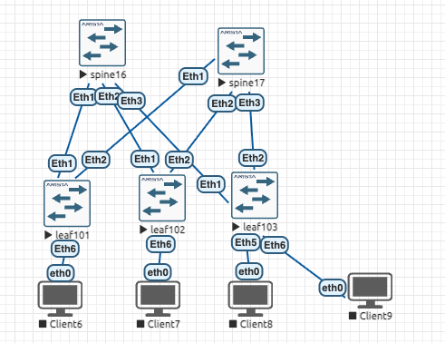

## Проектирование адресного пространства 

Цели : 
- Part 1: Собрать схему CLOS, как на схеме 
- Part 2: Распределить адресное пространство для underlay сети. 
- Part 3: Зафиксировать в документации план работ, адресное пространство, схему сети, настройки(при перенесении на оборудование)

### Реализовать схему


### Таблица адресов

[Глобальная табица и логика тут](../design.md)

|Device|Interface|IP Address|Subnet Mask
|---|---|---|---
Spine16|Eth1|10.16.101.1|255.255.255.252
Spine16|Eth2|10.16.102.1|255.255.255.252
Spine16|Eth3|10.16.103.1|255.255.255.252
Spine17|Eth1|10.17.101.1|255.255.255.252
Spine17|Eth2|10.17.102.1|255.255.255.252
Spine17|Eth3|10.17.103.1|255.255.255.252
Leaf101|Eth1|10.16.101.2|255.255.255.252
Leaf101|Eth2|10.17.101.2|255.255.255.252
Leaf102|Eth1|10.16.102.2|255.255.255.252
Leaf102|Eth2|10.17.102.2|255.255.255.252
Leaf103|Eth1|10.16.103.2|255.255.255.252
Leaf103|Eth2|10.17.103.2|255.255.255.252

### Выполнение:

#### Схема :



#### Настройка

Spine16:

```
hostname spine16
!
ip routing 
!
interface Ethernet1
   description leaf101
   no switchport
   ip address 10.16.101.1/30
!
interface Ethernet2
   description leaf102
   no switchport
   ip address 10.16.102.1/30
!
interface Ethernet3
   description leaf103
   no switchport
   ip address 10.16.103.1/30
!
interface Loopback0
   ip address 10.31.16.1/32
!
```

Spine17 

```
hostname spine17
!
ip routing 
!
interface Ethernet1
   description leaf101
   no switchport
   ip address 10.17.101.1/30
!
interface Ethernet2
   description leaf102
   no switchport
   ip address 10.17.102.1/30
!
interface Ethernet3
   description leaf103
   no switchport
   ip address 10.17.103.1/30
!
interface Loopback0
   ip address 10.31.17.1/32
```

Leaf101: 

```
hostname leaf101
!
ip routing
!
interface Ethernet1
   description spine16
   no switchport
   ip address 10.16.101.2/30
!
interface Ethernet2
   description spine17
   no switchport
   ip address 10.17.101.2/30
!
interface Ethernet6
   description Client6
!
interface Loopback0
   ip address 10.31.101.1/32
```

Leaf102:

```
hostname leaf102
!
ip routing
!
!
interface Ethernet1
   description spine16
   no switchport
   ip address 10.16.102.2/30
!
interface Ethernet2
   description spine17
   no switchport
   ip address 10.17.102.2/30
!
interface Ethernet6
   description Client7
!
interface Loopback0
   ip address 10.31.102.1/32
```

Leaf103:

```
hostname leaf103
!
ip routing
!
interface Ethernet1
   description leaf16
   no switchport
   ip address 10.16.103.2/30
!
interface Ethernet2
   description leaf17
   no switchport
   ip address 10.17.103.2/30
!
interface Ethernet5
   description Client8_eth0
!
interface Ethernet6
   description Client9_eth0
!
interface Loopback0
   ip address 10.31.103.1/32
!
```