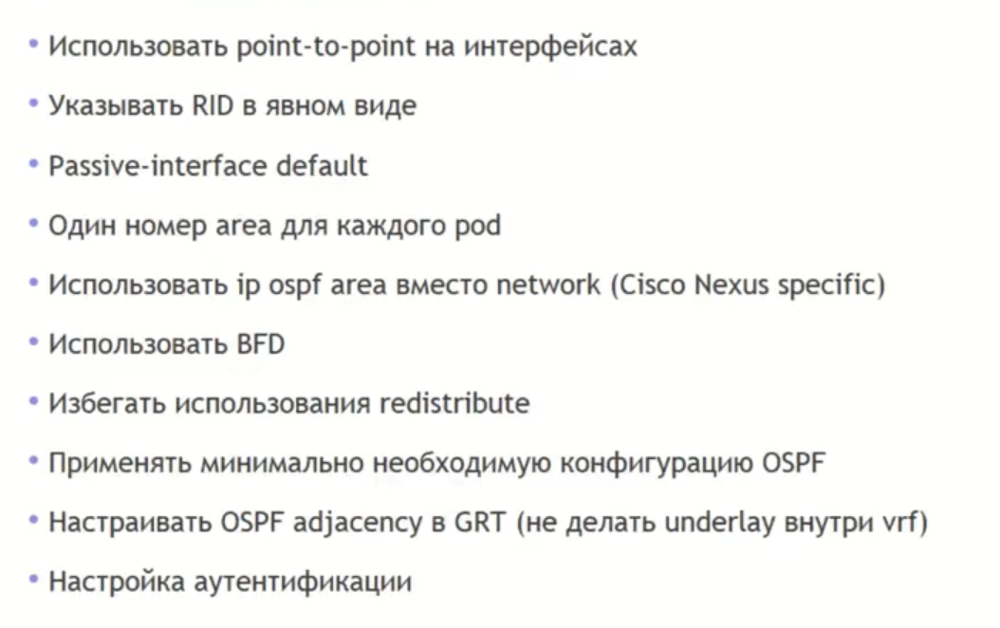
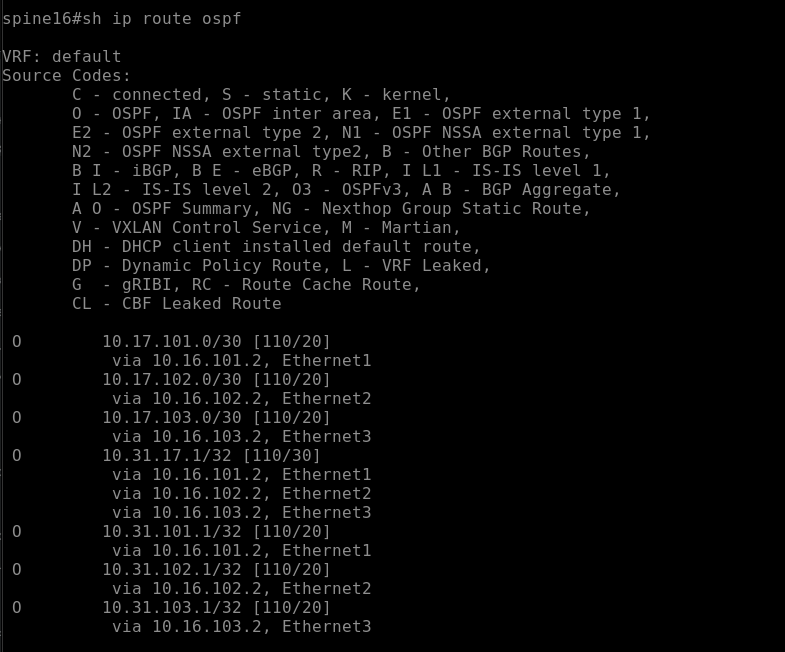
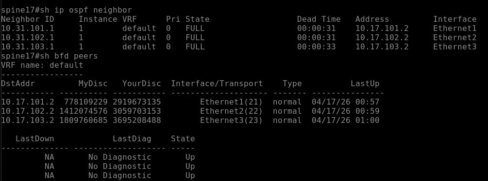
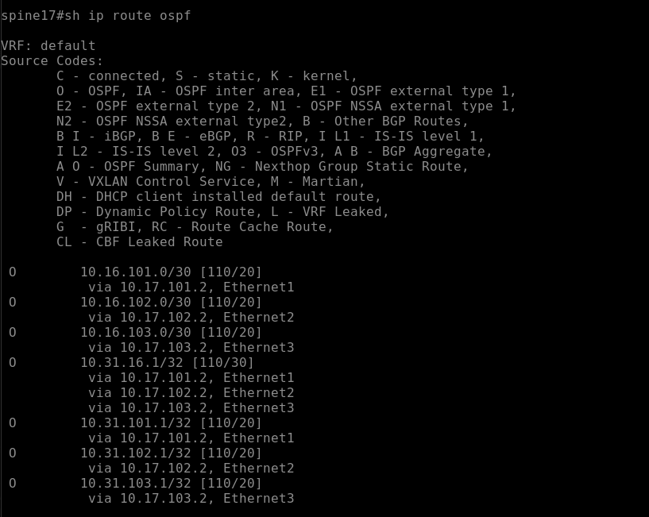
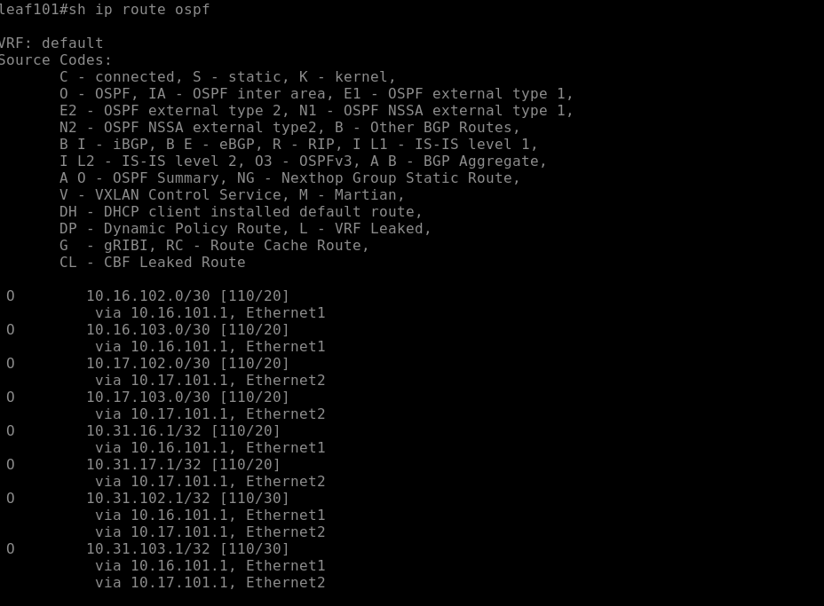
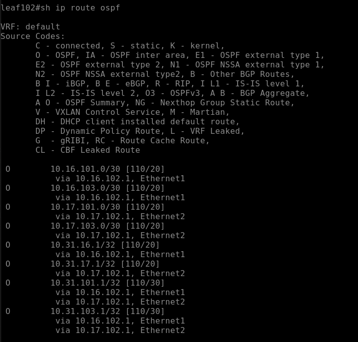

## Underlay. OSPF

Цели : 
- Настроить OSPF в Underlay сети, для IP связанности между всеми сетевыми устройствами.
- Зафиксировать в документации - план работы, адресное пространство, схему сети, конфигурацию устройств
- Убедиться в наличии IP связанности между устройствами в OSFP домене

### Выполнение:

#### Схема остается неизменной : 


### Таблица адресов

|Device|Interface|IP Address
|---|---|---
Spine16|lo0|10.31.16.1/32
Spine17|lo0|10.31.17.1/32
Leaf101|lo0|10.31.101.1/32
Leaf102|lo0|10.31.102.1/32
Leaf103|lo0|10.32.103.1/32

В данную таблицу добавлены только loopback адреса, тк ptp мы поднимали в [Lab01. Основы проектирования сети](../lab01/README.md)

## Планирование : 

Исходя из вебинара есть список рекомендаций:



Но часть из них мы пропустим.
В качестве модели underlay выбраны **routing-интерфейсы (L3)** с след. параметрами :

* без использования trunk, тк у нас L3 routing interface
* без `ip unnumbered`. так же, L3 routing interface
* с классическими `/30` P2P сетями
* Указание RID 
* Используем `passive-interface default`
* Все объекты будут в backbone area 0, тк мы не будем строить multi-pod.
* `ip ospf area` прописываем на интерфейсах вместо network
* Используем BFD с таймерами 100 100 3 
* underlay у нас в GRT 
* Не используем аутентификацию 
* Не используем редистрибуцию, в данном случае она нам в целом не нужна

На мой взгляд это стандартный минимальный набор для OSPF. 

## Настройка : 

### Конфигурация устройств : 

#### Spine16: 

```
interface Ethernet1
   description leaf101
   mtu 9194
   no switchport
   ip address 10.16.101.1/30
   bfd interval 100 min-rx 100 multiplier 3
   ip ospf network point-to-point
   ip ospf area 0.0.0.0
!
interface Ethernet2
   description leaf102
   mtu 9194
   no switchport
   ip address 10.16.102.1/30
   bfd interval 100 min-rx 100 multiplier 3
   ip ospf network point-to-point
   ip ospf area 0.0.0.0
!
interface Ethernet3
   description leaf103
   mtu 9194
   no switchport
   ip address 10.16.103.1/30
   bfd interval 100 min-rx 100 multiplier 3
   ip ospf network point-to-point
   ip ospf area 0.0.0.0
!
interface Loopback0
   ip address 10.31.16.1/32
   ip ospf area 0.0.0.0
!
router ospf 1
   router-id 10.31.16.1
   bfd default
   passive-interface default
   no passive-interface Ethernet1
   no passive-interface Ethernet2
   no passive-interface Ethernet3
   max-lsa 12000
!
```

#### Spine17: 

```
interface Ethernet1
   description leaf101
   mtu 9194
   no switchport
   ip address 10.17.101.1/30
   bfd interval 100 min-rx 100 multiplier 3
   ip ospf network point-to-point
   ip ospf area 0.0.0.0
!
interface Ethernet2
   description leaf102
   mtu 9194
   no switchport
   ip address 10.17.102.1/30
   bfd interval 100 min-rx 100 multiplier 3
   ip ospf network point-to-point
   ip ospf area 0.0.0.0
!
interface Ethernet3
   description leaf103
   mtu 9194
   no switchport
   ip address 10.17.103.1/30
   bfd interval 100 min-rx 100 multiplier 3
   ip ospf network point-to-point
   ip ospf area 0.0.0.0
!
interface Loopback0
   ip address 10.31.17.1/32
   ip ospf area 0.0.0.0
!
router ospf 1
   router-id 10.31.17.1
   bfd default
   passive-interface default
   no passive-interface Ethernet1
   no passive-interface Ethernet2
   no passive-interface Ethernet3
   max-lsa 12000
!
```

#### Leaf101: 

```
!
interface Ethernet1
   description spine16
   mtu 9194
   no switchport
   ip address 10.16.101.2/30
   bfd interval 100 min-rx 100 multiplier 3
   ip ospf network point-to-point
   ip ospf area 0.0.0.0
!
interface Ethernet2
   description spine17
   mtu 9194
   no switchport
   ip address 10.17.101.2/30
   bfd interval 100 min-rx 100 multiplier 3
   ip ospf network point-to-point
   ip ospf area 0.0.0.0
!
interface Loopback0
   ip address 10.31.101.1/32
   ip ospf area 0.0.0.0
!
router ospf 1
   router-id 10.31.101.1
   bfd default
   passive-interface default
   no passive-interface Ethernet1
   no passive-interface Ethernet2
   max-lsa 12000
!
```

#### Leaf102:

```
!
interface Ethernet1
   description spine16
   mtu 9194
   no switchport
   ip address 10.16.102.2/30
   bfd interval 100 min-rx 100 multiplier 3
   ip ospf network point-to-point
   ip ospf area 0.0.0.0
!
interface Ethernet2
   description spine17
   mtu 9194
   no switchport
   ip address 10.17.102.2/30
   bfd interval 100 min-rx 100 multiplier 3
   ip ospf network point-to-point
   ip ospf area 0.0.0.0
!
interface Loopback0
   ip address 10.31.102.1/32
   ip ospf area 0.0.0.0
!
router ospf 1
   router-id 10.31.102.1
   bfd default
   passive-interface default
   no passive-interface Ethernet1
   no passive-interface Ethernet2
   max-lsa 12000
!
```

#### Leaf103:

```
!
interface Ethernet1
   description leaf16
   mtu 9194
   no switchport
   ip address 10.16.103.2/30
   bfd interval 100 min-rx 100 multiplier 3
   ip ospf network point-to-point
   ip ospf area 0.0.0.0
!
interface Ethernet2
   description leaf17
   mtu 9194
   no switchport
   ip address 10.17.103.2/30
   bfd interval 100 min-rx 100 multiplier 3
   ip ospf network point-to-point
   ip ospf area 0.0.0.0
!
interface Loopback0
   ip address 10.31.103.1/32
   ip ospf area 0.0.0.0
!
router ospf 1
   router-id 10.31.103.1
   bfd default
   passive-interface default
   no passive-interface Ethernet1
   no passive-interface Ethernet2
   max-lsa 12000
!
```

На всех интерфейсах добавлен максимально возможный для данных образов MTU, он нужен для сходимости OSPF(обмен DBD-пакетами)

### Проверка:

### Spine16: 

* OSPF + BFD neighbors 


* OSPF routes 



##### ping lo0 Spine17:

```
spine16#ping 10.31.17.1  source loopback 0
PING 10.31.17.1 (10.31.17.1) from 10.31.16.1 : 72(100) bytes of data.
80 bytes from 10.31.17.1: icmp_seq=1 ttl=63 time=9.70 ms
80 bytes from 10.31.17.1: icmp_seq=2 ttl=63 time=4.47 ms
80 bytes from 10.31.17.1: icmp_seq=3 ttl=63 time=4.42 ms
80 bytes from 10.31.17.1: icmp_seq=4 ttl=63 time=4.38 ms
80 bytes from 10.31.17.1: icmp_seq=5 ttl=63 time=4.38 ms

--- 10.31.17.1 ping statistics ---
5 packets transmitted, 5 received, 0% packet loss, time 43ms
rtt min/avg/max/mdev = 4.379/5.471/9.700/2.114 ms, ipg/ewma 10.684/7.510 ms
```

##### ping lo0 leaf101:

```
spine16#ping 10.31.101.1  source loopback 0
PING 10.31.101.1 (10.31.101.1) from 10.31.16.1 : 72(100) bytes of data.
80 bytes from 10.31.101.1: icmp_seq=1 ttl=64 time=4.93 ms
80 bytes from 10.31.101.1: icmp_seq=2 ttl=64 time=2.34 ms
80 bytes from 10.31.101.1: icmp_seq=3 ttl=64 time=2.20 ms
80 bytes from 10.31.101.1: icmp_seq=4 ttl=64 time=2.26 ms
80 bytes from 10.31.101.1: icmp_seq=5 ttl=64 time=2.29 ms

--- 10.31.101.1 ping statistics ---
5 packets transmitted, 5 received, 0% packet loss, time 33ms
rtt min/avg/max/mdev = 2.201/2.804/4.930/1.063 ms, ipg/ewma 8.281/3.830 ms
```

##### ping lo0 leaf102:

```
spine16#ping 10.31.102.1  source loopback 0
PING 10.31.102.1 (10.31.102.1) from 10.31.16.1 : 72(100) bytes of data.
80 bytes from 10.31.102.1: icmp_seq=1 ttl=64 time=5.61 ms
80 bytes from 10.31.102.1: icmp_seq=2 ttl=64 time=2.15 ms
80 bytes from 10.31.102.1: icmp_seq=3 ttl=64 time=2.44 ms
80 bytes from 10.31.102.1: icmp_seq=4 ttl=64 time=2.14 ms
80 bytes from 10.31.102.1: icmp_seq=5 ttl=64 time=2.34 ms

--- 10.31.102.1 ping statistics ---
5 packets transmitted, 5 received, 0% packet loss, time 34ms
rtt min/avg/max/mdev = 2.143/2.936/5.605/1.339 ms, ipg/ewma 8.437/4.226 ms
```

##### ping lo0 leaf103:

```
PING 10.31.103.1 (10.31.103.1) from 10.31.16.1 : 72(100) bytes of data.
80 bytes from 10.31.103.1: icmp_seq=1 ttl=64 time=6.58 ms
80 bytes from 10.31.103.1: icmp_seq=2 ttl=64 time=2.07 ms
80 bytes from 10.31.103.1: icmp_seq=3 ttl=64 time=2.70 ms
80 bytes from 10.31.103.1: icmp_seq=4 ttl=64 time=1.96 ms
80 bytes from 10.31.103.1: icmp_seq=5 ttl=64 time=2.23 ms

--- 10.31.103.1 ping statistics ---
5 packets transmitted, 5 received, 0% packet loss, time 35ms
rtt min/avg/max/mdev = 1.963/3.108/6.582/1.755 ms, ipg/ewma 8.839/4.783 ms
```

### Spine17:

* OSPF + BFD neighbors 



* OSPF routes 



#### Так как пинг со стороны spine16 уже был, то добавлять обратный пинг не вижу смысла, поэтому переходим сразу к leaf'ам. 

##### ping lo0 leaf101:

```
spine17#ping 10.31.101.1 source loopback 0
PING 10.31.101.1 (10.31.101.1) from 10.31.17.1 : 72(100) bytes of data.
80 bytes from 10.31.101.1: icmp_seq=1 ttl=64 time=4.73 ms
80 bytes from 10.31.101.1: icmp_seq=2 ttl=64 time=2.18 ms
80 bytes from 10.31.101.1: icmp_seq=3 ttl=64 time=2.48 ms
80 bytes from 10.31.101.1: icmp_seq=4 ttl=64 time=2.20 ms
80 bytes from 10.31.101.1: icmp_seq=5 ttl=64 time=7.49 ms

--- 10.31.101.1 ping statistics ---
5 packets transmitted, 5 received, 0% packet loss, time 32ms
rtt min/avg/max/mdev = 2.179/3.815/7.488/2.069 ms, ipg/ewma 8.012/4.371 ms
```

##### ping lo0 leaf102:

```
spine17#ping 10.31.102.1 source loopback 0
PING 10.31.102.1 (10.31.102.1) from 10.31.17.1 : 72(100) bytes of data.
80 bytes from 10.31.102.1: icmp_seq=1 ttl=64 time=6.36 ms
80 bytes from 10.31.102.1: icmp_seq=2 ttl=64 time=2.63 ms
80 bytes from 10.31.102.1: icmp_seq=3 ttl=64 time=2.40 ms
80 bytes from 10.31.102.1: icmp_seq=4 ttl=64 time=2.41 ms
80 bytes from 10.31.102.1: icmp_seq=5 ttl=64 time=2.51 ms

--- 10.31.102.1 ping statistics ---
5 packets transmitted, 5 received, 0% packet loss, time 36ms
rtt min/avg/max/mdev = 2.403/3.261/6.360/1.551 ms, ipg/ewma 9.055/4.755 ms
```

##### ping lo0 leaf103:

```
spine17#ping 10.31.103.1 source loopback 0
PING 10.31.103.1 (10.31.103.1) from 10.31.17.1 : 72(100) bytes of data.
80 bytes from 10.31.103.1: icmp_seq=1 ttl=64 time=6.37 ms
80 bytes from 10.31.103.1: icmp_seq=2 ttl=64 time=1.98 ms
80 bytes from 10.31.103.1: icmp_seq=3 ttl=64 time=5.09 ms
80 bytes from 10.31.103.1: icmp_seq=4 ttl=64 time=2.70 ms
80 bytes from 10.31.103.1: icmp_seq=5 ttl=64 time=2.71 ms

--- 10.31.103.1 ping statistics ---
5 packets transmitted, 5 received, 0% packet loss, time 41ms
rtt min/avg/max/mdev = 1.983/3.771/6.369/1.669 ms, ipg/ewma 10.224/5.021 ms
```

### LEAF's 

Т.к. неиборов OSPF и BFD указывал со стороны spine'ов, то добавлять эту информацию повторно не вижу смысла.
С пингами та же ситуация, будем добавлять только недостающую инфу. 

### Leaf101:

* OSPF routes 



##### ping lo0 leaf102:

```
leaf101#ping 10.31.102.1 source loopback 0
PING 10.31.102.1 (10.31.102.1) from 10.31.101.1 : 72(100) bytes of data.
80 bytes from 10.31.102.1: icmp_seq=1 ttl=63 time=31.5 ms
80 bytes from 10.31.102.1: icmp_seq=2 ttl=63 time=23.4 ms
80 bytes from 10.31.102.1: icmp_seq=3 ttl=63 time=12.6 ms
80 bytes from 10.31.102.1: icmp_seq=4 ttl=63 time=5.61 ms
80 bytes from 10.31.102.1: icmp_seq=5 ttl=63 time=5.06 ms

--- 10.31.102.1 ping statistics ---
5 packets transmitted, 5 received, 0% packet loss, time 78ms
rtt min/avg/max/mdev = 5.063/15.638/31.522/10.341 ms, pipe 3, ipg/ewma 19.622/22.888 ms
```

##### ping lo0 leaf103:

```
leaf101#ping 10.31.103.1 source loopback 0
PING 10.31.103.1 (10.31.103.1) from 10.31.101.1 : 72(100) bytes of data.
80 bytes from 10.31.103.1: icmp_seq=1 ttl=63 time=9.55 ms
80 bytes from 10.31.103.1: icmp_seq=2 ttl=63 time=5.89 ms
80 bytes from 10.31.103.1: icmp_seq=3 ttl=63 time=4.26 ms
80 bytes from 10.31.103.1: icmp_seq=4 ttl=63 time=4.86 ms
80 bytes from 10.31.103.1: icmp_seq=5 ttl=63 time=4.16 ms

--- 10.31.103.1 ping statistics ---
5 packets transmitted, 5 received, 0% packet loss, time 45ms
rtt min/avg/max/mdev = 4.160/5.744/9.548/1.998 ms, ipg/ewma 11.152/7.549 ms
```

### Leaf102:

* OSPF routes 



##### ping lo0 leaf103:

```
leaf102#ping 10.31.103.1 source loopback 0
PING 10.31.103.1 (10.31.103.1) from 10.31.102.1 : 72(100) bytes of data.
80 bytes from 10.31.103.1: icmp_seq=1 ttl=63 time=7.87 ms
80 bytes from 10.31.103.1: icmp_seq=2 ttl=63 time=5.28 ms
80 bytes from 10.31.103.1: icmp_seq=3 ttl=63 time=5.10 ms
80 bytes from 10.31.103.1: icmp_seq=4 ttl=63 time=4.32 ms
80 bytes from 10.31.103.1: icmp_seq=5 ttl=63 time=4.42 ms

--- 10.31.103.1 ping statistics ---
5 packets transmitted, 5 received, 0% packet loss, time 43ms
rtt min/avg/max/mdev = 4.323/5.398/7.872/1.291 ms, ipg/ewma 10.750/6.569 ms
```

### Leaf103:

* OSPF routes 


Все пинги dst leaf103 lo0 были выше, поэтому пропускаем. 