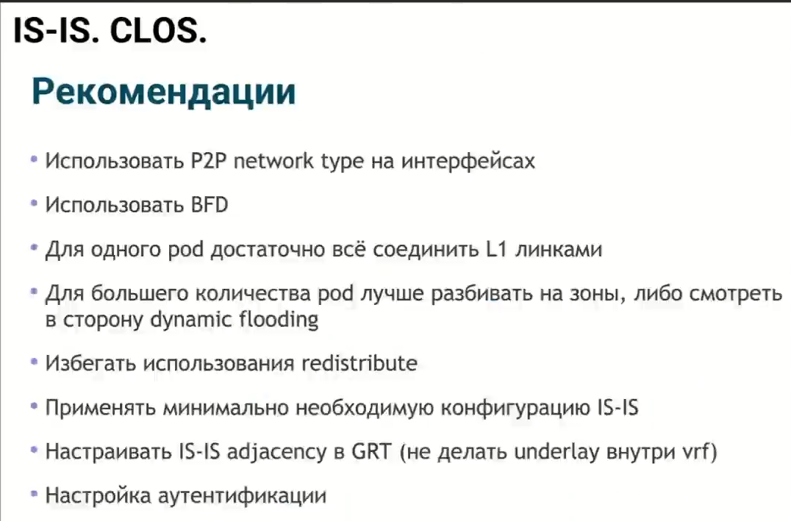
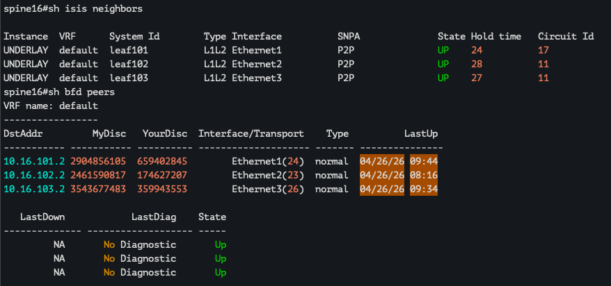
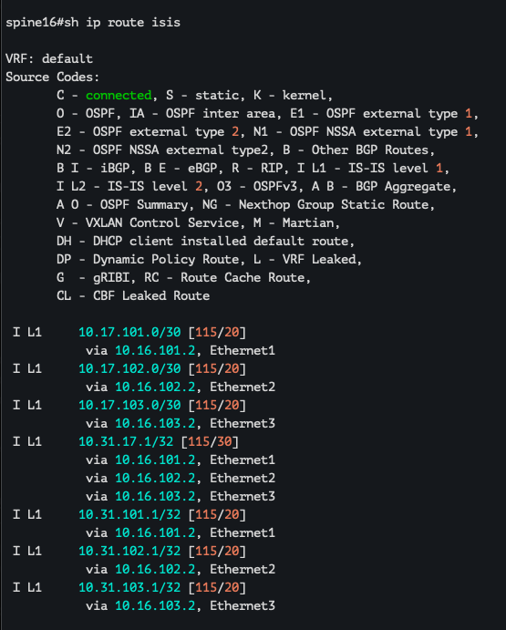
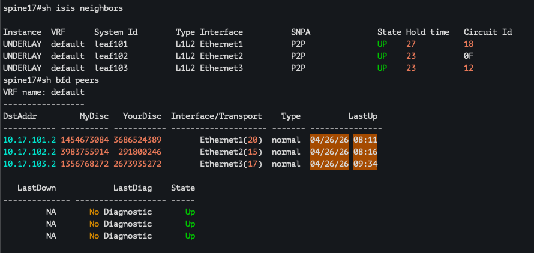
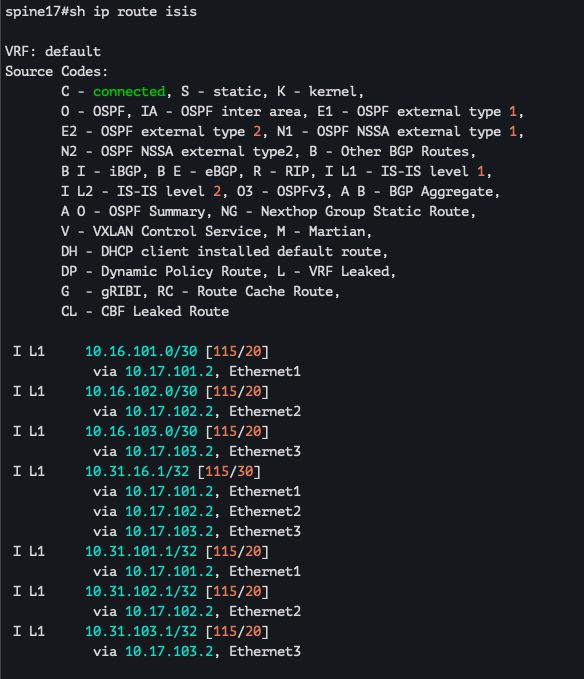
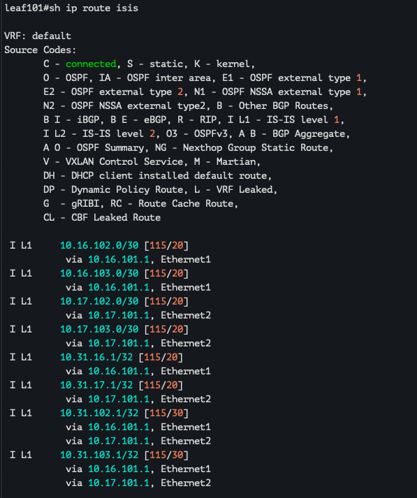
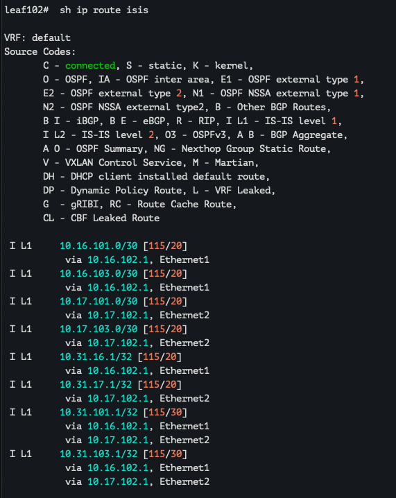
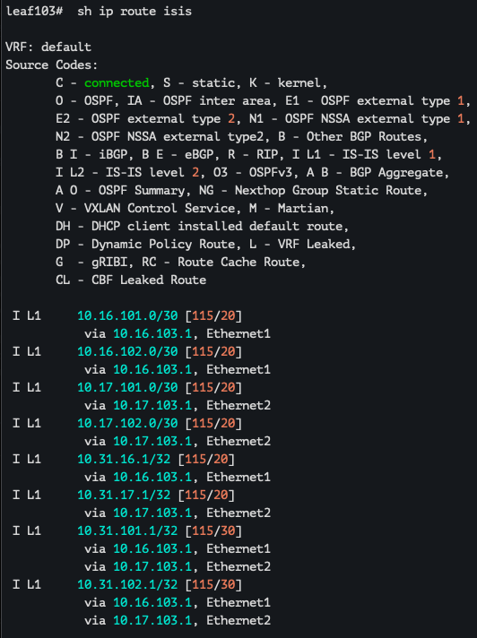

## Underlay. IS-IS

Цели : 
- Настроить IS-IS в Underlay сети, для IP связанности между всеми сетевыми устройствами.
- Зафиксировать в документации - план работы, адресное пространство, схему сети, конфигурацию устройств
- Убедиться в наличии IP связанности между устройствами

### Выполнение:

#### Схема остается неизменной : 


## Планирование : 

Исходя из вебинара есть список рекомендаций, он не сильно отличается от рекомендаций в OSPF:



Соответственно используем их по максимуму. 


## Настройка : 

### Конфигурация устройств : 

#### Spine16: 

```
interface Ethernet1
   description leaf101
   no switchport
   ip address 10.16.101.1/30
   bfd interval 100 min-rx 100 multiplier 3
   isis enable UNDERLAY
   isis network point-to-point
   isis authentication key 7 VqNoqYj5Qxo=
!
interface Ethernet2
   description leaf102
   no switchport
   ip address 10.16.102.1/30
   bfd interval 100 min-rx 100 multiplier 3
   isis enable UNDERLAY
   isis network point-to-point
   isis authentication key 7 VqNoqYj5Qxo=
!
interface Ethernet3
   description leaf103
   no switchport
   ip address 10.16.103.1/30
   bfd interval 100 min-rx 100 multiplier 3
   isis enable UNDERLAY
   isis network point-to-point
   isis authentication key 7 VqNoqYj5Qxo=
!
interface Loopback0
   ip address 10.31.16.1/32
   isis enable UNDERLAY
!
router isis UNDERLAY
   net 49.0001.0010.0031.0016.0001.00
   router-id ipv4 10.31.16.1
   log-adjacency-changes
   !
   address-family ipv4 unicast
      bfd all-interfaces
!

```

#### Spine17:

```
interface Ethernet1
   description leaf101
   no switchport
   ip address 10.17.101.1/30
   isis enable UNDERLAY
   isis network point-to-point
   isis authentication key 7 VqNoqYj5Qxo=
!
interface Ethernet2
   description leaf102
   no switchport
   ip address 10.17.102.1/30
   isis enable UNDERLAY
   isis network point-to-point
   isis authentication key 7 VqNoqYj5Qxo=
!
interface Ethernet3
   description leaf103
   no switchport
   ip address 10.17.103.1/30
   isis enable UNDERLAY
   isis network point-to-point
   isis authentication key 7 VqNoqYj5Qxo=
!
interface Loopback0
   ip address 10.31.17.1/32
   isis enable UNDERLAY
!
router isis UNDERLAY
   net 49.0001.0010.0031.0017.0001.00
   router-id ipv4 10.31.17.1
   log-adjacency-changes
   !
   address-family ipv4 unicast
      bfd all-interfaces
!
```

#### Leaf101: 

```
interface Ethernet1
   description spine16
   no switchport
   ip address 10.16.101.2/30
   bfd interval 100 min-rx 100 multiplier 3
   isis enable UNDERLAY
   isis network point-to-point
   isis authentication key 7 VqNoqYj5Qxo=
!
interface Ethernet2
   description spine17
   no switchport
   ip address 10.17.101.2/30
   bfd interval 100 min-rx 100 multiplier 3
   isis enable UNDERLAY
   isis network point-to-point
   isis authentication key 7 VqNoqYj5Qxo=
!
interface Loopback0
   ip address 10.31.101.1/32
   isis enable UNDERLAY
!
router isis UNDERLAY
   net 49.0001.0010.0031.0101.0001.00
   router-id ipv4 10.31.101.1
   log-adjacency-changes
   !
   address-family ipv4 unicast
      bfd all-interfaces
!
```

#### Leaf102: 

```
interface Ethernet1
   description spine16
   no switchport
   ip address 10.16.102.2/30
   isis enable UNDERLAY
   isis network point-to-point
   isis authentication key 7 VqNoqYj5Qxo=
!
interface Ethernet2
   description spine17
   no switchport
   ip address 10.17.102.2/30
   isis enable UNDERLAY
   isis network point-to-point
   isis authentication key 7 VqNoqYj5Qxo=
!
interface Loopback0
   ip address 10.31.102.1/32
   isis enable UNDERLAY
!
router isis UNDERLAY
   net 49.0001.0010.0031.0102.0001.00
   router-id ipv4 10.31.102.1
   log-adjacency-changes
   !
   address-family ipv4 unicast
      bfd all-interfaces
!

```

#### Leaf103:

```
interface Ethernet1
   description leaf16
   no switchport
   ip address 10.16.103.2/30
   isis enable UNDERLAY
   isis network point-to-point
   isis authentication key 7 VqNoqYj5Qxo=
!
interface Ethernet2
   description leaf17
   no switchport
   ip address 10.17.103.2/30
   isis enable UNDERLAY
   isis network point-to-point
   isis authentication key 7 VqNoqYj5Qxo=
!
interface Loopback0
   ip address 10.31.103.1/32
   isis enable UNDERLAY
!
router isis UNDERLAY
   net 49.0001.0010.0031.0103.0001.00
   router-id ipv4 10.31.103.1
   log-adjacency-changes
   !
   address-family ipv4 unicast
      bfd all-interfaces
!
```

Добавил аутентификацию только на hello пакеты без keychain, без area и/или domain аутентификации. Ключ на всех ptp соединения одинаковый. 
В закрытом POD'e аутентификация в целом мне видится излишней, сделал только для теста. 


### Проверка:

### Spine16: 

* ISIS + BFD neighbors 



* ISIS routes 



##### ping lo0 Spine17:

```
spine16#ping 10.31.17.1 source lo0
PING 10.31.17.1 (10.31.17.1) from 10.31.16.1 : 72(100) bytes of data.
80 bytes from 10.31.17.1: icmp_seq=1 ttl=63 time=17.6 ms
80 bytes from 10.31.17.1: icmp_seq=2 ttl=63 time=10.3 ms
80 bytes from 10.31.17.1: icmp_seq=3 ttl=63 time=4.60 ms
80 bytes from 10.31.17.1: icmp_seq=4 ttl=63 time=4.30 ms
80 bytes from 10.31.17.1: icmp_seq=5 ttl=63 time=4.64 ms

--- 10.31.17.1 ping statistics ---
5 packets transmitted, 5 received, 0% packet loss, time 59ms
rtt min/avg/max/mdev = 4.302/8.283/17.554/5.152 ms, pipe 2, ipg/ewma 14.787/12.645 ms
spine16#
```

##### ping lo0 Leaf101:

```
spine16#ping 10.31.101.1 source lo0
PING 10.31.101.1 (10.31.101.1) from 10.31.16.1 : 72(100) bytes of data.
80 bytes from 10.31.101.1: icmp_seq=1 ttl=64 time=5.90 ms
80 bytes from 10.31.101.1: icmp_seq=2 ttl=64 time=2.15 ms
80 bytes from 10.31.101.1: icmp_seq=3 ttl=64 time=2.13 ms
80 bytes from 10.31.101.1: icmp_seq=4 ttl=64 time=2.11 ms
80 bytes from 10.31.101.1: icmp_seq=5 ttl=64 time=2.24 ms

--- 10.31.101.1 ping statistics ---
5 packets transmitted, 5 received, 0% packet loss, time 34ms
rtt min/avg/max/mdev = 2.111/2.908/5.900/1.496 ms, ipg/ewma 8.379/4.354 ms

```

##### ping lo0 Leaf102:

```
spine16#ping 10.31.102.1 source lo0
PING 10.31.102.1 (10.31.102.1) from 10.31.16.1 : 72(100) bytes of data.
80 bytes from 10.31.102.1: icmp_seq=1 ttl=64 time=6.61 ms
80 bytes from 10.31.102.1: icmp_seq=2 ttl=64 time=2.41 ms
80 bytes from 10.31.102.1: icmp_seq=3 ttl=64 time=2.29 ms
80 bytes from 10.31.102.1: icmp_seq=4 ttl=64 time=2.22 ms
80 bytes from 10.31.102.1: icmp_seq=5 ttl=64 time=2.34 ms

--- 10.31.102.1 ping statistics ---
5 packets transmitted, 5 received, 0% packet loss, time 34ms
rtt min/avg/max/mdev = 2.224/3.174/6.612/1.719 ms, ipg/ewma 8.425/4.832 ms

```

##### ping lo0 Leaf103:

```
spine16#ping 10.31.103.1 source lo0
PING 10.31.103.1 (10.31.103.1) from 10.31.16.1 : 72(100) bytes of data.
80 bytes from 10.31.103.1: icmp_seq=1 ttl=64 time=5.47 ms
80 bytes from 10.31.103.1: icmp_seq=2 ttl=64 time=2.15 ms
80 bytes from 10.31.103.1: icmp_seq=3 ttl=64 time=2.31 ms
80 bytes from 10.31.103.1: icmp_seq=4 ttl=64 time=2.29 ms
80 bytes from 10.31.103.1: icmp_seq=5 ttl=64 time=2.14 ms

--- 10.31.103.1 ping statistics ---
5 packets transmitted, 5 received, 0% packet loss, time 34ms
rtt min/avg/max/mdev = 2.136/2.870/5.467/1.300 ms, ipg/ewma 8.621/4.123 ms

```

### Spine16: 

* Neighbors 



* Routes 



#### Так как пинг со стороны spine16 уже был, то добавлять обратный пинг не вижу смысла, поэтому переходим сразу к leaf'ам. 

##### ping lo0 leaf101:

```
spine17#ping 10.31.101.1 source lo0
PING 10.31.101.1 (10.31.101.1) from 10.31.17.1 : 72(100) bytes of data.
80 bytes from 10.31.101.1: icmp_seq=1 ttl=64 time=4.78 ms
80 bytes from 10.31.101.1: icmp_seq=2 ttl=64 time=2.25 ms
80 bytes from 10.31.101.1: icmp_seq=3 ttl=64 time=2.24 ms
80 bytes from 10.31.101.1: icmp_seq=4 ttl=64 time=2.34 ms
80 bytes from 10.31.101.1: icmp_seq=5 ttl=64 time=2.45 ms

--- 10.31.101.1 ping statistics ---
5 packets transmitted, 5 received, 0% packet loss, time 30ms
rtt min/avg/max/mdev = 2.239/2.811/4.781/0.987 ms, ipg/ewma 7.615/3.767 ms
```

##### ping lo0 leaf102:

```
spine17#ping 10.31.102.1 source lo0
PING 10.31.102.1 (10.31.102.1) from 10.31.17.1 : 72(100) bytes of data.
80 bytes from 10.31.102.1: icmp_seq=1 ttl=64 time=6.78 ms
80 bytes from 10.31.102.1: icmp_seq=2 ttl=64 time=2.27 ms
80 bytes from 10.31.102.1: icmp_seq=3 ttl=64 time=2.14 ms
80 bytes from 10.31.102.1: icmp_seq=4 ttl=64 time=2.11 ms
80 bytes from 10.31.102.1: icmp_seq=5 ttl=64 time=2.17 ms

--- 10.31.102.1 ping statistics ---
5 packets transmitted, 5 received, 0% packet loss, time 35ms
rtt min/avg/max/mdev = 2.108/3.093/6.783/1.845 ms, ipg/ewma 8.640/4.872 ms
```

##### ping lo0 leaf103:

```
spine17#ping 10.31.103.1 source lo0
PING 10.31.103.1 (10.31.103.1) from 10.31.17.1 : 72(100) bytes of data.
80 bytes from 10.31.103.1: icmp_seq=1 ttl=64 time=4.62 ms
80 bytes from 10.31.103.1: icmp_seq=2 ttl=64 time=2.11 ms
80 bytes from 10.31.103.1: icmp_seq=3 ttl=64 time=2.20 ms
80 bytes from 10.31.103.1: icmp_seq=4 ttl=64 time=2.11 ms
80 bytes from 10.31.103.1: icmp_seq=5 ttl=64 time=2.13 ms

--- 10.31.103.1 ping statistics ---
5 packets transmitted, 5 received, 0% packet loss, time 35ms
rtt min/avg/max/mdev = 2.105/2.632/4.620/0.994 ms, ipg/ewma 8.807/3.591 ms
```

### LEAFs

Т.к. неиборов ISIS и BFD указывал со стороны spine'ов, то добавлять эту информацию повторно не вижу смысла.
С пингами та же ситуация, будем добавлять только недостающую инфу. 

### Leaf101:

* Routes 



##### ping lo0 leaf102:

```
leaf101#ping 10.31.102.1 source lo0
PING 10.31.102.1 (10.31.102.1) from 10.31.101.1 : 72(100) bytes of data.
80 bytes from 10.31.102.1: icmp_seq=1 ttl=63 time=9.10 ms
80 bytes from 10.31.102.1: icmp_seq=2 ttl=63 time=4.21 ms
80 bytes from 10.31.102.1: icmp_seq=3 ttl=63 time=4.46 ms
80 bytes from 10.31.102.1: icmp_seq=4 ttl=63 time=4.56 ms
80 bytes from 10.31.102.1: icmp_seq=5 ttl=63 time=4.45 ms

--- 10.31.102.1 ping statistics ---
5 packets transmitted, 5 received, 0% packet loss, time 42ms
rtt min/avg/max/mdev = 4.205/5.354/9.103/1.877 ms, ipg/ewma 10.511/7.169 ms
```

##### ping lo0 leaf103:

```
leaf101#ping 10.31.103.1 source lo0
PING 10.31.103.1 (10.31.103.1) from 10.31.101.1 : 72(100) bytes of data.
80 bytes from 10.31.103.1: icmp_seq=1 ttl=63 time=7.25 ms
80 bytes from 10.31.103.1: icmp_seq=2 ttl=63 time=4.44 ms
80 bytes from 10.31.103.1: icmp_seq=3 ttl=63 time=4.43 ms
80 bytes from 10.31.103.1: icmp_seq=4 ttl=63 time=4.37 ms
80 bytes from 10.31.103.1: icmp_seq=5 ttl=63 time=4.91 ms

--- 10.31.103.1 ping statistics ---
5 packets transmitted, 5 received, 0% packet loss, time 41ms
rtt min/avg/max/mdev = 4.373/5.081/7.254/1.103 ms, ipg/ewma 10.202/6.140 ms
```

### Leaf102:

* Routes 



##### ping lo0 leaf103:

```
leaf102#ping 10.31.103.1 source loopback 0
PING 10.31.103.1 (10.31.103.1) from 10.31.102.1 : 72(100) bytes of data.
80 bytes from 10.31.103.1: icmp_seq=1 ttl=63 time=7.56 ms
80 bytes from 10.31.103.1: icmp_seq=2 ttl=63 time=4.64 ms
80 bytes from 10.31.103.1: icmp_seq=3 ttl=63 time=4.50 ms
80 bytes from 10.31.103.1: icmp_seq=4 ttl=63 time=4.61 ms
80 bytes from 10.31.103.1: icmp_seq=5 ttl=63 time=9.17 ms

--- 10.31.103.1 ping statistics ---
5 packets transmitted, 5 received, 0% packet loss, time 42ms
rtt min/avg/max/mdev = 4.497/6.096/9.172/1.922 ms, ipg/ewma 10.547/6.901 ms
```

### Leaf103:

* Routes 



Все пинги dst leaf103 lo0 были выше, поэтому пропускаем. 