## Underlay. BGP 

Цели : 
- Настроить BGP в Underlay сети, для IP связанности между всеми сетевыми устройствами
- Зафиксировать в документации - план работы, адресное пространство, схему сети, конфигурацию устройств
- Убедиться в наличии IP связанности между устройствами в BGP домене

### Выполнение:

#### Схема остается неизменной : 


#### Планирование : 

В качестве типов пиров был выбран eBGP 

#### Обоснование:

* Защита от петель через loop-prevention 
* Простая балансировка (ECMP): eBGP по умолчанию считает все пути через разные AS равнозначными, что упрощает настройку балансировки трафика между Spine.
* Иерархичность: Легко разделять зоны ответственности и применять политики фильтрации на границах AS.
* Более удобно для масштабирования, нам не нужны рефлюки, нет необходимости next-hop-self
* Подготовка к использованию VXLAN EVPN, в будущем будем использовать pure eBGP single protocol

---

Исходя из вебинаров есть список рекомендаций: 

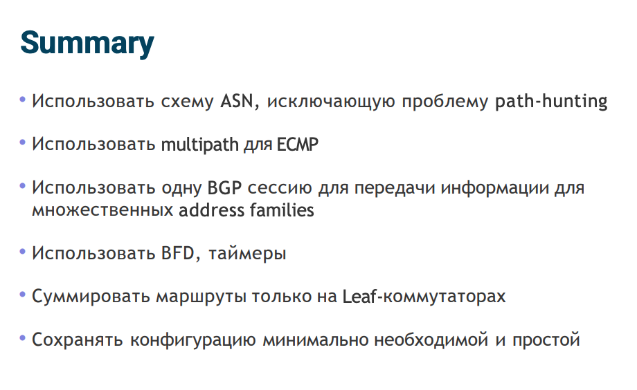

### Конфигурация устройств : 

#### Spine16: 

```
interface Ethernet1
   description leaf101
   no switchport
   ip address 10.16.101.1/30
   bfd interval 100 min-rx 100 multiplier 3
!
interface Ethernet2
   description leaf102
   no switchport
   ip address 10.16.102.1/30
   bfd interval 100 min-rx 100 multiplier 3
!
interface Ethernet3
   description leaf103
   no switchport
   ip address 10.16.103.1/30
   bfd interval 100 min-rx 100 multiplier 3
!
interface Loopback0
   ip address 10.31.16.1/32
!
route-map RED_L0 permit 10
   match interface Loopback0
   set origin incomplete
!
router bgp 65200
   router-id 10.31.16.1
   maximum-paths 4 ecmp 4
   neighbor 10.16.101.2 remote-as 65201
   neighbor 10.16.101.2 bfd
   neighbor 10.16.101.2 description LEAF101
   neighbor 10.16.102.2 remote-as 65202
   neighbor 10.16.102.2 bfd
   neighbor 10.16.102.2 description LEAF102
   neighbor 10.16.103.2 remote-as 65203
   neighbor 10.16.103.2 bfd
   neighbor 10.16.103.2 description LEAF103
   !
   address-family ipv4
      neighbor 10.16.101.2 activate
      neighbor 10.16.102.2 activate
      neighbor 10.16.103.2 activate
      redistribute connected route-map RED_L0
!
```

#### Spine17:

```
!
interface Ethernet1
   description leaf101
   no switchport
   ip address 10.17.101.1/30
!
interface Ethernet2
   description leaf102
   no switchport
   ip address 10.17.102.1/30
!
interface Ethernet3
   description leaf103
   no switchport
   ip address 10.17.103.1/30
!
interface Loopback0
   ip address 10.31.17.1/32
!
!
route-map RED_L0 permit 10
   match interface Loopback0
   set origin incomplete
!
router bgp 65200
   router-id 10.31.17.1
   maximum-paths 4 ecmp 4
   neighbor 10.17.101.2 remote-as 65201
   neighbor 10.17.101.2 bfd
   neighbor 10.17.101.2 description LEAF101
   neighbor 10.17.102.2 remote-as 65202
   neighbor 10.17.102.2 bfd
   neighbor 10.17.102.2 description LEAF102
   neighbor 10.17.103.2 remote-as 65203
   neighbor 10.17.103.2 bfd
   neighbor 10.17.103.2 description LEAF103
   !
   address-family ipv4
      neighbor 10.17.101.2 activate
      neighbor 10.17.102.2 activate
      neighbor 10.17.103.2 activate
      redistribute connected route-map RED_L0
!
```

#### Leaf101:

```
interface Ethernet1
   description spine16
   no switchport
   ip address 10.16.101.2/30
   bfd interval 100 min-rx 100 multiplier 3
!
interface Ethernet2
   description spine17
   no switchport
   ip address 10.17.101.2/30
   bfd interval 100 min-rx 100 multiplier 3
!
interface Loopback0
   ip address 10.31.101.1/32
!
route-map RED_L0 permit 10
   match interface Loopback0
   set origin incomplete
!
router bgp 65201
   router-id 10.31.101.1
   maximum-paths 4 ecmp 4
   neighbor 10.16.101.1 remote-as 65200
   neighbor 10.16.101.1 bfd
   neighbor 10.16.101.1 description SPINE16
   neighbor 10.17.101.1 remote-as 65200
   neighbor 10.17.101.1 bfd
   neighbor 10.17.101.1 description SPINE17
   !
   address-family ipv4
      neighbor 10.16.101.1 activate
      neighbor 10.17.101.1 activate
      redistribute connected route-map RED_L0
!
```

#### Leaf102: 

```
!
interface Ethernet1
   description spine16
   no switchport
   ip address 10.16.102.2/30
!
interface Ethernet2
   description spine17
   no switchport
   ip address 10.17.102.2/30
!
interface Loopback0
   ip address 10.31.102.1/32
!
route-map RED_L0 permit 10
   match interface Loopback0
   set origin incomplete
!
router bgp 65202
   router-id 10.31.102.1
   maximum-paths 4 ecmp 4
   neighbor 10.16.102.1 remote-as 65200
   neighbor 10.16.102.1 bfd
   neighbor 10.16.102.1 description SPINE16
   neighbor 10.17.102.1 remote-as 65200
   neighbor 10.17.102.1 bfd
   neighbor 10.17.102.1 description SPINE17
   !
   address-family ipv4
      neighbor 10.16.102.1 activate
      neighbor 10.17.102.1 activate
      redistribute connected route-map RED_L0
```

#### Leaf103:

```
interface Ethernet1
   description leaf16
   no switchport
   ip address 10.16.103.2/30
!
interface Ethernet2
   description leaf17
   no switchport
   ip address 10.17.103.2/30
!
interface Loopback0
   ip address 10.31.103.1/32
!
!
route-map RED_L0 permit 10
   match interface Loopback0
   set origin incomplete
!
router bgp 65203
   router-id 10.31.103.1
   maximum-paths 4 ecmp 4
   neighbor 10.16.103.1 remote-as 65200
   neighbor 10.16.103.1 bfd
   neighbor 10.16.103.1 description SPINE16
   neighbor 10.17.103.1 remote-as 65200
   neighbor 10.17.103.1 bfd
   neighbor 10.17.103.1 description SPINE17
   !
   address-family ipv4
      neighbor 10.16.103.1 activate
      neighbor 10.17.103.1 activate
      redistribute connected route-map RED_L0
```

### Проверка:


# Spine16: 

* BGP + BFD peers 

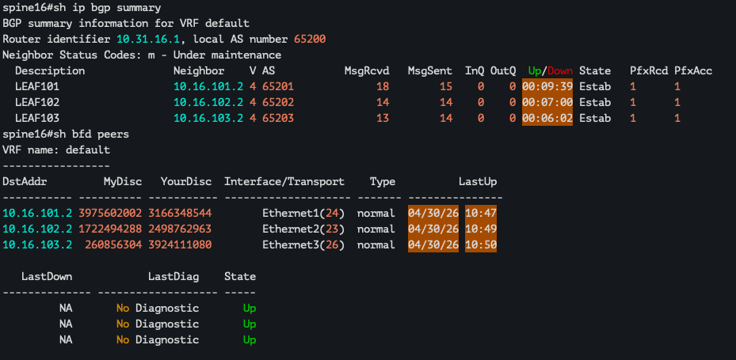

* RIB 

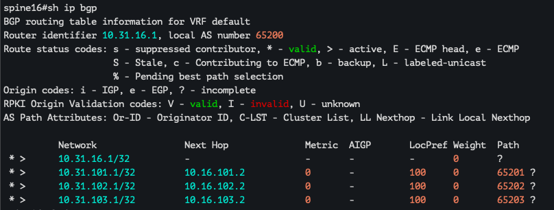

* Routes

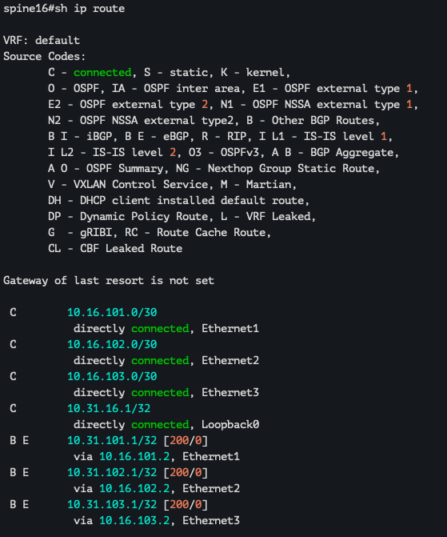


#### Проверка доступности: 

#### Leaf101

```
spine16#ping 10.31.101.1 source loopback 0
PING 10.31.101.1 (10.31.101.1) from 10.31.16.1 : 72(100) bytes of data.
80 bytes from 10.31.101.1: icmp_seq=1 ttl=64 time=7.65 ms
80 bytes from 10.31.101.1: icmp_seq=2 ttl=64 time=2.35 ms
80 bytes from 10.31.101.1: icmp_seq=3 ttl=64 time=2.33 ms
80 bytes from 10.31.101.1: icmp_seq=4 ttl=64 time=2.29 ms
80 bytes from 10.31.101.1: icmp_seq=5 ttl=64 time=2.27 ms

--- 10.31.101.1 ping statistics ---
5 packets transmitted, 5 received, 0% packet loss, time 34ms
rtt min/avg/max/mdev = 2.274/3.378/7.654/2.137 ms, ipg/ewma 8.563/5.440 ms
```

#### Leaf102

```
spine16#ping 10.31.102.1 source loopback 0
PING 10.31.102.1 (10.31.102.1) from 10.31.16.1 : 72(100) bytes of data.
80 bytes from 10.31.102.1: icmp_seq=1 ttl=64 time=13.4 ms
80 bytes from 10.31.102.1: icmp_seq=2 ttl=64 time=7.13 ms
80 bytes from 10.31.102.1: icmp_seq=3 ttl=64 time=2.14 ms
80 bytes from 10.31.102.1: icmp_seq=4 ttl=64 time=2.18 ms
80 bytes from 10.31.102.1: icmp_seq=5 ttl=64 time=2.29 ms

--- 10.31.102.1 ping statistics ---
5 packets transmitted, 5 received, 0% packet loss, time 60ms
rtt min/avg/max/mdev = 2.139/5.422/13.380/4.412 ms, pipe 2, ipg/ewma 15.032/9.169 ms
```

#### Leaf103 

```
spine16#ping 10.31.103.1 source loopback 0
PING 10.31.103.1 (10.31.103.1) from 10.31.16.1 : 72(100) bytes of data.
80 bytes from 10.31.103.1: icmp_seq=1 ttl=64 time=3.92 ms
80 bytes from 10.31.103.1: icmp_seq=2 ttl=64 time=2.07 ms
80 bytes from 10.31.103.1: icmp_seq=3 ttl=64 time=2.05 ms
80 bytes from 10.31.103.1: icmp_seq=4 ttl=64 time=3.19 ms
80 bytes from 10.31.103.1: icmp_seq=5 ttl=64 time=2.45 ms

--- 10.31.103.1 ping statistics ---
5 packets transmitted, 5 received, 0% packet loss, time 32ms
rtt min/avg/max/mdev = 2.053/2.735/3.916/0.720 ms, ipg/ewma 7.906/3.320 ms
```

- Между lo интерфейсами SPINE нет связности. Мы не использовали allowas-in, тк в этом нет необходимости. 

# Spine17: 

* BGP + BFD peers 

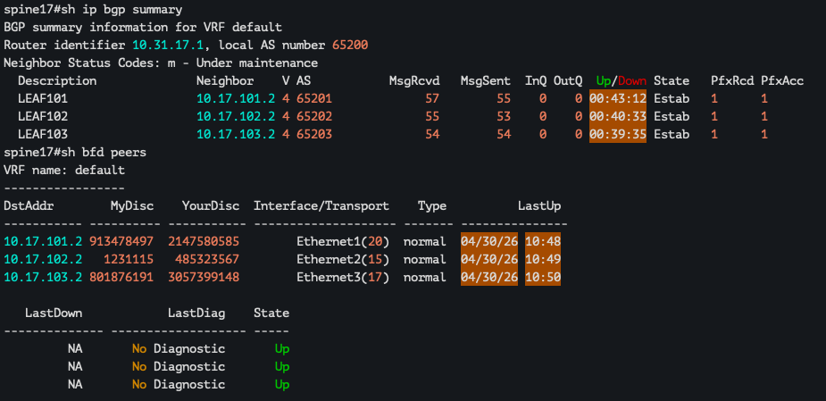

* RIB 

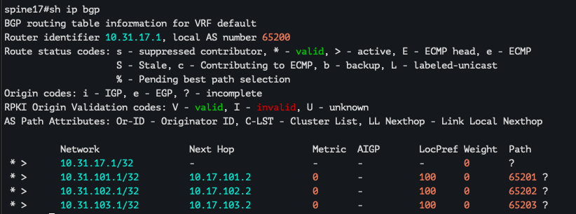

* Routes 

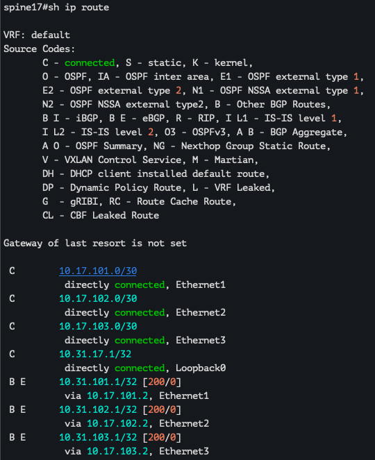

#### Проверка доступности: 

#### Leaf101

```
spine17#ping 10.31.101.1 source lo0
PING 10.31.101.1 (10.31.101.1) from 10.31.17.1 : 72(100) bytes of data.
80 bytes from 10.31.101.1: icmp_seq=1 ttl=64 time=5.74 ms
80 bytes from 10.31.101.1: icmp_seq=2 ttl=64 time=2.31 ms
80 bytes from 10.31.101.1: icmp_seq=3 ttl=64 time=6.12 ms
80 bytes from 10.31.101.1: icmp_seq=4 ttl=64 time=2.29 ms
80 bytes from 10.31.101.1: icmp_seq=5 ttl=64 time=2.40 ms

--- 10.31.101.1 ping statistics ---
5 packets transmitted, 5 received, 0% packet loss, time 40ms
rtt min/avg/max/mdev = 2.288/3.771/6.122/1.768 ms, ipg/ewma 10.101/4.695 ms
```

#### Leaf102

```
spine17#ping 10.31.102.1 source lo0
PING 10.31.102.1 (10.31.102.1) from 10.31.17.1 : 72(100) bytes of data.
80 bytes from 10.31.102.1: icmp_seq=1 ttl=64 time=4.38 ms
80 bytes from 10.31.102.1: icmp_seq=2 ttl=64 time=2.52 ms
80 bytes from 10.31.102.1: icmp_seq=3 ttl=64 time=2.18 ms
80 bytes from 10.31.102.1: icmp_seq=4 ttl=64 time=2.48 ms
80 bytes from 10.31.102.1: icmp_seq=5 ttl=64 time=2.36 ms

--- 10.31.102.1 ping statistics ---
5 packets transmitted, 5 received, 0% packet loss, time 31ms
rtt min/avg/max/mdev = 2.175/2.783/4.378/0.806 ms, ipg/ewma 7.748/3.552 ms
```

#### Leaf103

```
spine17#ping 10.31.103.1 source lo0
PING 10.31.103.1 (10.31.103.1) from 10.31.17.1 : 72(100) bytes of data.
80 bytes from 10.31.103.1: icmp_seq=1 ttl=64 time=4.27 ms
80 bytes from 10.31.103.1: icmp_seq=2 ttl=64 time=2.16 ms
80 bytes from 10.31.103.1: icmp_seq=3 ttl=64 time=2.22 ms
80 bytes from 10.31.103.1: icmp_seq=4 ttl=64 time=2.03 ms
80 bytes from 10.31.103.1: icmp_seq=5 ttl=64 time=2.27 ms

--- 10.31.103.1 ping statistics ---
5 packets transmitted, 5 received, 0% packet loss, time 30ms
rtt min/avg/max/mdev = 2.031/2.591/4.269/0.842 ms, ipg/ewma 7.571/3.402 ms
```

# Leaf101 

* BGP + BFD peers 

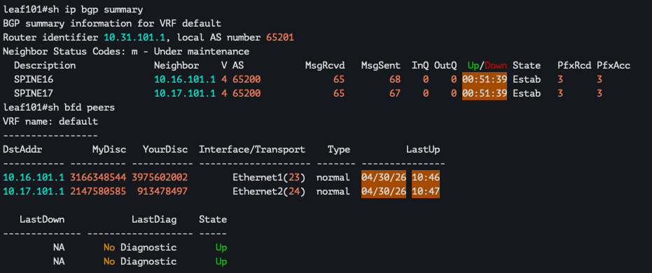

* RIB 

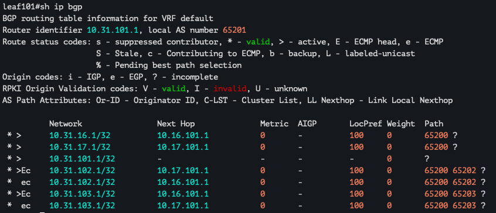

* Routes 

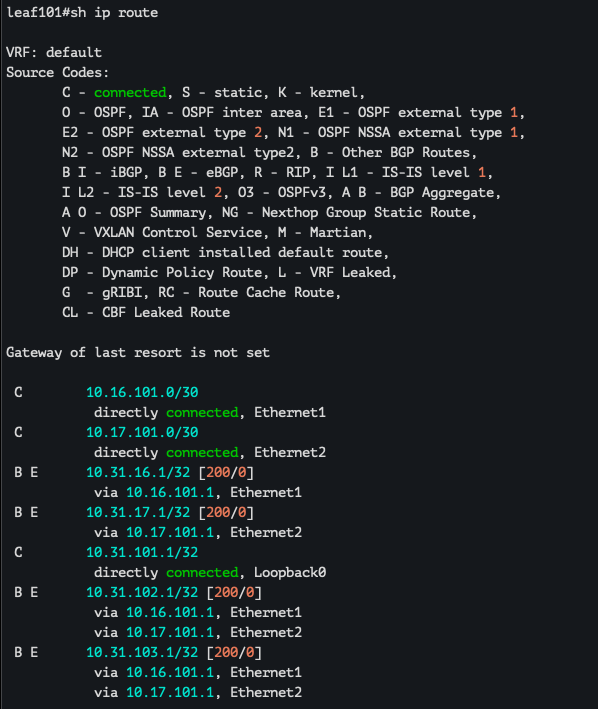

#### Проверка доступности: 

Проверять будем только между leaf, потому что проверка со стороны spine уже была произведена 

#### Leaf102 

```
leaf101#ping 10.31.102.1 source loopback 0
PING 10.31.102.1 (10.31.102.1) from 10.31.101.1 : 72(100) bytes of data.
80 bytes from 10.31.102.1: icmp_seq=1 ttl=63 time=13.5 ms
80 bytes from 10.31.102.1: icmp_seq=2 ttl=63 time=4.48 ms
80 bytes from 10.31.102.1: icmp_seq=3 ttl=63 time=4.61 ms
80 bytes from 10.31.102.1: icmp_seq=4 ttl=63 time=4.46 ms
80 bytes from 10.31.102.1: icmp_seq=5 ttl=63 time=4.52 ms

--- 10.31.102.1 ping statistics ---
5 packets transmitted, 5 received, 0% packet loss, time 53ms
rtt min/avg/max/mdev = 4.456/6.317/13.524/3.603 ms, ipg/ewma 13.230/9.795 ms
```

#### Leaf103 

```
leaf101#ping 10.31.103.1 source loopback 0
PING 10.31.103.1 (10.31.103.1) from 10.31.101.1 : 72(100) bytes of data.
80 bytes from 10.31.103.1: icmp_seq=1 ttl=63 time=7.36 ms
80 bytes from 10.31.103.1: icmp_seq=2 ttl=63 time=5.10 ms
80 bytes from 10.31.103.1: icmp_seq=3 ttl=63 time=5.02 ms
80 bytes from 10.31.103.1: icmp_seq=4 ttl=63 time=5.22 ms
80 bytes from 10.31.103.1: icmp_seq=5 ttl=63 time=4.15 ms

--- 10.31.103.1 ping statistics ---
5 packets transmitted, 5 received, 0% packet loss, time 42ms
rtt min/avg/max/mdev = 4.153/5.369/7.357/1.062 ms, ipg/ewma 10.562/6.310 ms
```

# Leaf102 

* BGP + BFD peers 

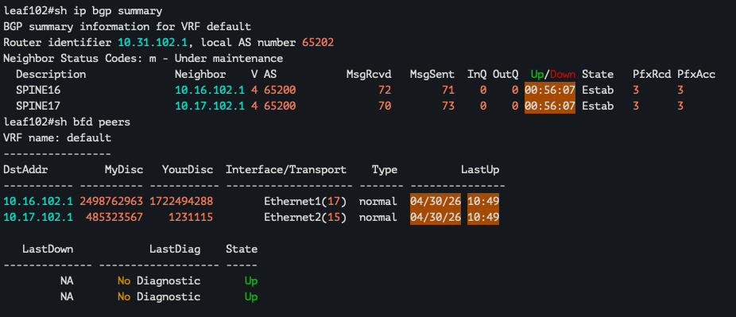

* RIB

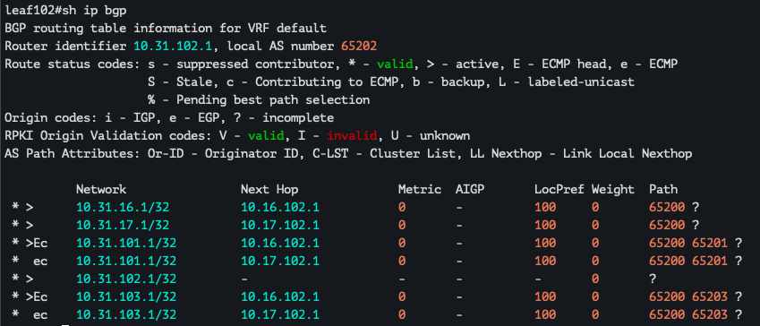

* Routes 

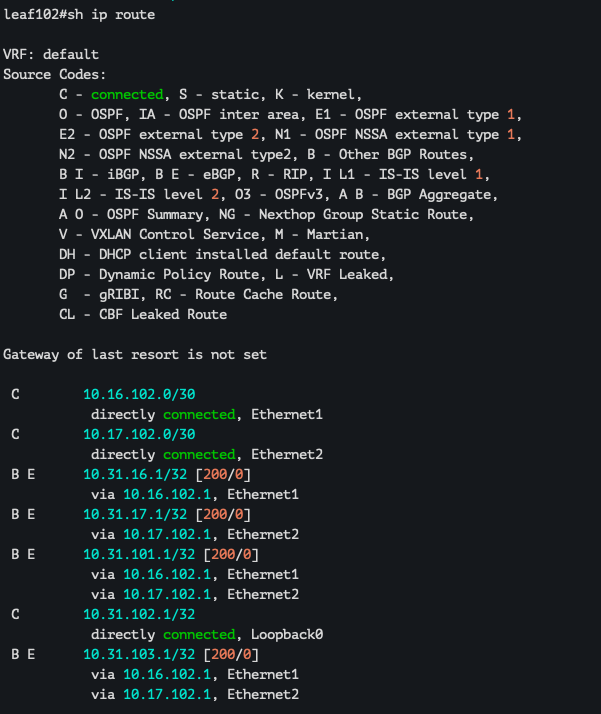

#### Leaf103

```
leaf102#ping 10.31.103.1 source loopback 0
PING 10.31.103.1 (10.31.103.1) from 10.31.102.1 : 72(100) bytes of data.
80 bytes from 10.31.103.1: icmp_seq=1 ttl=63 time=7.78 ms
80 bytes from 10.31.103.1: icmp_seq=2 ttl=63 time=4.87 ms
80 bytes from 10.31.103.1: icmp_seq=3 ttl=63 time=4.39 ms
80 bytes from 10.31.103.1: icmp_seq=4 ttl=63 time=5.37 ms
80 bytes from 10.31.103.1: icmp_seq=5 ttl=63 time=5.30 ms

--- 10.31.103.1 ping statistics ---
5 packets transmitted, 5 received, 0% packet loss, time 42ms
rtt min/avg/max/mdev = 4.392/5.540/7.781/1.173 ms, ipg/ewma 10.482/6.638 ms
```

# Leaf103

* BGP + BFD peers 

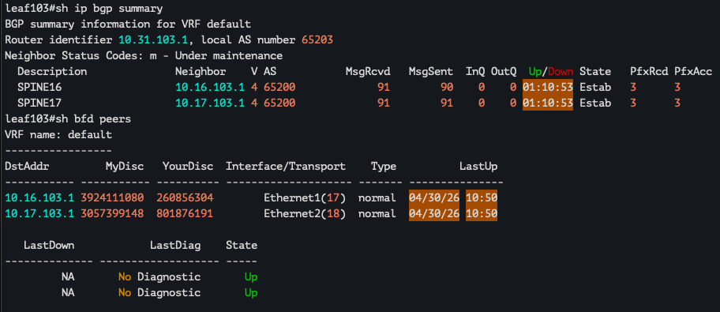

* RIB

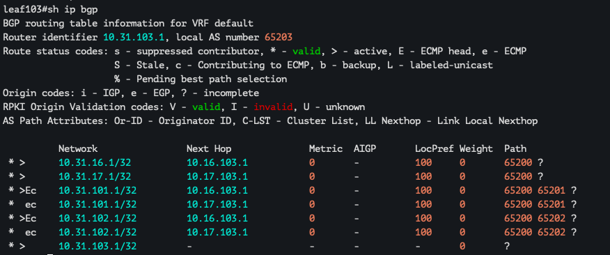

* Routes 

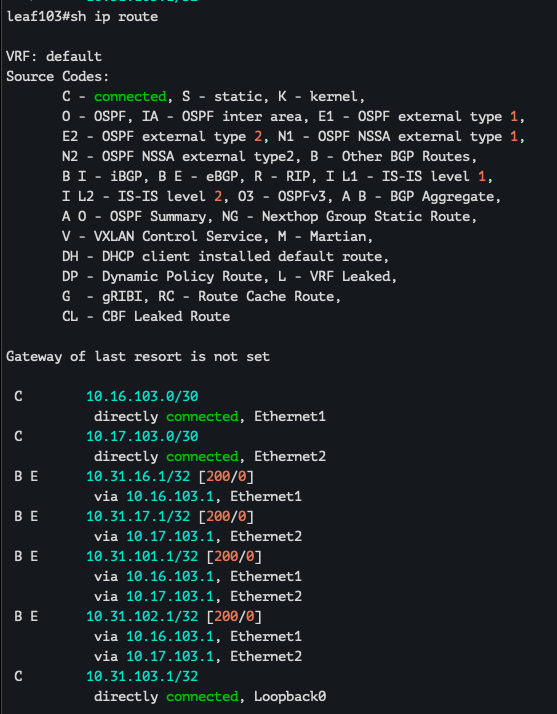

Проверки доступности уже приводились выше, дублировать смысла не вижу. 

# P.S. 

Специально не используем peer group и listen range для настроек, потому что это не совсем удобно в нашем случае, учитывая оборудование и дизайн выбора префиксов, поэтому все нейборы настроены руками, а не группами. 

В случае использования juniper'ов, можно было бы более точно настраивать peer group и указывать listen range более тонко, в нашем же случае для ptp используются сети вида 10.[16-17].[101-103].0/30, добавить несколько сетей мы не можем из-за особенностей архитектуры, а добавлять на listen 10.16.0.0/15 или вовсе более широкие как будто не совсем безопасно, опять же в рамках лаб не имеет разницы

В случае не лабораторных выбирались бы ptp сети из более удобного и рационального общего префикса, но выбор дизайна был сделан сильно заранее, поэтому выкручиваемся как можем. 