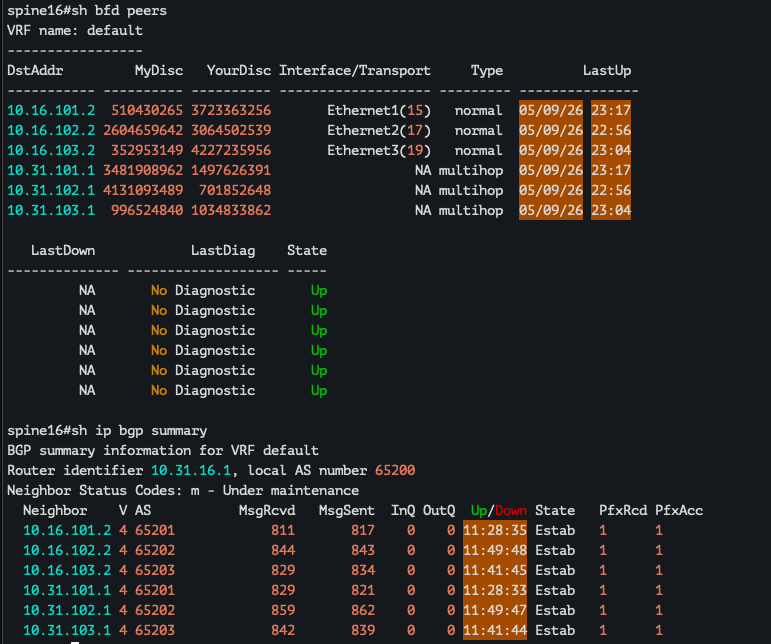
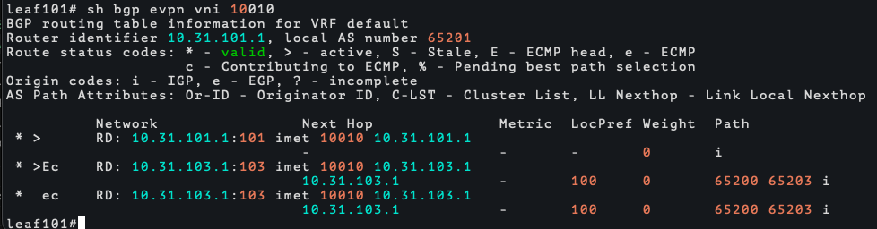
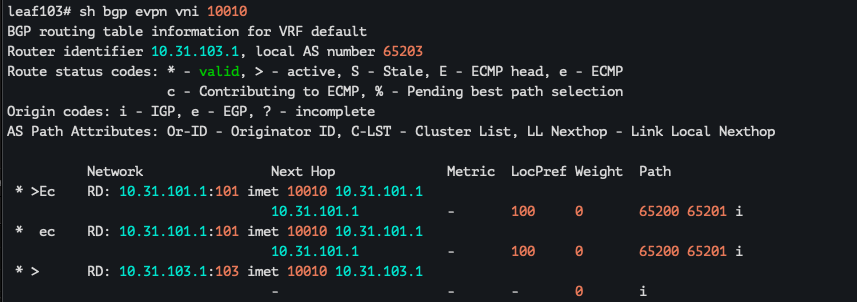
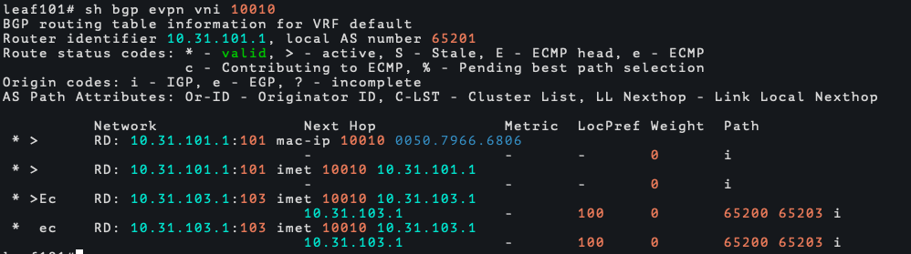
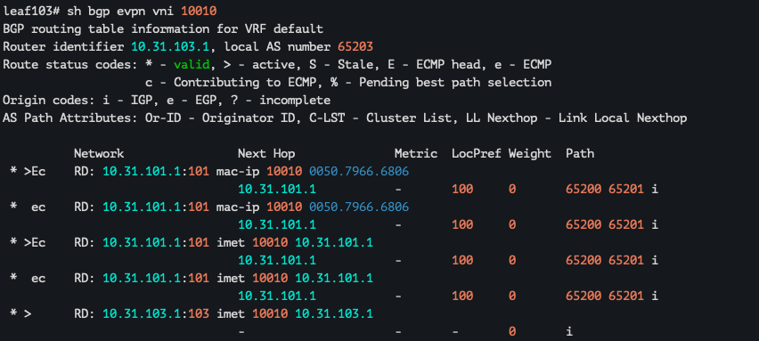
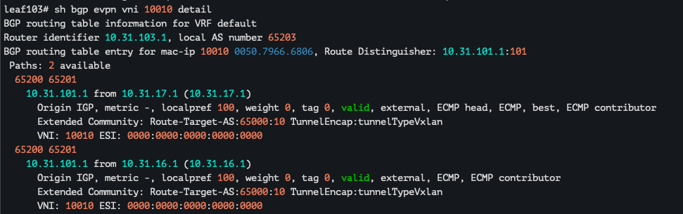
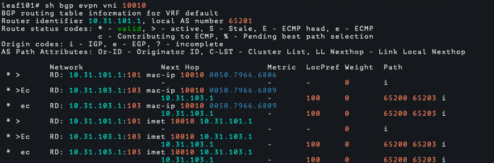
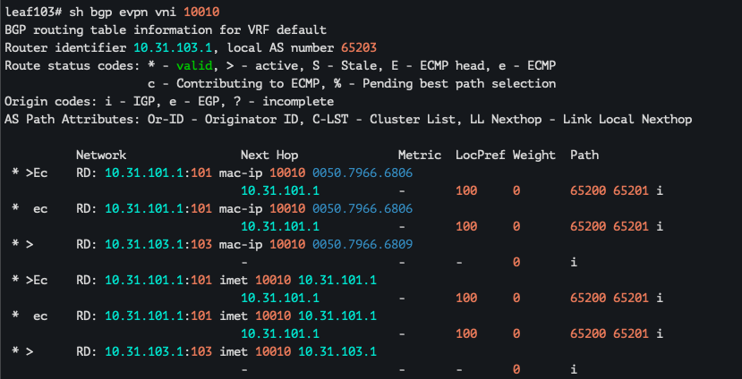

## VxLAN. L2 VNI

Цели : 
- Настроить BGP peering между Leaf и Spine в AF l2vpn evpn
- Настроить связанность между клиентами в первой зоне и убедиться в её наличии
- Зафиксировать в документации - план работы, адресное пространство, схему сети, конфигурацию устройств

### Выполнение:

#### Схема остается неизменной : 


#### Планирование : 

1. Создаем связность в AF l2vpn evpn
2. Настраиваем vxlan, биндим vlan в vxlan, используем только EVPN-VXLAN в режиме vlan-aware
3. Проверяем связность клиентов в пределах L2 домена

#### Обоснование: 

* Изначально планировалось использовать для лабы pure eBGP single protocol, поэтому просто добавляем новые пиры(lo интерфейсы устройств) в address family evpn 
* vxlan только EVPN, static/multicast исключены, потому что evpn имеет слишком много преимуществ, например автоматический поиск VTEP, лучшая масштабируемость, есть мак лёрнинг на уровне контрол плейна, минимизация BUM трафика
* VLAN based исключаем, тк каждый влан тратит EVI, имеет низкую гибкость, тк тратит много маршрутов в BGP, не сохраняет оригинальный VLAN ID 
* VLAN bundle так же исключаем, считается, что используется в очень редких случаях, например selective Q-in-Q, имеет ограничение на уровне технологии - все мак адреса во всех вланах должны быть уникальны, тк данная технология делает общую таблицу мак адресов, плохая реализация изоляции бродкаст трафика

### Конфигурация устройств : 

#### Spine16: 

```
peer-filter PF_AS_LEAF
   10 match as-range 65201-65205 result accept
!
peer-filter PF_AS_OVERLAY
   10 match as-range 65201-65205 result accept
!
router bgp 65200
   router-id 10.31.16.1
   maximum-paths 4 ecmp 4
   bgp listen range 10.16.101.0/30 peer-group LEAF peer-filter PF_AS_LEAF
   bgp listen range 10.16.102.0/30 peer-group LEAF peer-filter PF_AS_LEAF
   bgp listen range 10.16.103.0/30 peer-group LEAF peer-filter PF_AS_LEAF
   bgp listen range 10.31.101.1/32 peer-group OVERLAY peer-filter PF_AS_OVERLAY
   bgp listen range 10.31.102.1/32 peer-group OVERLAY peer-filter PF_AS_OVERLAY
   bgp listen range 10.31.103.1/32 peer-group OVERLAY peer-filter PF_AS_OVERLAY
   neighbor LEAF peer group
   neighbor LEAF bfd
   neighbor OVERLAY peer group
   neighbor OVERLAY update-source Loopback0
   neighbor OVERLAY bfd
   neighbor OVERLAY ebgp-multihop 2
   neighbor OVERLAY send-community extended
   !
   address-family evpn
      neighbor OVERLAY activate
      neighbor OVERLAY next-hop-unchanged
   !
   address-family ipv4
      neighbor LEAF activate
      redistribute connected route-map RED_L0
```

#### Spine17:

```
peer-filter PF_AS_LEAF
   10 match as-range 65201-65205 result accept
!
peer-filter PF_AS_OVERLAY
   10 match as-range 65201-65205 result accept
!
router bgp 65200
   router-id 10.31.17.1
   maximum-paths 4 ecmp 4
   bgp listen range 10.17.101.0/30 peer-group LEAF peer-filter PF_AS_LEAF
   bgp listen range 10.17.102.0/30 peer-group LEAF peer-filter PF_AS_LEAF
   bgp listen range 10.17.103.0/30 peer-group LEAF peer-filter PF_AS_LEAF
   bgp listen range 10.31.101.1/32 peer-group OVERLAY peer-filter PF_AS_OVERLAY
   bgp listen range 10.31.102.1/32 peer-group OVERLAY peer-filter PF_AS_OVERLAY
   bgp listen range 10.31.103.1/32 peer-group OVERLAY peer-filter PF_AS_OVERLAY
   neighbor LEAF peer group
   neighbor LEAF bfd
   neighbor OVERLAY peer group
   neighbor OVERLAY update-source Loopback0
   neighbor OVERLAY bfd
   neighbor OVERLAY ebgp-multihop 2
   neighbor OVERLAY send-community extended
   !
   address-family evpn
      neighbor OVERLAY activate
      neighbor OVERLAY next-hop-unchanged
   !
   address-family ipv4
      neighbor LEAF activate
      redistribute connected route-map RED_L0
!
```

#### Leaf101:

```
interface Ethernet6
   description client_vlan10
   switchport access vlan 10
!
interface Vxlan1
   vxlan source-interface Loopback0
   vxlan udp-port 4789
   vxlan vlan 10 vni 10010
!
peer-filter SPINE
   10 match as-range 65200 result accept
!
router bgp 65201
   router-id 10.31.101.1
   maximum-paths 4 ecmp 4
   neighbor OVERLAY peer group
   neighbor OVERLAY remote-as 65200
   neighbor OVERLAY update-source Loopback0
   neighbor OVERLAY bfd
   neighbor OVERLAY ebgp-multihop 2
   neighbor OVERLAY send-community extended
   neighbor SPINE peer group
   neighbor SPINE remote-as 65200
   neighbor SPINE bfd
   neighbor 10.16.101.1 peer group SPINE
   neighbor 10.17.101.1 peer group SPINE
   neighbor 10.31.16.1 peer group OVERLAY
   neighbor 10.31.17.1 peer group OVERLAY
   !
   vlan-aware-bundle VLAN-AWARE
      rd 10.31.101.1:101
      route-target both 65000:10
      redistribute learned
      vlan 10
   !
   address-family evpn
      neighbor OVERLAY activate
   !
   address-family ipv4
      neighbor SPINE activate
      redistribute connected route-map RED_L0
```

#### Leaf103:

```
interface Ethernet6
   switchport access vlan 10
!
interface Vxlan1
   vxlan source-interface Loopback0
   vxlan udp-port 4789
   vxlan vlan 10 vni 10010
!
router bgp 65203
   router-id 10.31.103.1
   maximum-paths 2 ecmp 4
   neighbor OVERLAY peer group
   neighbor OVERLAY remote-as 65200
   neighbor OVERLAY update-source Loopback0
   neighbor OVERLAY bfd
   neighbor OVERLAY ebgp-multihop 2
   neighbor OVERLAY send-community extended
   neighbor SNIPE peer group
   neighbor SPINE peer group
   neighbor SPINE remote-as 65200
   neighbor SPINE bfd
   neighbor 10.16.103.1 peer group SPINE
   neighbor 10.17.103.1 peer group SPINE
   neighbor 10.31.16.1 peer group OVERLAY
   neighbor 10.31.17.1 peer group OVERLAY
   !
   vlan-aware-bundle VLAN-AWARE
      rd 10.31.103.1:103
      route-target both 65000:10
      redistribute learned
      vlan 10
   !
   address-family evpn
      neighbor OVERLAY activate
   !
   address-family ipv4
      neighbor SPINE activate
      redistribute connected route-map RED_L0
!
```

* Тк в данной лабе используются только LEAF101 и LEAF103, то конфигурацию LEAF102 не привожу, он настроен идентично в контексте BGP overlay, остальных настроек на нем пока что нет

#### Client6_vlan10: 

```
show

NAME   IP/MASK              GATEWAY                             GATEWAY
VPCS1  172.16.0.6/24        0.0.0.0

```

#### Client9_vlan10:

```
show

NAME   IP/MASK              GATEWAY                             GATEWAY
VPCS1  172.16.0.9/24        0.0.0.0

```

### Проверка:

OVERLAY bgp пиры между лупбеками поднялись с BFD в multihop соседстве, добавлю только с одной строны, но на втором спайне ситуация аналогичная 



Arista сама понимает, что у нас используется multihop BFD и отдельная команда в данном случае не нужна 

Смотрим в наш VNI 

#### LEAF101: 



#### LEAF103:



Как видим на кажном есть 3 маршрута : 

1 это наш VTEP, и 2 маршрута в ECMP от удаленной стороны, маков на данном этапе нет, потому что не было бродкаст трафика. 
В л2 мак таблица маков так же нет, потому что они отвалились по agging time 

#### LEAF101: 

```
leaf101#sh mac address-table dynamic vlan 10
          Mac Address Table
------------------------------------------------------------------

Vlan    Mac Address       Type        Ports      Moves   Last Move
----    -----------       ----        -----      -----   ---------
Total Mac Addresses for this criterion: 0

          Multicast Mac Address Table
------------------------------------------------------------------

Vlan    Mac Address       Type        Ports
----    -----------       ----        -----
```

#### LEAF103:

```
leaf103#sh mac address-table dynamic vlan 10
          Mac Address Table
------------------------------------------------------------------

Vlan    Mac Address       Type        Ports      Moves   Last Move
----    -----------       ----        -----      -----   ---------
Total Mac Addresses for this criterion: 0

          Multicast Mac Address Table
------------------------------------------------------------------

Vlan    Mac Address       Type        Ports
----    -----------       ----        -----
Total Mac Addresses for this criterion: 0
```

Следовательно мы ничего не передаем в рамках VNI, тк нет изученных маков. 

Попробуем со стороны client6 пропинговать несуществующий хост : 

```
VPCS>
VPCS> ping 172.16.0.1

host (172.16.0.1) not reachable
```
На LEAF101 появляется мак в Л2 : 

```
leaf101#sh mac address-table dynamic vlan 10
          Mac Address Table
------------------------------------------------------------------

Vlan    Mac Address       Type        Ports      Moves   Last Move
----    -----------       ----        -----      -----   ---------
  10    0050.7966.6806    DYNAMIC     Et6        1       0:00:06 ago
Total Mac Addresses for this criterion: 1

          Multicast Mac Address Table
------------------------------------------------------------------

Vlan    Mac Address       Type        Ports
----    -----------       ----        -----
Total Mac Addresses for this criterion: 0
```
И он же появляется в таблице VNI 

Со стороны LEAF101 : 



Маршрут 1, потому что он пришел с VTEP, который на этом же устройстве

Со стороны LEAF103 : 



Видим, что маршрута 2, потому что приходит 2 путями через ECMP 



В Л2 мак таблице на LEAF103 :

```
leaf103#sh mac address-table dynamic vlan 10
          Mac Address Table
------------------------------------------------------------------

Vlan    Mac Address       Type        Ports      Moves   Last Move
----    -----------       ----        -----      -----   ---------
  10    0050.7966.6806    DYNAMIC     Vx1        1       0:01:56 ago
Total Mac Addresses for this criterion: 1

          Multicast Mac Address Table
------------------------------------------------------------------

Vlan    Mac Address       Type        Ports
----    -----------       ----        -----
Total Mac Addresses for this criterion: 0
```
Т.е. мак изучился по BGP и попал в л2 влан через VTEP VXLAN и порт с маком в контексте просмотра л2 мак таблицы указан наш VTEP - Vx1

Если повторить эксперимент с рассылкой бродкаст трафика, то ситуация будет зеркальной, предлагаю сразу проверять доступность в л2 между хостами : 

Хосты пингуются : 

```
VPCS>  ping 172.16.0.9

84 bytes from 172.16.0.9 icmp_seq=1 ttl=64 time=13.545 ms
84 bytes from 172.16.0.9 icmp_seq=2 ttl=64 time=8.155 ms
84 bytes from 172.16.0.9 icmp_seq=3 ttl=64 time=7.740 ms
84 bytes from 172.16.0.9 icmp_seq=4 ttl=64 time=7.979 ms
84 bytes from 172.16.0.9 icmp_seq=5 ttl=64 time=9.258 ms
```
Маки в AF evpn учатся с двух сторон 

#### LEAF101:



```
leaf101#sh mac address-table dynamic vlan 10
          Mac Address Table
------------------------------------------------------------------

Vlan    Mac Address       Type        Ports      Moves   Last Move
----    -----------       ----        -----      -----   ---------
  10    0050.7966.6806    DYNAMIC     Et6        1       0:05:08 ago
  10    0050.7966.6809    DYNAMIC     Vx1        1       0:01:34 ago
Total Mac Addresses for this criterion: 2

          Multicast Mac Address Table
------------------------------------------------------------------

Vlan    Mac Address       Type        Ports
----    -----------       ----        -----
Total Mac Addresses for this criterion: 0
```

#### LEAF103:



```
leaf103#sh mac address-table dynamic vlan 10
          Mac Address Table
------------------------------------------------------------------

Vlan    Mac Address       Type        Ports      Moves   Last Move
----    -----------       ----        -----      -----   ---------
  10    0050.7966.6806    DYNAMIC     Vx1        1       0:06:23 ago
  10    0050.7966.6809    DYNAMIC     Et6        1       0:02:50 ago
Total Mac Addresses for this criterion: 2

          Multicast Mac Address Table
------------------------------------------------------------------

Vlan    Mac Address       Type        Ports
----    -----------       ----        -----
Total Mac Addresses for this criterion: 0
```

Вопросы, возникшие во время/после лабы 
1. Для "overlay" ebgp сессий обязательно надо прописывать ebgp-multihop, но я не совсем понимаю, почему 2 хопов достаточно, в теории необходимо 3 : 1 хоп это, например leaf101 lo, второй хоп это ptp сетка и 3 - lo интерфейс на спайне.
2. Трафик так или иначе должен идти по ethenet портам, но почему-то я не вижу пакеты BGP для underlay, а дампить lo интерфейсы в лабе невозможно, поэтому покопаться в установлении "overlay" bgp пакетах из вопроса 1 не получилось, так же не видно условные пинги между конечныеми "клиентами" в дампе, есть решение в рамках моей схемы или это странное ограничение лабы ? Тк хосты работают - пакеты передаются, но где их ловить непонятно.
3. Вопрос про allowas-in, насколько я понимаю в моей схеме не нужен, за исключением реализации vPC(aka MC-LAG), тк vPC лифы должны быть в одной AS, но непонятна реализация этого peer-link'а, мы же не соединяем leaf напрямую, получается peer-link гоняем через spine ? 
4. Вопрос про best-path relax, так же в моей схеме не используется, потому что у меня SPINE в одной AS, т.е. маршруты уже имеют идентичные пути для ECMP, нужен только для схемы, где каждое устройство в собственной AS ? 

