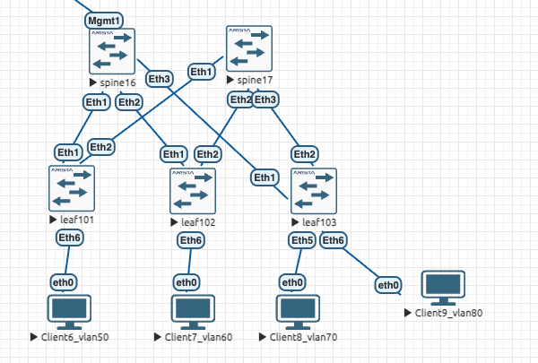
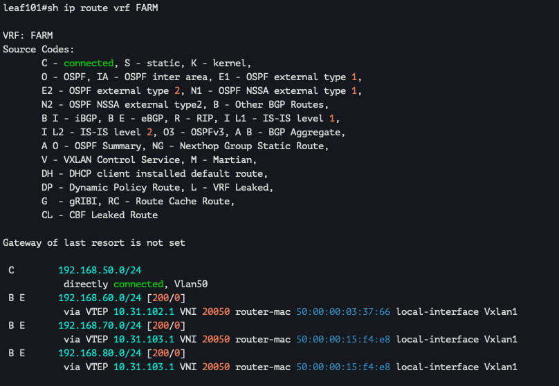
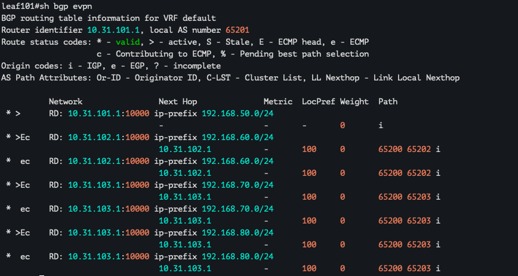
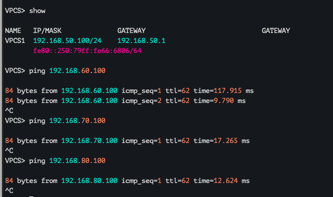
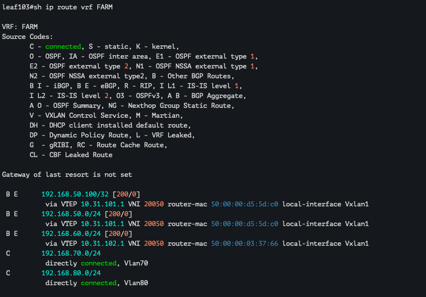
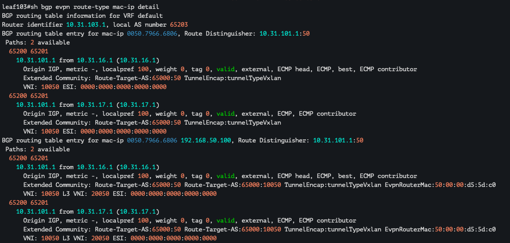

## VxLAN. L3 VNI

Цели : 
- настроить маршрутизацию в рамках Overlay между клиентами

### Выполнение:

#### Схему модернизировал, для соответствия заданию, сейчас каждый клиент в своем L3VNI : 



#### Планирование : 

1. Настроите каждого клиента в своем VNI
2. Настроите маршрутизацию между клиентами.
3. Зафиксируете в документации - план работы, адресное пространство, схему сети, конфигурацию устройств

* По факту underlay уже собран, работаем только с конфигурацией LEAF, поэтому настройки будут приведены только для них

#### LEAF101: 

```
vlan 50
!
vrf instance FARM
!
interface Ethernet6
   description Client6_vlan50
   switchport access vlan 50
!
interface Vlan50
   vrf FARM
   ip address virtual 192.168.50.1/24
!
interface Vxlan1
   vxlan source-interface Loopback0
   vxlan udp-port 4789
   vxlan vrf FARM vni 20050
!
ip virtual-router mac-address de:ad:be:ef:00:01
!
ip routing vrf FARM
!
router bgp 65201
   router-id 10.31.101.1
   maximum-paths 4 ecmp 4
   neighbor OVERLAY peer group
   neighbor OVERLAY remote-as 65200
   neighbor OVERLAY update-source Loopback0
   neighbor OVERLAY bfd
   neighbor OVERLAY ebgp-multihop 2
   neighbor OVERLAY send-community extended
   neighbor SPINE peer group
   neighbor SPINE remote-as 65200
   neighbor SPINE bfd
   neighbor 10.16.101.1 peer group SPINE
   neighbor 10.17.101.1 peer group SPINE
   neighbor 10.31.16.1 peer group OVERLAY
   neighbor 10.31.17.1 peer group OVERLAY
   !
   address-family evpn
      neighbor OVERLAY activate
   !
   address-family ipv4
      neighbor SPINE activate
      redistribute connected route-map RED_L0
   !
   vrf FARM
      rd 10.31.101.1:10000
      route-target import evpn 65000:10050
      route-target export evpn 65000:10050
      redistribute connected
```

#### LEAF102: 

```
vlan 60
!
vrf instance FARM
!
interface Ethernet6
   description Client7_vlan60
   switchport access vlan 60
!
interface Vlan60
   vrf FARM
   ip address virtual 192.168.60.1/24
!
interface Vxlan1
   vxlan source-interface Loopback0
   vxlan udp-port 4789
   vxlan vrf FARM vni 20050
!
ip virtual-router mac-address de:ad:be:ef:00:01
!
ip routing vrf FARM
!
router bgp 65202
   router-id 10.31.102.1
   maximum-paths 4 ecmp 4
   neighbor OVERLAY peer group
   neighbor OVERLAY remote-as 65200
   neighbor OVERLAY update-source Loopback0
   neighbor OVERLAY bfd
   neighbor OVERLAY ebgp-multihop 2
   neighbor OVERLAY send-community extended
   neighbor SPINE peer group
   neighbor SPINE remote-as 65200
   neighbor SPINE bfd
   neighbor 10.16.102.1 peer group SPINE
   neighbor 10.17.102.1 peer group SPINE
   neighbor 10.31.16.1 peer group OVERLAY
   neighbor 10.31.17.1 peer group OVERLAY
   !
   address-family evpn
      neighbor OVERLAY activate
   !
   address-family ipv4
      neighbor SPINE activate
      redistribute connected route-map RED_L0
   !
   vrf FARM
      rd 10.31.102.1:10000
      route-target import evpn 65000:10050
      route-target export evpn 65000:10050
      redistribute connected
!
```

#### LEAF103: 

```
vlan 70,80
!
vrf instance FARM
!
interface Ethernet5
   description Client8_vlan70
   switchport access vlan 70
!
interface Ethernet6
   description Cient9_vlan80
   switchport access vlan 80
!
interface Vlan70
   vrf FARM
   ip address virtual 192.168.70.1/24
!
interface Vlan80
   vrf FARM
   ip address virtual 192.168.80.1/24
!
interface Vxlan1
   vxlan source-interface Loopback0
   vxlan udp-port 4789
   vxlan vrf FARM vni 20050
!
ip virtual-router mac-address de:ad:be:ef:00:01
!
ip routing vrf FARM
!
router bgp 65203
   router-id 10.31.103.1
   maximum-paths 2 ecmp 4
   neighbor OVERLAY peer group
   neighbor OVERLAY remote-as 65200
   neighbor OVERLAY update-source Loopback0
   neighbor OVERLAY bfd
   neighbor OVERLAY ebgp-multihop 2
   neighbor OVERLAY send-community extended
   neighbor SNIPE peer group
   neighbor SPINE peer group
   neighbor SPINE remote-as 65200
   neighbor SPINE bfd
   neighbor 10.16.103.1 peer group SPINE
   neighbor 10.17.103.1 peer group SPINE
   neighbor 10.31.16.1 peer group OVERLAY
   neighbor 10.31.17.1 peer group OVERLAY
   !
   address-family evpn
      neighbor OVERLAY activate
   !
   address-family ipv4
      neighbor SPINE activate
      redistribute connected route-map RED_L0
   !
   vrf FARM
      rd 10.31.103.1:10000
      route-target import evpn 65000:10050
      route-target export evpn 65000:10050
      redistribute connected
!

```

#### Все клиенты в своем Л3 :

|Device|IP Address|GW
|---|---|---
Client6_vlan50|192.168.50.100/24|192.168.50.1
Client7_vlan60|192.168.60.100/24|192.168.60.1
Client8_vlan70|192.168.70.100/24|192.168.70.1
Client9_vlan80|192.168.80.100/24|192.168.80.1
LEAF101_IfVlan50|192.168.50.1/24|
LEAF102_IfVlan60|192.168.60.1/24|
LEAF103_IfVlan70|192.168.70.1/24|
LEAF103_IfVlan80|192.168.80.1/24|

#### Проверка : 

В целом в данной ситуации можно проверить только роуты в vrf и bgp evpn, тк мы удалили все привязки vlan, то передавать будем только vrf инстанс, а там мы редистрибутим коннектед роуты \24, очень похоже на MPLS VRF, но вместо MPLS метки видим VTEP и VNI анонсирующего LEAF





Для успокоения проверяем пинг со стороны клиента до других клиентов : 



### По факту все условия ДЗ выполнены, таблицы маршрутизации как в FIB (условно ip route можно считать отображением FIB), так и в RIB удобно читаются глазами. Однако такая схема применима в основном в лабораторных условиях. В реальных сценариях зачастую требуется использование L2VNI + L3VNI, поэтому дополнительно вводится редистрибуция VLAN’ов.

Добавляем вланы в vxlan и router bgp 

#### LEAF101:

```
interface Vxlan1
   vxlan source-interface Loopback0
   vxlan udp-port 4789
   vxlan vlan 50 vni 10050
   vxlan vrf FARM vni 20050
!
router bgp 65201
   vlan 50
      rd 10.31.101.1:50
      route-target both 65000:50
      redistribute learned
```

После пинга, лернинга и анонса 

У нас появляется more specific /32 маршрут до конкретного ip адреса 



А так же добавляется mac-ip


