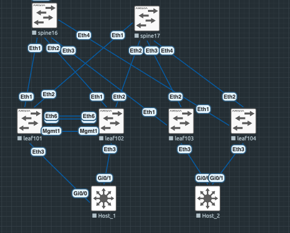
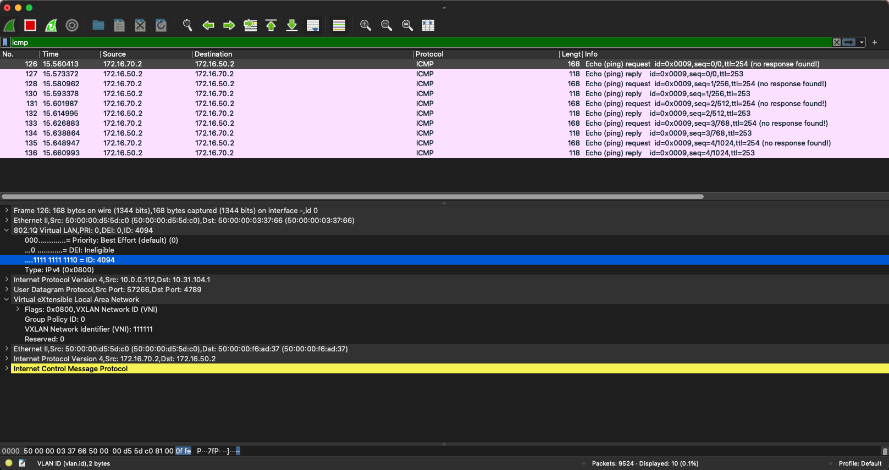
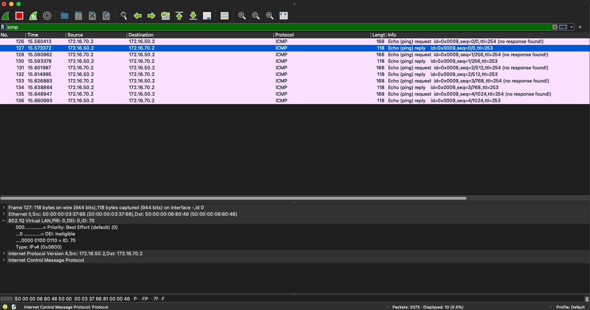

# VPC, EVPN Multihoming

Цели : 

- Подключить клиентов 2-я линками к различным Leaf
- Настроить агрегированный канал со стороны клиента
- Настроить multihoming для работы в Overlay сети
- Зафиксировать в документации - план работы, адресное пространство, схему сети, конфигурацию устройств
- * Опционально - протестировать отказоустойчивость - убедиться, что связность не теряется при отключении одного из линков

### Выполнение:

Будем использовать как VPC, так и EVPN multihoming, для понимания разницы настройки и видов маршрутов

#### Схема модернизируется под задачу :

Добавляется LEAF, убираются virtual PC и добавляются 2 коммутатора для LACP вместо virtual PC. 



#### Планирование : 

1. Собираем VPC между leaf101 и leaf102. Peer-link через LACP + keepalive линк на MGMT портах в vrf MLAG(тк заканчиваются "физические" порты), настраиваем shared lo ip адрес, который будет source update для VTEP 
2. Собираем LACP между host1 и leaf101, leaf102 
3. Настраиваем конфигурацию на leaf103 и leaf104 для multihoming LACP 
4. Собираем LACP между host2 и leaf103, leaf104 
5. Проверяем связность между клиентами
- *  Тушим линки и/или вовсе выключаем один из LEAF'ов


### Конфигурация устройств : 


<details>
<summary> Leaf101.conf </summary>


```
hostname leaf101
!
spanning-tree mode mstp
no spanning-tree vlan-id 4094
!
vlan 70
!
vlan 4094
   name PeerLink
   trunk group PeerLink
!
vrf instance FARM
!
vrf instance MLAG
!
interface Port-Channel33
   description Host_1_Po1
   switchport trunk allowed vlan 70
   switchport mode trunk
   mlag 1
!
interface Port-Channel56
   description PeerLink_Leaf102_Po56
   switchport mode trunk
   switchport trunk group MLAG-PEERLINK
   switchport trunk group PeerLink
   spanning-tree link-type point-to-point
!
interface Ethernet1
   description spine16
   no switchport
   ip address 10.16.101.2/30
   bfd interval 100 min-rx 100 multiplier 3
!
interface Ethernet2
   description spine17
   no switchport
   ip address 10.17.101.2/30
   bfd interval 100 min-rx 100 multiplier 3
!
interface Ethernet3
   description Host_1_Po1_Gi0/0
   switchport trunk allowed vlan 70
   switchport mode trunk
   channel-group 33 mode active
!
interface Ethernet5
   description PeerLink_Leaf102_Po56_E5
   channel-group 56 mode active
!
interface Ethernet6
   description PeerLink_Leaf102_Po56_E6
   channel-group 56 mode active
!
interface Loopback0
   ip address 10.31.101.1/32
!
interface Loopback1
   description MLAG_VXLAN_VTEP
   ip address 10.0.0.112/32
!
interface Management1
   vrf MLAG
   ip address 192.168.0.1/30
!
interface Vlan50
   vrf FARM
   ip address virtual 192.168.50.1/24
!
interface Vlan70
   vrf FARM
   ip address 172.16.70.251/24
   ip virtual-router address 172.16.70.1/24
!
interface Vlan4094
   ip address 192.168.0.5/30
!
interface Vxlan1
   vxlan source-interface Loopback1
   vxlan udp-port 4789
   vxlan vlan 70 vni 100070
   vxlan vrf FARM vni 111111
   vxlan learn-restrict any
!
ip virtual-router mac-address de:ad:be:ef:00:01
!
ip routing
ip routing vrf FARM
ip routing vrf MLAG
!
mlag configuration
   domain-id Leaf101-Leaf102
   local-interface Vlan4094
   peer-address 192.168.0.6
   peer-address heartbeat 192.168.0.2 vrf MLAG
   peer-link Port-Channel56
   dual-primary detection delay 1 action errdisable all-interfaces
!
route-map RED_L0 permit 10
   match interface Loopback0
   set origin incomplete
!
route-map RED_L0 permit 20
   match interface Loopback1
   set origin incomplete
!
peer-filter SPINE
   10 match as-range 65200 result accept
!
router bgp 65201
   router-id 10.31.101.1
   maximum-paths 4 ecmp 4
   neighbor MLAG peer group
   neighbor MLAG remote-as 65201
   neighbor MLAG next-hop-self
   neighbor MLAG bfd
   neighbor OVERLAY peer group
   neighbor OVERLAY remote-as 65200
   neighbor OVERLAY update-source Loopback0
   neighbor OVERLAY bfd
   neighbor OVERLAY ebgp-multihop 2
   neighbor OVERLAY send-community extended
   neighbor SPINE peer group
   neighbor SPINE remote-as 65200
   neighbor SPINE bfd
   neighbor 10.16.101.1 peer group SPINE
   neighbor 10.17.101.1 peer group SPINE
   neighbor 10.31.16.1 peer group OVERLAY
   neighbor 10.31.17.1 peer group OVERLAY
   neighbor 192.168.0.6 peer group MLAG
   !
   vlan 70
      rd 10.31.101.1:70
      route-target both 65000:70
      redistribute learned
   !
   address-family evpn
      neighbor OVERLAY activate
   !
   address-family ipv4
      neighbor MLAG activate
      neighbor SPINE activate
      redistribute connected route-map RED_L0
   !
   vrf FARM
      rd 10.31.101.1:10000
      route-target import evpn 65000:10050
      route-target export evpn 65000:10050
      redistribute connected
!
```

</details>

<details>
<summary> Leaf102.conf </summary>

```
hostname leaf102
!
spanning-tree mode mstp
no spanning-tree vlan-id 4094
!
vlan 70
!
vlan 4094
   name PeerLink
   trunk group PeerLink
!
vrf instance FARM
!

vrf instance MLAG
!
interface Port-Channel33
   description Host_1_Po1
   switchport trunk allowed vlan 70
   switchport mode trunk
   mlag 1
!
interface Port-Channel56
   description PeerLink_Leaf101_Po56
   switchport mode trunk
   switchport trunk group MLAG-PEERLINK
   switchport trunk group PeerLink
   spanning-tree link-type point-to-point
!
interface Ethernet1
   description spine16
   no switchport
   ip address 10.16.102.2/30
!
interface Ethernet2
   description spine17
   no switchport
   ip address 10.17.102.2/30
!
interface Ethernet3
   description Host_1_Po1_Gi0/1
   switchport trunk allowed vlan 70
   switchport mode trunk
   channel-group 33 mode active
!
!
interface Ethernet5
   description PeerLink_Leaf101_Po56_E5
   channel-group 56 mode active
!
interface Ethernet6
   description PeerLink_Leaf101_Po56_E6
   channel-group 56 mode active
!
interface Loopback0
   ip address 10.31.102.1/32
!
interface Loopback1
   description MLAG_VXLAN_VTEP
   ip address 10.0.0.112/32
!
interface Management1
   vrf MLAG
   ip address 192.168.0.2/30
!
interface Vlan70
   vrf FARM
   ip address 172.16.70.252/24
   ip virtual-router address 172.16.70.1/24
!
interface Vlan4094
   ip address 192.168.0.6/30
!
interface Vxlan1
   vxlan source-interface Loopback1
   vxlan udp-port 4789
   vxlan vlan 70 vni 100070
   vxlan vrf FARM vni 111111
   vxlan learn-restrict any
!
ip virtual-router mac-address de:ad:be:ef:00:01
!
ip routing
ip routing vrf FARM
ip routing vrf MLAG
!
mlag configuration
   domain-id Leaf101-Leaf102
   local-interface Vlan4094
   peer-address 192.168.0.5
   peer-address heartbeat 192.168.0.1 vrf MLAG
   peer-link Port-Channel56
   dual-primary detection delay 1 action errdisable all-interfaces
!
route-map RED_L0 permit 10
   match interface Loopback0
   set origin incomplete
!
route-map RED_L0 permit 20
   match interface Loopback1
   set origin incomplete
!
router bgp 65201
   router-id 10.31.102.1
   maximum-paths 4 ecmp 4
   neighbor MLAG peer group
   neighbor MLAG remote-as 65201
   neighbor MLAG next-hop-self
   neighbor MLAG bfd
   neighbor OVERLAY peer group
   neighbor OVERLAY remote-as 65200
   neighbor OVERLAY update-source Loopback0
   neighbor OVERLAY bfd
   neighbor OVERLAY ebgp-multihop 2
   neighbor OVERLAY send-community extended
   neighbor SPINE peer group
   neighbor SPINE remote-as 65200
   neighbor SPINE bfd
   neighbor 10.16.102.1 peer group SPINE
   neighbor 10.17.102.1 peer group SPINE
   neighbor 10.31.16.1 peer group OVERLAY
   neighbor 10.31.17.1 peer group OVERLAY
   neighbor 192.168.0.5 peer group MLAG
   !
   vlan 70
      rd 10.31.102.1:70
      route-target both 65000:70
      redistribute learned
   !
   address-family evpn
      neighbor OVERLAY activate
   !
   address-family ipv4
      neighbor MLAG activate
      neighbor SPINE activate
      redistribute connected route-map RED_L0
   !
   vrf FARM
      rd 10.31.102.1:10000
      route-target import evpn 65000:10050
      route-target export evpn 65000:10050
      redistribute connected
!

```
</details>

<details>
<summary> Проверка настроек со стороны Leaf101+Leaf102 </summary>

#### MLAG со стороны Leaf101

```
leaf101#sh mlag
MLAG Configuration:
domain-id                          :     Leaf101-Leaf102
local-interface                    :            Vlan4094
peer-address                       :         192.168.0.6
peer-link                          :      Port-Channel56
hb-peer-address                    :         192.168.0.2
hb-peer-vrf                        :                MLAG
peer-config                        :          consistent

MLAG Status:
state                              :              Active
negotiation status                 :           Connected
peer-link status                   :                  Up
local-int status                   :                  Up
system-id                          :   52:00:00:03:37:66
dual-primary detection             :          Configured
dual-primary interface errdisabled :               False

MLAG Ports:
Disabled                           :                   0
Configured                         :                   0
Inactive                           :                   0
Active-partial                     :                   0
Active-full                        :                   1

MLAG Detailed Status:
State                                :            secondary
Peer State                           :              primary

```

#### MLAG со стороны Leaf102 

```
leaf102#sh mlag detail
MLAG Configuration:
domain-id                          :     Leaf101-Leaf102
local-interface                    :            Vlan4094
peer-address                       :         192.168.0.5
peer-link                          :      Port-Channel56
hb-peer-address                    :         192.168.0.1
hb-peer-vrf                        :                MLAG
peer-config                        :          consistent

MLAG Status:
state                              :              Active
negotiation status                 :           Connected
peer-link status                   :                  Up
local-int status                   :                  Up
system-id                          :   52:00:00:03:37:66
dual-primary detection             :          Configured
dual-primary interface errdisabled :               False

MLAG Ports:
Disabled                           :                   0
Configured                         :                   0
Inactive                           :                   0
Active-partial                     :                   0
Active-full                        :                   1

MLAG Detailed Status:
State                                :               primary
Peer State                           :             secondary
```
Как видим MLAG собрался 

#### iBGP 

```
leaf101#sh ip bgp neighbors 192.168.0.6 advertised-routes
BGP routing table information for VRF default
Router identifier 10.31.101.1, local AS number 65201
Route status codes: s - suppressed contributor, * - valid, > - active, E - ECMP head, e - ECMP
                    S - Stale, c - Contributing to ECMP, b - backup, L - labeled-unicast, q - Queued for advertisement
                    % - Pending best path selection
Origin codes: i - IGP, e - EGP, ? - incomplete
RPKI Origin Validation codes: V - valid, I - invalid, U - unknown
AS Path Attributes: Or-ID - Originator ID, C-LST - Cluster List, LL Nexthop - Link Local Nexthop

          Network                Next Hop              Metric  AIGP       LocPref Weight  Path
 * >      10.0.0.112/32          192.168.0.5           -       -          100     -       ?
 * >      10.31.16.1/32          192.168.0.5           -       -          100     -       65200 ?
 * >      10.31.17.1/32          192.168.0.5           -       -          100     -       65200 ?
 * >      10.31.101.1/32         192.168.0.5           -       -          100     -       ?
 * >Ec    10.31.103.1/32         192.168.0.5           -       -          100     -       65200 65203 ?
 * >Ec    10.31.104.1/32         192.168.0.5           -       -          100     -       65200 65204 ?
leaf101#sh ip bgp neighbors 192.168.0.6 received-routes
BGP routing table information for VRF default
Router identifier 10.31.101.1, local AS number 65201
Route status codes: s - suppressed contributor, * - valid, > - active, E - ECMP head, e - ECMP
                    S - Stale, c - Contributing to ECMP, b - backup, L - labeled-unicast
                    % - Pending best path selection
Origin codes: i - IGP, e - EGP, ? - incomplete
RPKI Origin Validation codes: V - valid, I - invalid, U - unknown
AS Path Attributes: Or-ID - Originator ID, C-LST - Cluster List, LL Nexthop - Link Local Nexthop

          Network                Next Hop              Metric  AIGP       LocPref Weight  Path
 *        10.0.0.112/32          192.168.0.6           -       -          100     -       ?
 *        10.31.16.1/32          192.168.0.6           -       -          100     -       65200 ?
 *        10.31.17.1/32          192.168.0.6           -       -          100     -       65200 ?
 * >      10.31.102.1/32         192.168.0.6           -       -          100     -       ?
 *        10.31.103.1/32         192.168.0.6           -       -          100     -       65200 65203 ?
 *        10.31.104.1/32         192.168.0.6           -       -          100     -       65200 65204 ?
```
Для примера возьмем lo Leaf103 

```
leaf101#sh ip bgp 10.31.103.1/32
BGP routing table information for VRF default
Router identifier 10.31.101.1, local AS number 65201
BGP routing table entry for 10.31.103.1/32
 Paths: 5 available
  65200 65203
    10.17.101.1 from 10.17.101.1 (10.31.17.1)
      Origin INCOMPLETE, metric 0, localpref 100, IGP metric 0, weight 0, tag 0
      Received 23:08:08 ago, valid, external, ECMP head, ECMP, best, ECMP contributor
      Rx SAFI: Unicast
  65200 65203
    10.16.101.1 from 10.16.101.1 (10.31.16.1)
      Origin INCOMPLETE, metric 0, localpref 100, IGP metric 0, weight 0, tag 0
      Received 03:36:13 ago, valid, external, ECMP, ECMP contributor
      Rx SAFI: Unicast
  65200 65203
    10.31.17.1 from 10.31.17.1 (10.31.17.1)
      Origin INCOMPLETE, metric 0, localpref 100, IGP metric 0, weight 0, tag 0
      Received 23:11:57 ago, valid, external, ECMP head, ECMP
      Rx SAFI: Unicast
  65200 65203
    10.31.16.1 from 10.31.16.1 (10.31.16.1)
      Origin INCOMPLETE, metric 0, localpref 100, IGP metric 0, weight 0, tag 0
      Received 03:36:13 ago, valid, external, ECMP
      Rx SAFI: Unicast
  65200 65203
    192.168.0.6 from 192.168.0.6 (10.31.102.1)
      Origin INCOMPLETE, metric 0, localpref 100, IGP metric 0, weight 0, tag 0
      Received 23:11:59 ago, valid, internal
      Rx SAFI: Unicast
```
С маршрутам тоже все ок 

#### LACP 

#### Leaf101 :

```
leaf101#sh port-channel detailed
Port Channel Port-Channel33 (Fallback State: Unconfigured):
Minimum links: unconfigured
Minimum speed: unconfigured
Current weight/Max weight: 1/16
  Active Ports:
     Port            Time Became Active   Protocol   Mode      Weight   State
    --------------- -------------------- ---------- --------- --------- -------
     Ethernet3       Thu 23:17:03         LACP       Active      1      Rx,Tx
     PeerEthernet3   Thu 23:02:07         LACP       Active      0      Unknown

```

#### Leaf102: 

```
leaf102#sh port-channel detailed
Port Channel Port-Channel33 (Fallback State: Unconfigured):
Minimum links: unconfigured
Minimum speed: unconfigured
Current weight/Max weight: 1/16
  Active Ports:
     Port            Time Became Active   Protocol   Mode      Weight   State
    --------------- -------------------- ---------- --------- --------- -------
     Ethernet3       Thu 23:02:07         LACP       Active      1      Rx,Tx
     PeerEthernet3   Thu 23:17:03         LACP       Active      0      Unknown

Port Channel Port-Channel56 (Fallback State: Unconfigured):

```

Вот тут не совсем удобно, потому что мы не знаем статус порта у vpc соседа 

Проверяем, что для дальних лифов передаются данные от vPC пары 

```
leaf104#sh bgp evpn route-type imet detail
BGP routing table information for VRF default
Router identifier 10.31.104.1, local AS number 65204
BGP routing table entry for imet 10.0.0.112, Route Distinguisher: 10.31.101.1:70
 Paths: 2 available
  65200 65201
    10.0.0.112 from 10.31.16.1 (10.31.16.1)
      Origin IGP, metric -, localpref 100, weight 0, tag 0, valid, external, ECMP head, ECMP, best, ECMP contributor
      Extended Community: Route-Target-AS:65000:70 TunnelEncap:tunnelTypeVxlan
      VNI: 100070
      PMSI Tunnel: Ingress Replication, MPLS Label: 100070, Leaf Information Required: false, Tunnel ID: 10.0.0.112
  65200 65201
    10.0.0.112 from 10.31.17.1 (10.31.17.1)
      Origin IGP, metric -, localpref 100, weight 0, tag 0, valid, external, ECMP, ECMP contributor
      Extended Community: Route-Target-AS:65000:70 TunnelEncap:tunnelTypeVxlan
      VNI: 100070
      PMSI Tunnel: Ingress Replication, MPLS Label: 100070, Leaf Information Required: false, Tunnel ID: 10.0.0.112
BGP routing table entry for imet 10.0.0.112, Route Distinguisher: 10.31.102.1:70
 Paths: 2 available
  65200 65201
    10.0.0.112 from 10.31.17.1 (10.31.17.1)
      Origin IGP, metric -, localpref 100, weight 0, tag 0, valid, external, ECMP head, ECMP, best, ECMP contributor
      Extended Community: Route-Target-AS:65000:70 TunnelEncap:tunnelTypeVxlan
      VNI: 100070
      PMSI Tunnel: Ingress Replication, MPLS Label: 100070, Leaf Information Required: false, Tunnel ID: 10.0.0.112
  65200 65201
    10.0.0.112 from 10.31.16.1 (10.31.16.1)
      Origin IGP, metric -, localpref 100, weight 0, tag 0, valid, external, ECMP, ECMP contributor
      Extended Community: Route-Target-AS:65000:70 TunnelEncap:tunnelTypeVxlan
      VNI: 100070
      PMSI Tunnel: Ingress Replication, MPLS Label: 100070, Leaf Information Required: false, Tunnel ID: 10.0.0.112
```

В type 3 маршрутах видим, что маршрут существует в 4 экземплярах, у всех одинаковый VTEP, но разные пути через разные спайны + разные RD

Проверим type 2 

```
leaf104#sh bgp evpn route-type mac-ip
BGP routing table information for VRF default
Router identifier 10.31.104.1, local AS number 65204
Route status codes: * - valid, > - active, S - Stale, E - ECMP head, e - ECMP
                    c - Contributing to ECMP, % - Pending best path selection
Origin codes: i - IGP, e - EGP, ? - incomplete
AS Path Attributes: Or-ID - Originator ID, C-LST - Cluster List, LL Nexthop - Link Local Nexthop

          Network                Next Hop              Metric  LocPref Weight  Path
 * >Ec    RD: 10.31.101.1:70 mac-ip 5000.0006.8046
                                 10.0.0.112            -       100     0       65200 65201 i
 *  ec    RD: 10.31.101.1:70 mac-ip 5000.0006.8046
                                 10.0.0.112            -       100     0       65200 65201 i
 * >Ec    RD: 10.31.102.1:70 mac-ip 5000.0006.8046
                                 10.0.0.112            -       100     0       65200 65201 i
 *  ec    RD: 10.31.102.1:70 mac-ip 5000.0006.8046
                                 10.0.0.112            -       100     0       65200 65201 i
 * >Ec    RD: 10.31.101.1:70 mac-ip 5000.0006.8046 172.16.70.2
                                 10.0.0.112            -       100     0       65200 65201 i
 *  ec    RD: 10.31.101.1:70 mac-ip 5000.0006.8046 172.16.70.2
                                 10.0.0.112            -       100     0       65200 65201 i
 * >Ec    RD: 10.31.102.1:70 mac-ip 5000.0006.8046 172.16.70.2
                                 10.0.0.112            -       100     0       65200 65201 i
 *  ec    RD: 10.31.102.1:70 mac-ip 5000.0006.8046 172.16.70.2
                                 10.0.0.112            -       100     0       65200 65201 i

```

```
leaf104#sh bgp evpn route-type mac-ip detail
BGP routing table information for VRF default
Router identifier 10.31.104.1, local AS number 65204
BGP routing table entry for mac-ip 5000.0006.8046, Route Distinguisher: 10.31.101.1:70
 Paths: 2 available
  65200 65201
    10.0.0.112 from 10.31.17.1 (10.31.17.1)
      Origin IGP, metric -, localpref 100, weight 0, tag 0, valid, external, ECMP head, ECMP, best, ECMP contributor
      Extended Community: Route-Target-AS:65000:70 TunnelEncap:tunnelTypeVxlan
      VNI: 100070 ESI: 0000:0000:0000:0000:0000
  65200 65201
    10.0.0.112 from 10.31.16.1 (10.31.16.1)
      Origin IGP, metric -, localpref 100, weight 0, tag 0, valid, external, ECMP, ECMP contributor
      Extended Community: Route-Target-AS:65000:70 TunnelEncap:tunnelTypeVxlan
      VNI: 100070 ESI: 0000:0000:0000:0000:0000
BGP routing table entry for mac-ip 5000.0006.8046, Route Distinguisher: 10.31.102.1:70
 Paths: 2 available
  65200 65201
    10.0.0.112 from 10.31.16.1 (10.31.16.1)
      Origin IGP, metric -, localpref 100, weight 0, tag 0, valid, external, ECMP head, ECMP, best, ECMP contributor
      Extended Community: Route-Target-AS:65000:70 TunnelEncap:tunnelTypeVxlan
      VNI: 100070 ESI: 0000:0000:0000:0000:0000
  65200 65201
    10.0.0.112 from 10.31.17.1 (10.31.17.1)
      Origin IGP, metric -, localpref 100, weight 0, tag 0, valid, external, ECMP, ECMP contributor
      Extended Community: Route-Target-AS:65000:70 TunnelEncap:tunnelTypeVxlan
      VNI: 100070 ESI: 0000:0000:0000:0000:0000
BGP routing table entry for mac-ip 5000.0006.8046 172.16.70.2, Route Distinguisher: 10.31.101.1:70
 Paths: 2 available
  65200 65201
    10.0.0.112 from 10.31.17.1 (10.31.17.1)
      Origin IGP, metric -, localpref 100, weight 0, tag 0, valid, external, ECMP head, ECMP, best, ECMP contributor
      Extended Community: Route-Target-AS:65000:70 Route-Target-AS:65000:10050 TunnelEncap:tunnelTypeVxlan EvpnRouterMac:50:00:00:d5:5d:c0
      VNI: 100070 L3 VNI: 111111 ESI: 0000:0000:0000:0000:0000
  65200 65201
    10.0.0.112 from 10.31.16.1 (10.31.16.1)
      Origin IGP, metric -, localpref 100, weight 0, tag 0, valid, external, ECMP, ECMP contributor
      Extended Community: Route-Target-AS:65000:70 Route-Target-AS:65000:10050 TunnelEncap:tunnelTypeVxlan EvpnRouterMac:50:00:00:d5:5d:c0
      VNI: 100070 L3 VNI: 111111 ESI: 0000:0000:0000:0000:0000
BGP routing table entry for mac-ip 5000.0006.8046 172.16.70.2, Route Distinguisher: 10.31.102.1:70
 Paths: 2 available
  65200 65201
    10.0.0.112 from 10.31.17.1 (10.31.17.1)
      Origin IGP, metric -, localpref 100, weight 0, tag 0, valid, external, ECMP head, ECMP, best, ECMP contributor
      Extended Community: Route-Target-AS:65000:70 Route-Target-AS:65000:10050 TunnelEncap:tunnelTypeVxlan EvpnRouterMac:50:00:00:03:37:66
      VNI: 100070 L3 VNI: 111111 ESI: 0000:0000:0000:0000:0000
  65200 65201
    10.0.0.112 from 10.31.16.1 (10.31.16.1)
      Origin IGP, metric -, localpref 100, weight 0, tag 0, valid, external, ECMP, ECMP contributor
      Extended Community: Route-Target-AS:65000:70 Route-Target-AS:65000:10050 TunnelEncap:tunnelTypeVxlan EvpnRouterMac:50:00:00:03:37:66
      VNI: 100070 L3 VNI: 111111 ESI: 0000:0000:0000:0000:0000
```
Ситуация аналогичная, по 4 маршрута на mac-ip, по 2 с каждого RD и для каждого спайн
</details>

<details>
<summary> Host_1.conf  </summary>

```
hostname host_1
!
!
interface Port-channel1
 description Leaf101-102_Po33
 switchport trunk allowed vlan 70
 switchport trunk encapsulation dot1q
 switchport mode trunk
!
interface GigabitEthernet0/0
 description leaf101_eth3
 switchport trunk allowed vlan 70
 switchport trunk encapsulation dot1q
 switchport mode trunk
 negotiation auto
 channel-group 1 mode active
!
interface GigabitEthernet0/1
 description leaf102_eth3
 switchport trunk allowed vlan 70
 switchport trunk encapsulation dot1q
 switchport mode trunk
 negotiation auto
 channel-group 1 mode active
!
interface Vlan70
 ip address 172.16.70.2 255.255.255.0
!
ip route 0.0.0.0 0.0.0.0 172.16.70.1
!

```
</details>

<details>
<summary> Проверка LACP со стороны Host_1 </summary>

```
host_1#sh etherchannel 1  summary

Number of channel-groups in use: 1
Number of aggregators:           1

Group  Port-channel  Protocol    Ports
------+-------------+-----------+-----------------------------------------------
1      Po1(SU)         LACP      Gi0/0(P)    Gi0/1(P)

```
```
host_1#sh lacp neighbor
Flags:  S - Device is requesting Slow LACPDUs
        F - Device is requesting Fast LACPDUs
        A - Device is in Active mode       P - Device is in Passive mode

Channel group 1 neighbors

Partner's information:

                  LACP port                        Admin  Oper   Port    Port
Port      Flags   Priority  Dev ID          Age    key    Key    Number  State
Gi0/0     SA      32768     5200.0003.3766   5s    0x0    0x21   0x8003  0x3D
Gi0/1     SA      32768     5200.0003.3766   0s    0x0    0x21   0x3     0x3D
host_1#sh lacp neighbor
```
Видим, что LACP собрался, в качестве нейбора видим одинаковый Dev ID 
</details>

<details>
<summary> Leaf103.conf </summary>

```
!
link tracking group LACP_HOST_2
   recovery delay 1
!
hostname leaf103
!
vlan 50
!
vrf instance FARM
!
!
interface Port-Channel33
   description host_2_Po1
   switchport trunk allowed vlan 50
   switchport mode trunk
   !
   evpn ethernet-segment
      identifier auto lacp
      designated-forwarder election algorithm preference 100
      route-target import 00:33:00:33:00:33
   lacp system-id 0033.0033.0033
!
interface Ethernet1
   description leaf16
   no switchport
   ip address 10.16.103.2/30
   bfd interval 100 min-rx 100 multiplier 3
   link tracking group LACP_HOST_2 upstream
!
interface Ethernet2
   description leaf17
   no switchport
   ip address 10.17.103.2/30
   bfd interval 100 min-rx 100 multiplier 3
   link tracking group LACP_HOST_2 upstream
!
interface Ethernet3
   description host_2_Po1_Gi0/0
   switchport trunk allowed vlan 50
   switchport mode trunk
   channel-group 33 mode active
   link tracking group LACP_HOST_2 downstream
!
!
interface Loopback0
   ip address 10.31.103.1/32
!
interface Management1
!
interface Vlan50
   vrf FARM
   ip address 172.16.50.251/24
   ip virtual-router address 172.16.50.1/24
!
interface Vxlan1
   vxlan source-interface Loopback0
   vxlan udp-port 4789
   vxlan vlan 50 vni 100050
   vxlan vrf FARM vni 111111
   vxlan learn-restrict any
!
ip virtual-router mac-address de:ad:be:ef:00:01
!
ip routing
ip routing vrf FARM
!
!
route-map RED_L0 permit 10
   match interface Loopback0
   set origin incomplete
!
router bgp 65203
   router-id 10.31.103.1
   maximum-paths 2 ecmp 4
   neighbor OVERLAY peer group
   neighbor OVERLAY remote-as 65200
   neighbor OVERLAY update-source Loopback0
   neighbor OVERLAY bfd
   neighbor OVERLAY ebgp-multihop 2
   neighbor OVERLAY send-community extended
   neighbor SNIPE peer group
   neighbor SPINE peer group
   neighbor SPINE remote-as 65200
   neighbor SPINE bfd
   neighbor 10.16.103.1 peer group SPINE
   neighbor 10.17.103.1 peer group SPINE
   neighbor 10.31.16.1 peer group OVERLAY
   neighbor 10.31.17.1 peer group OVERLAY
   !
   vlan 50
      rd 10.31.103.1:50
      route-target both 65000:50
      redistribute learned
   !
   address-family evpn
      neighbor OVERLAY activate
   !
   address-family ipv4
      neighbor SPINE activate
      redistribute connected route-map RED_L0
   !
   vrf FARM
      rd 10.31.103.1:10000
      route-target import evpn 65000:10050
      route-target export evpn 65000:10050
      redistribute connected
!
```
</details>

<details>
<summary> Leaf104.conf </summary>

```
!
link tracking group LACP_HOST_2
   recovery delay 1
!
hostname leaf104
!
!
vlan 50
!
vrf instance FARM
!
interface Port-Channel33
   description host_2_Po1
   switchport trunk allowed vlan 50
   switchport mode trunk
   !
   evpn ethernet-segment
      identifier auto lacp
      designated-forwarder election algorithm preference 100
      route-target import 00:33:00:33:00:33
   lacp system-id 0033.0033.0033
!
interface Ethernet1
   description spine16
   no switchport
   ip address 10.16.104.2/30
   bfd interval 100 min-rx 100 multiplier 3
   link tracking group LACP_HOST_2 upstream
!
interface Ethernet2
   description spine17
   no switchport
   ip address 10.17.104.2/30
   bfd interval 100 min-rx 100 multiplier 3
   link tracking group LACP_HOST_2 upstream
!
interface Ethernet3
   description host_2_Po1_Gi0/1
   switchport trunk allowed vlan 50
   switchport mode trunk
   channel-group 33 mode active
   link tracking group LACP_HOST_2 downstream
!
!
interface Loopback0
   ip address 10.31.104.1/32
!
interface Management1
!
interface Vlan50
   vrf FARM
   ip address 172.16.50.250/24
   ip virtual-router address 172.16.50.1/24
!
interface Vxlan1
   vxlan source-interface Loopback0
   vxlan udp-port 4789
   vxlan vlan 50 vni 100050
   vxlan vrf FARM vni 111111
   vxlan learn-restrict any
!
ip virtual-router mac-address de:ad:be:ef:00:01
!
ip routing
ip routing vrf FARM
!
route-map RED_L0 permit 10
   match interface Loopback0
   set origin incomplete
!
peer-filter SPINE
   10 match as-range 65200 result accept
!
router bgp 65204
   router-id 10.31.104.1
   maximum-paths 4 ecmp 4
   neighbor OVERLAY peer group
   neighbor OVERLAY remote-as 65200
   neighbor OVERLAY update-source Loopback0
   neighbor OVERLAY bfd
   neighbor OVERLAY ebgp-multihop 2
   neighbor OVERLAY send-community extended
   neighbor SPINE peer group
   neighbor SPINE remote-as 65200
   neighbor SPINE bfd
   neighbor 10.16.104.1 peer group SPINE
   neighbor 10.17.104.1 peer group SPINE
   neighbor 10.31.16.1 peer group OVERLAY
   neighbor 10.31.17.1 peer group OVERLAY
   !
   vlan 50
      rd 10.31.104.1:50
      route-target both 65000:50
      redistribute learned
   !
   address-family evpn
      neighbor OVERLAY activate
   !
   address-family ipv4
      neighbor SPINE activate
      redistribute connected route-map RED_L0
   !
   vrf FARM
      rd 10.31.104.1:10000
      route-target import evpn 65000:10050
      route-target export evpn 65000:10050
      redistribute connected
!
```
</details>

<details>
<summary> Проверка настроек со стороны Leaf103+Leaf104 </summary>

LACP Leaf103 
```
leaf103#sh port-channel detailed
Port Channel Port-Channel33 (Fallback State: Unconfigured):
Minimum links: unconfigured
Minimum speed: unconfigured
Current weight/Max weight: 1/16
  Active Ports:
     Port         Time Became Active     Protocol     Mode       Weight   State
    ------------ --------------------- ------------ ---------- ---------- -----
     Ethernet3    Thu 23:19:51           LACP         Active       1      Rx,Tx
```
LACP Leaf104 
```
sh port-channel detailed
Port Channel Port-Channel33 (Fallback State: Unconfigured):
Minimum links: unconfigured
Minimum speed: unconfigured
Current weight/Max weight: 1/16
  Active Ports:
     Port         Time Became Active     Protocol     Mode       Weight   State
    ------------ --------------------- ------------ ---------- ---------- -----
     Ethernet3    Thu 23:19:50           LACP         Active       1      Rx,Tx

```
Маршруты type 1 с дальних лифов 

```
leaf101#sh bgp evpn route-type auto-discovery
BGP routing table information for VRF default
Router identifier 10.31.101.1, local AS number 65201
Route status codes: * - valid, > - active, S - Stale, E - ECMP head, e - ECMP
                    c - Contributing to ECMP, % - Pending best path selection
Origin codes: i - IGP, e - EGP, ? - incomplete
AS Path Attributes: Or-ID - Originator ID, C-LST - Cluster List, LL Nexthop - Link Local Nexthop

          Network                Next Hop              Metric  LocPref Weight  Path
 * >Ec    RD: 10.31.103.1:50 auto-discovery 0 0150:0000:0880:0000:0100
                                 10.31.103.1           -       100     0       65200 65203 i
 *  ec    RD: 10.31.103.1:50 auto-discovery 0 0150:0000:0880:0000:0100
                                 10.31.103.1           -       100     0       65200 65203 i
 * >Ec    RD: 10.31.104.1:50 auto-discovery 0 0150:0000:0880:0000:0100
                                 10.31.104.1           -       100     0       65200 65204 i
 *  ec    RD: 10.31.104.1:50 auto-discovery 0 0150:0000:0880:0000:0100
                                 10.31.104.1           -       100     0       65200 65204 i
```
```
leaf101#sh bgp evpn route-type auto-discovery detail
BGP routing table information for VRF default
Router identifier 10.31.101.1, local AS number 65201
BGP routing table entry for auto-discovery 0 0150:0000:0880:0000:0100, Route Distinguisher: 10.31.103.1:50
 Paths: 2 available
  65200 65203
    10.31.103.1 from 10.31.17.1 (10.31.17.1)
      Origin IGP, metric -, localpref 100, weight 0, tag 0, valid, external, ECMP head, ECMP, best, ECMP contributor
      Extended Community: Route-Target-AS:65000:50 TunnelEncap:tunnelTypeVxlan
      VNI: 100050
  65200 65203
    10.31.103.1 from 10.31.16.1 (10.31.16.1)
      Origin IGP, metric -, localpref 100, weight 0, tag 0, valid, external, ECMP, ECMP contributor
      Extended Community: Route-Target-AS:65000:50 TunnelEncap:tunnelTypeVxlan
      VNI: 100050
BGP routing table entry for auto-discovery 0 0150:0000:0880:0000:0100, Route Distinguisher: 10.31.104.1:50
 Paths: 2 available
  65200 65204
    10.31.104.1 from 10.31.17.1 (10.31.17.1)
      Origin IGP, metric -, localpref 100, weight 0, tag 0, valid, external, ECMP head, ECMP, best, ECMP contributor
      Extended Community: Route-Target-AS:65000:50 TunnelEncap:tunnelTypeVxlan
      VNI: 100050
  65200 65204
    10.31.104.1 from 10.31.16.1 (10.31.16.1)
      Origin IGP, metric -, localpref 100, weight 0, tag 0, valid, external, ECMP, ECMP contributor
      Extended Community: Route-Target-AS:65000:50 TunnelEncap:tunnelTypeVxlan
      VNI: 100050
BGP routing table entry for auto-discovery 0150:0000:0880:0000:0100, Route Distinguisher: 10.31.103.1:1
 Paths: 2 available, Priority: high
  65200 65203
    10.31.103.1 from 10.31.17.1 (10.31.17.1)
      Origin IGP, metric -, localpref 100, weight 0, tag 0, valid, external, ECMP head, ECMP, best, ECMP contributor
      Extended Community: Route-Target-AS:65000:50 TunnelEncap:tunnelTypeVxlan EvpnEsiLabel:0
      VNI: 0
  65200 65203
    10.31.103.1 from 10.31.16.1 (10.31.16.1)
      Origin IGP, metric -, localpref 100, weight 0, tag 0, valid, external, ECMP, ECMP contributor
      Extended Community: Route-Target-AS:65000:50 TunnelEncap:tunnelTypeVxlan EvpnEsiLabel:0
      VNI: 0
BGP routing table entry for auto-discovery 0150:0000:0880:0000:0100, Route Distinguisher: 10.31.104.1:1
 Paths: 2 available, Priority: high
  65200 65204
    10.31.104.1 from 10.31.17.1 (10.31.17.1)
      Origin IGP, metric -, localpref 100, weight 0, tag 0, valid, external, ECMP head, ECMP, best, ECMP contributor
      Extended Community: Route-Target-AS:65000:50 TunnelEncap:tunnelTypeVxlan EvpnEsiLabel:0
      VNI: 0
  65200 65204
    10.31.104.1 from 10.31.16.1 (10.31.16.1)
      Origin IGP, metric -, localpref 100, weight 0, tag 0, valid, external, ECMP, ECMP contributor
      Extended Community: Route-Target-AS:65000:50 TunnelEncap:tunnelTypeVxlan EvpnEsiLabel:0
      VNI: 0
```
В type 1 маршрутах видим как для каждой сети есть по 2 маршрута через spine + по 2 с каждого RD. 

</details>
<details>
<summary> Host_2.conf </summary>

```
hostname host_2
!
!
spanning-tree mode pvst
spanning-tree extend system-id
!
!
interface Port-channel1
 description Leaf103-104_Po33
 switchport trunk allowed vlan 50
 switchport trunk encapsulation dot1q
 switchport mode trunk
!
interface GigabitEthernet0/0
 description leaf103_eth3
 switchport trunk allowed vlan 50
 switchport trunk encapsulation dot1q
 switchport mode trunk
 negotiation auto
 channel-group 1 mode active
!
interface GigabitEthernet0/1
 description leaf104_eth3
 switchport trunk allowed vlan 50
 switchport trunk encapsulation dot1q
 switchport mode trunk
 negotiation auto
 channel-group 1 mode active
!
!
interface Vlan50
 ip address 172.16.50.2 255.255.255.0
!
ip route 0.0.0.0 0.0.0.0 172.16.50.1
```
</details>
<details>
<summary> Проверка LACP со стороны Host_2 </summary>

```
host_2>sh etherchannel summary
Group  Port-channel  Protocol    Ports
------+-------------+-----------+-----------------------------------------------
1      Po1(SU)         LACP      Gi0/0(P)    Gi0/1(P)
```
```
host_2>sh lacp neighbor
Flags:  S - Device is requesting Slow LACPDUs
        F - Device is requesting Fast LACPDUs
        A - Device is in Active mode       P - Device is in Passive mode

Channel group 1 neighbors

Partner's information:

                  LACP port                        Admin  Oper   Port    Port
Port      Flags   Priority  Dev ID          Age    key    Key    Number  State
Gi0/0     SA      32768     0033.0033.0033  26s    0x0    0x21   0x3     0x3D
Gi0/1     SA      32768     0033.0033.0033  28s    0x0    0x21   0x3     0x3D
```
Сам etherchannel собран и в LACP соседях видим одинаковый Dev-ID 

</details>

### Проверка :

Большую часть проверки уже провели, в данном сегменте проверяем связность между клиентами. 

```
host_2>ping 172.16.70.2
Type escape sequence to abort.
Sending 5, 100-byte ICMP Echos to 172.16.70.2, timeout is 2 seconds:
!!!!!
Success rate is 100 percent (5/5), round-trip min/avg/max = 14/15/18 ms
```
Собственно пинг есть 

С опциональным заданием есть небольшая проблема, связанная с тем, что устройства не фиксируют падение "физических" линков, в случае выключения линков со стороны leaf'ов, да и в случае выключения лифа в лабе тоже, вероятно связано с тем, что я решил сэкономить на RAM и вместо arista поднял образ cisco vios_l2.
Соответственно что лифы, что устройства продолжают кидать часть пакетов в выключенный линк, который горит активным.
Если руками выключать с двух сторон, то все ок. 

Вопросы : 

1. Для MLAG как-то непонятно работает механизм разворачивания VxLAN, в случае отказа аплинков на одном лифе и даунлинков на другом, трафик с dst Host_1 начнет кататься по peer-link в виде чистых L2 пакетов, без VxLAN, я так понимаю дальше он доходит до vPC соседа, который оборачивает L2 в VxLAN и отправляет в фабрику, пакеты с src Host_1 летят в этом же peer-link уже с меткой VXLAN, между MLAG соседями и конечным хостом влан растянут в кольце. 
Т.е. если сурс ip у нас за vPC, который соединен напрямую с конечным хостом, то мы на этом же vPC накидываем метку VxLAN.

Но обратные пакеты с dst этого хоста разворачиваются уже на другом vPC и в этом же peer-link летят как голый L2. 

При этом RD маршрута от конечного vPC на дальних лифах мы видим, трафик разворачивается сразу, потому что VTEP настроен на shared lo, но несмотря на то, что пакеты по маршруту идут на другой RD(они же на другой RD идут ?), мы все равно разворачиваем VxLAN на ближайшем vPC. 
По идее доставлять трафик в виде VxLAN до конечного vPC удобнее, тк он тогда будет синхронно оборачивать и снимать метку на одном и том же устройстве.

<details>
<summary> Ответ </summary>

Ответ на вопрос : 
Про хождение через пир-линк. Тут вы правы - трафик действительно в данном кейсе ходит как чистый L2
Почему так сделано:
- Производительность - гнать VXLAN через Peer-Link (добавляя 50 байт заголовка, тратя CPU на encap/decap) внутри одной стойки бессмысленно.
- Стабильность control plane - при отказе линка BGP EVPN маршруты (Type-2) не отзываются, фабрика не флапает. Отказ "гасится" локально.
- Простота - не нужно поднимать MTU на Peer-Link и усложнять логику.

Отдельно про RD и shared VTEP: RD - это просто идентификатор для различения маршрутов внутри MLAG-пары. На forwarding он не влияет, решение принимается по next-hop (shared VTEP). Идея "доставлять трафик в VXLAN до конечного vPC, чтобы он сам снимал метку" звучит логично и симметрично, но на практике избыточна и не дает преимуществ перед текущей схемой.
</details>

2. При ребуте MLAG соседа очень долго сходится информация, что сосед упал, не смотря на то, что ibgp сесия отвалилась по bfd(это больше влияет на передачу маршрутов от ibgp соседов вверх в сторону фабрики), в теории на сам трафик влиять не должно, потому что у конечного хоста упадут физические линки в LAG и конечный хост перестанет туда передавать трафик, для дальних лифов пропадет RD упавшего соседа для этого маршрута, потому что там так же отработает BFD. 
Сходимость информации о падении MLAG соседа дотюнивать надо или нам вообще это не важно, потому что маршрутов от него в фабрике нет и он не принимает участие в передаче трафика ? 

<details>
<summary> Ответ </summary>

Нужно ли дотюнивать "медленное" детектирование падения MLAG-соседа?
Короткий ответ: Нет, дотюнивать не нужно. Это особенность протокола, а не проблема.

Почему:

- У MLAG и BFD разные задачи. BFD (300 мс) - для быстрой перестройки маршрутизации. MLAG (30 сек) - для синхронизации L2-таблиц, он должен быть "ленивым", чтобы не флапать при микропотерях.
- К тому моменту, как MLAG через 30 секунд поймет, что сосед упал, фабрика уже 29.5 секунд ходит через живой лиф (BFD и LACP сделали свою работу за миллисекунды).
- Уменьшать heartbeat-интервал в production рискованно - можно получить ложный split-brain.
</details>