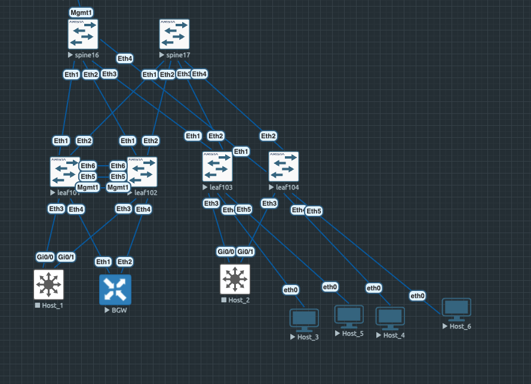

# EVPN route-type 5. Оптимизация таблиц маршрутизации. 

Цели : 

- Разместить двух "клиентов" в разных VRF в рамках одной фабрики
- Настроить маршрутизацию между клиентами через внешнее устройство
- Зафиксировать в документации - план работы, адресное пространство, схему сети, настройки сетевого оборудования

## Планирование :

#### Схема снова модернизируется под задачу :



* Выключаем хосты, подключенные по LACP 
* Добавляем BGW, через который будем маршрутизировать разные vrf
* Добавляем "клиентские" хосты, подключаем их в разные VRF

Таблица соответствия
|Device|VRF|Vlan|IP Address
|---|---|---|---
Leaf103|VRF1|3000|VirtIP 172.16.3.1
Leaf104|VRF1|2000|VirtIP 172.16.4.1
Host_3|VRF1|3000|172.16.3.103/24
Host_4|VRF1|2000|172.16.4.104/24
Leaf103|VRF2|3001|VirtIP 172.31.3.1
Leaf104|VRF2|2001|VirtIP 172.31.4.1
Host_5|VRF2|3001|172.31.3.205/24
Host_6|VRF2|2001|172.31.4.206/24

Исходя из таблицы понимаем, что Host_3 и Host_4 находятся в разных сетях и разных бродкастах, но в одном VRF1

Host_5 и Host_6 так же в разных бродкастах и разных сетях, но уже в другом VRF2

Разобьем лабораторную работу на 2 пункта : 
1. Настраиваем клиентов в разных VRF и проверяем доступность 
2. Добавляем маршрутизацию разных VRF через внешнее устройство 

### Выполнение 1:

<details>
<summary> Leaf103.conf </summary>

```
hostname leaf103
!
vlan 3000-3001
!
vrf instance VRF1
!
vrf instance VRF2
!
!
interface Ethernet1
   description leaf16
   no switchport
   ip address 10.16.103.2/30
   bfd interval 100 min-rx 100 multiplier 3
!
interface Ethernet2
   description leaf17
   no switchport
   ip address 10.17.103.2/30
   bfd interval 100 min-rx 100 multiplier 3
!
!
interface Ethernet4
   description Host_3
   switchport access vlan 3000
!
interface Ethernet5
   description Host_5
   switchport access vlan 3001
!
!
interface Loopback0
   ip address 10.31.103.1/32
!
!
interface Vlan3000
   vrf VRF1
   ip address 172.16.3.3/24
   ip virtual-router address 172.16.3.1
!
interface Vlan3001
   vrf VRF2
   ip address 172.31.3.3/24
   ip virtual-router address 172.31.3.1
!
interface Vxlan1
   vxlan source-interface Loopback0
   vxlan udp-port 4789
   vxlan vlan 3000 vni 10300
   vxlan vlan 3001 vni 10301
   vxlan vrf VRF1 vni 10001
   vxlan vrf VRF2 vni 10002
   vxlan learn-restrict any
!
ip virtual-router mac-address de:ad:be:ef:00:01
!
ip routing
ip routing vrf VRF1
ip routing vrf VRF2
!
!
route-map RED_L0 permit 10
   match interface Loopback0
   set origin incomplete
!
router bgp 65203
   router-id 10.31.103.1
   maximum-paths 2 ecmp 4
   neighbor OVERLAY peer group
   neighbor OVERLAY remote-as 65200
   neighbor OVERLAY update-source Loopback0
   neighbor OVERLAY bfd
   neighbor OVERLAY ebgp-multihop 2
   neighbor OVERLAY send-community extended
   neighbor SNIPE peer group
   neighbor SPINE peer group
   neighbor SPINE remote-as 65200
   neighbor SPINE bfd
   neighbor 10.16.103.1 peer group SPINE
   neighbor 10.17.103.1 peer group SPINE
   neighbor 10.31.16.1 peer group OVERLAY
   neighbor 10.31.17.1 peer group OVERLAY
   !
   address-family evpn
      neighbor OVERLAY activate
   !
   address-family ipv4
      neighbor SPINE activate
      redistribute connected route-map RED_L0
   !
   vrf VRF1
      rd 10.31.103.1:10001
      route-target import evpn 65000:10001
      route-target export evpn 65000:10001
      redistribute connected
   !
   vrf VRF2
      rd 10.31.103.1:10002
      route-target import evpn 65000:10002
      route-target export evpn 65000:10002
      redistribute connected
!
```

</details>

<details>
<summary> Leaf104.conf </summary>

```
hostname leaf104
!
vlan 2000-2001
!
!
vrf instance VRF1
!
vrf instance VRF2
!
!
interface Ethernet1
   description spine16
   no switchport
   ip address 10.16.104.2/30
   bfd interval 100 min-rx 100 multiplier 3
!
interface Ethernet2
   description spine17
   no switchport
   ip address 10.17.104.2/30
   bfd interval 100 min-rx 100 multiplier 3
!
interface Ethernet4
   description Host_4
   switchport access vlan 2000
!
interface Ethernet5
   description Host_6
   switchport access vlan 2001
!
!
interface Loopback0
   ip address 10.31.104.1/32
!
interface Management1
!
!
interface Vlan2000
   vrf VRF1
   ip address 172.16.4.4/24
   ip virtual-router address 172.16.4.1
!
interface Vlan2001
   vrf VRF2
   ip address 172.31.4.4/24
   ip virtual-router address 172.31.4.1
!
interface Vxlan1
   vxlan source-interface Loopback0
   vxlan udp-port 4789
   vxlan vrf VRF1 vni 10001
   vxlan vrf VRF2 vni 10002
   vxlan learn-restrict any
!
!
ip virtual-router mac-address de:ad:be:ef:00:01
!
ip routing
ip routing vrf VRF1
ip routing vrf VRF2
!
route-map RED_L0 permit 10
   match interface Loopback0
   set origin incomplete
!
peer-filter SPINE
   10 match as-range 65200 result accept
!
router bgp 65204
   router-id 10.31.104.1
   maximum-paths 4 ecmp 4
   neighbor OVERLAY peer group
   neighbor OVERLAY remote-as 65200
   neighbor OVERLAY update-source Loopback0
   neighbor OVERLAY bfd
   neighbor OVERLAY ebgp-multihop 2
   neighbor OVERLAY send-community extended
   neighbor SPINE peer group
   neighbor SPINE remote-as 65200
   neighbor SPINE bfd
   neighbor 10.16.104.1 peer group SPINE
   neighbor 10.17.104.1 peer group SPINE
   neighbor 10.31.16.1 peer group OVERLAY
   neighbor 10.31.17.1 peer group OVERLAY
   !
   address-family evpn
      neighbor OVERLAY activate
   !
   address-family ipv4
      neighbor SPINE activate
      redistribute connected route-map RED_L0
   !
   vrf VRF1
      rd 10.31.104.1:10001
      route-target import evpn 65000:10001
      route-target export evpn 65000:10001
      redistribute connected
   !
   vrf VRF2
      rd 10.31.104.1:10002
      route-target import evpn 65000:10002
      route-target export evpn 65000:10002
      redistribute connected
!
```

</details>

<details>
<summary> Host_3.conf </summary>

```
Host_3> show

NAME   IP/MASK              GATEWAY                             GATEWAY
Host_3 172.16.3.103/24      172.16.3.1
```

</details>

<details>
<summary> Host_4.conf </summary>

```
Host_4> show

NAME   IP/MASK              GATEWAY                             GATEWAY
Host_4 172.16.4.104/24      172.16.4.1
```

</details>

<details>
<summary> Host_5.conf </summary>

```
Host_5> show

NAME   IP/MASK              GATEWAY                             GATEWAY
Host_5 172.31.3.205/24      172.31.3.1
```

</details>

<details>
<summary> Host_6.conf </summary>

```
Host_6> show

NAME   IP/MASK              GATEWAY                             GATEWAY
Host_6 172.31.4.206/24      172.31.4.1
```

</details>

Смотрим в RIB в разных vrf и видим, что существуют только созданные внутри фермы сети и маршруты per vrf: 

<details>
<summary> VRF1 </summary>

```
leaf102#sh ip route vrf VRF1

VRF: VRF1
Source Codes:
       C - connected, S - static, K - kernel,
       O - OSPF, IA - OSPF inter area, E1 - OSPF external type 1,
       E2 - OSPF external type 2, N1 - OSPF NSSA external type 1,
       N2 - OSPF NSSA external type2, B - Other BGP Routes,
       B I - iBGP, B E - eBGP, R - RIP, I L1 - IS-IS level 1,
       I L2 - IS-IS level 2, O3 - OSPFv3, A B - BGP Aggregate,
       A O - OSPF Summary, NG - Nexthop Group Static Route,
       V - VXLAN Control Service, M - Martian,
       DH - DHCP client installed default route,
       DP - Dynamic Policy Route, L - VRF Leaked,
       G  - gRIBI, RC - Route Cache Route,
       CL - CBF Leaked Route

Gateway of last resort is not set

 C        10.255.255.4/30
           directly connected, Vlan4010
 B E      172.16.3.0/24 [200/0]
           via VTEP 10.31.103.1 VNI 10001 router-mac 50:00:00:15:f4:e8 local-interface Vxlan1
 B E      172.16.4.0/24 [200/0]
           via VTEP 10.31.104.1 VNI 10001 router-mac 50:00:00:f6:ad:37 local-interface Vxlan1

```

</details>

<details>
<summary> VRF2 </summary>

```
leaf102#sh ip route vrf VRF2

VRF: VRF2
Source Codes:
       C - connected, S - static, K - kernel,
       O - OSPF, IA - OSPF inter area, E1 - OSPF external type 1,
       E2 - OSPF external type 2, N1 - OSPF NSSA external type 1,
       N2 - OSPF NSSA external type2, B - Other BGP Routes,
       B I - iBGP, B E - eBGP, R - RIP, I L1 - IS-IS level 1,
       I L2 - IS-IS level 2, O3 - OSPFv3, A B - BGP Aggregate,
       A O - OSPF Summary, NG - Nexthop Group Static Route,
       V - VXLAN Control Service, M - Martian,
       DH - DHCP client installed default route,
       DP - Dynamic Policy Route, L - VRF Leaked,
       G  - gRIBI, RC - Route Cache Route,
       CL - CBF Leaked Route

Gateway of last resort is not set

 C        10.255.254.4/30
           directly connected, Vlan4011
 B E      172.31.3.0/24 [200/0]
           via VTEP 10.31.103.1 VNI 10002 router-mac 50:00:00:15:f4:e8 local-interface Vxlan1
 B E      172.31.4.0/24 [200/0]
           via VTEP 10.31.104.1 VNI 10002 router-mac 50:00:00:f6:ad:37 local-interface Vxlan1
```

</details>

Как видим префиксы прилетают с разными VNI в зависимости от VRF и с разными router-mac в зависимости от лифа, который заанонсил маршрут. 

Префиксы у нас идут только с 1 лифа, но по разным путям, что видно из вывода 

```
leaf102#sh bgp evpn route-type ip-prefix 172.31.3.0/24
BGP routing table information for VRF default
Router identifier 10.31.102.1, local AS number 65201
BGP routing table entry for ip-prefix 172.31.3.0/24, Route Distinguisher: 10.31.103.1:10002
 Paths: 2 available
  65200 65203
    10.31.103.1 from 10.31.16.1 (10.31.16.1)
      Origin IGP, metric -, localpref 100, weight 0, tag 0, valid, external, ECMP head, ECMP, best, ECMP contributor
      Extended Community: Route-Target-AS:65000:10002 TunnelEncap:tunnelTypeVxlan EvpnRouterMac:50:00:00:15:f4:e8
      VNI: 10002
  65200 65203
    10.31.103.1 from 10.31.17.1 (10.31.17.1)
      Origin IGP, metric -, localpref 100, weight 0, tag 0, valid, external, ECMP, ECMP contributor
      Extended Community: Route-Target-AS:65000:10002 TunnelEncap:tunnelTypeVxlan EvpnRouterMac:50:00:00:15:f4:e8
      VNI: 10002
```

Мы не растягивали сеть между лифами, тк в ином случае потребуется помимо type-5 добавлять L2VNI с type-2 маршрутами, для анонсов more-specific маршрутов /32 на каждый ip внутри нашей широкой /24, иначе схема работать не будет. А этим мы уже занимались  [Lab06. Построение Overlay eBGP, L3 VNI](../lab06). 

Брали разные префиксы в VRF, чтоб более наглядно показать, что у нас нет связности между VRF, но это так же справедливо для повторяющихся префиксов в разных vrf, они так же не будут работать, потому что VRF разделены по VNI, связывать разные VRF с одинаковыми префиксами в рамках лабораторных работ мне видится проблематичной затеей, да и она в таком контексте лишена смысла. 

#### Проверяем связность :

```
Host_3> show

NAME   IP/MASK              GATEWAY                             GATEWAY
Host_3 172.16.3.103/24      172.16.3.1
       fe80::250:79ff:fe66:680a/64

Host_3> ping 172.16.4.104

84 bytes from 172.16.4.104 icmp_seq=1 ttl=62 time=7.539 ms
84 bytes from 172.16.4.104 icmp_seq=2 ttl=62 time=8.121 ms

Host_3> ping 172.31.3.205

*172.16.3.3 icmp_seq=1 ttl=64 time=2.700 ms (ICMP type:3, code:0, Destination network unreachable)
*172.16.3.3 icmp_seq=2 ttl=64 time=2.242 ms (ICMP type:3, code:0, Destination network unreachable)

```

В рамках одного VRF связность есть, но хост в другом VRF недоступен, в VRF2 ситуация аналогична. Хосты Host_5 и Host_6 видят друг друга, но не видят Host_3 и Host_4

### Выполнение 2:

Настроим маршрутизацию между клиентами в разных VRF через внешнее устройство, в качестве внешнего устройства будем использовать eBGP соседа BGW, которого подключаем в vPC пару и настраиваем BGP с двух Leaf'ов. 

### Конфигурация устройств : 

<details>
<summary> Leaf101.conf </summary>

```

4010-4011
!
vlan 4001
   name VRF1_Exit
!
vlan 4002
   name VRF2_exit
!
vrf instance VRF1
!
vrf instance VRF2
!

interface Ethernet4
   description BGW_Eth1
   switchport trunk allowed vlan 4001-4002
   switchport mode trunk
   bfd interval 100 min-rx 100 multiplier 3
!
!
interface Vlan4001
   vrf VRF1
   ip address 10.255.255.2/30
!
interface Vlan4002
   vrf VRF2
   ip address 10.255.254.2/30
!
ip prefix-list EXPORT_TO_VRF1
   seq 10 permit 172.31.3.0/24
   seq 20 permit 172.31.4.0/24
!
ip prefix-list EXPORT_TO_VRF2
   seq 10 permit 172.16.3.0/24
   seq 20 permit 172.16.4.0/24
!
ip prefix-list IMPORT_FROM_VRF1
   seq 10 permit 172.16.3.0/24
   seq 20 permit 172.16.4.0/24
!
ip prefix-list IMPORT_FROM_VRF2
   seq 10 permit 172.31.3.0/24
   seq 20 permit 172.31.4.0/24
!
ip prefix-list default_in
   seq 10 permit 0.0.0.0/0
!
route-map RM_IN_VRF1 permit 10
   match ip address prefix-list IMPORT_FROM_VRF2
!
route-map RM_IN_VRF1 permit 20
   match ip address prefix-list default_in
!
route-map RM_IN_VRF2 permit 10
   match ip address prefix-list IMPORT_FROM_VRF1
!
route-map RM_IN_VRF2 permit 20
   match ip address prefix-list default_in
!
route-map RM_OUT_VRF1 permit 10
   match ip address prefix-list EXPORT_TO_VRF2
!
route-map RM_OUT_VRF2 permit 10
   match ip address prefix-list EXPORT_TO_VRF1
!
!
router bgp 65201
   router-id 10.31.101.1
   maximum-paths 4 ecmp 4
   neighbor EXIT peer group
   neighbor EXIT remote-as 64001
   neighbor EXIT bfd
   neighbor EXIT allowas-in 3
   neighbor 10.255.254.1 peer group EXIT
   neighbor 10.255.255.1 peer group EXIT
   !
   address-family ipv4
      neighbor EXIT activate
   !
   vrf VRF1
      rd 10.31.101.1:10001
      route-target import evpn 65000:10001
      route-target export evpn 65000:10001
      neighbor 10.255.255.1 peer group EXIT
      neighbor 10.255.255.1 route-map RM_IN_VRF1 in
      neighbor 10.255.255.1 route-map RM_OUT_VRF1 out
      redistribute connected
   !
      vrf VRF2
      rd 10.31.101.1:10002
      route-target import evpn 65000:10002
      route-target export evpn 65000:10002
      neighbor 10.255.254.1 peer group EXIT
      neighbor 10.255.254.1 route-map RM_IN_VRF2 in
      neighbor 10.255.254.1 route-map RM_OUT_VRF2 out
      redistribute connected
!
```

</details>

Хост 2 не привожу, там аналогичный конфиг, но с другими нейборами. 

<details>
<summary> BGW.conf </summary>

```
!
vlan 4001
   name eBGP_FARM_VRF1_Leaf101
!
vlan 4002
   name eBGP_FARM_VRF2_Leaf101
!
vlan 4010
   name eBGP_FARM_VRF1_Leaf102
!
vlan 4011
   name eBGP_FARM_VRF2_Leaf102
!
!
interface Ethernet1
   description Leaf101_Eth4
   switchport trunk allowed vlan 4001-4002
   switchport mode trunk
   bfd interval 100 min-rx 100 multiplier 3
!
interface Ethernet2
   description Leaf102_Eth4
   switchport trunk allowed vlan 4010-4011
   switchport mode trunk
   bfd interval 100 min-rx 100 multiplier 3
!
!
interface Vlan4001
   ip address 10.255.255.1/30
!
interface Vlan4002
   ip address 10.255.254.1/30
!
interface Vlan4010
   ip address 10.255.255.5/30
!
interface Vlan4011
   ip address 10.255.254.5/30
!
ip routing
!
!
router bgp 64001
   router-id 10.10.10.10
   maximum-paths 2
   neighbor POD_1 peer group
   neighbor POD_1 remote-as 65201
   neighbor POD_1 bfd
   neighbor POD_1 default-originate always
   neighbor 10.255.254.2 peer group POD_1
   neighbor 10.255.254.6 peer group POD_1
   neighbor 10.255.255.2 peer group POD_1
   neighbor 10.255.255.6 peer group POD_1
   !
   address-family ipv4
      neighbor POD_1 activate
!
```

</details>

#### Проверяем связность между vrf :

Со стороны Host_4 попробуем пропинговать всех клиентов 

```
Host_4> ping 172.16.3.103

84 bytes from 172.16.3.103 icmp_seq=1 ttl=62 time=13.067 ms
84 bytes from 172.16.3.103 icmp_seq=2 ttl=62 time=12.975 ms

```

```
Host_4> ping 172.31.3.205

84 bytes from 172.31.3.205 icmp_seq=1 ttl=59 time=28.559 ms
84 bytes from 172.31.3.205 icmp_seq=2 ttl=59 time=20.504 ms

```

```
Host_4> ping 172.31.4.206

84 bytes from 172.31.4.206 icmp_seq=1 ttl=59 time=19.822 ms
84 bytes from 172.31.4.206 icmp_seq=2 ttl=59 time=20.469 ms
84 bytes from 172.31.4.206 icmp_seq=3 ttl=59 time=19.913 ms
```
* Ликинг между vrf через внешнее устройство работает. 

Дополнительно прикладываю FIB со стороны BGW 

```
BGW#sh ip bgp
BGP routing table information for VRF default
Router identifier 10.10.10.10, local AS number 64001
Route status codes: s - suppressed contributor, * - valid, > - active, E - ECMP head, e - ECMP
                    S - Stale, c - Contributing to ECMP, b - backup, L - labeled-unicast
                    % - Pending best path selection
Origin codes: i - IGP, e - EGP, ? - incomplete
RPKI Origin Validation codes: V - valid, I - invalid, U - unknown
AS Path Attributes: Or-ID - Originator ID, C-LST - Cluster List, LL Nexthop - Link Local Nexthop

          Network                Next Hop              Metric  AIGP       LocPref Weight  Path
 * >Ec    172.16.3.0/24          10.255.255.6          0       -          100     0       65201 65200 65203 i
 *  ec    172.16.3.0/24          10.255.255.2          0       -          100     0       65201 65200 65203 i
 * >Ec    172.16.4.0/24          10.255.255.6          0       -          100     0       65201 65200 65204 i
 *  ec    172.16.4.0/24          10.255.255.2          0       -          100     0       65201 65200 65204 i
 * >Ec    172.31.3.0/24          10.255.254.6          0       -          100     0       65201 65200 65203 i
 *  ec    172.31.3.0/24          10.255.254.2          0       -          100     0       65201 65200 65203 i
 * >Ec    172.31.4.0/24          10.255.254.6          0       -          100     0       65201 65200 65204 i
 *  ec    172.31.4.0/24          10.255.254.2          0       -          100     0       65201 65200 65204 i
```


Пакеты прилетают по дефолту в BGW, а потом BGW отправляет в нужный vrf и все работает. 


Вопросы : 

Изначально пытался сделать ликинг только нужных префиксов, а не гонять через дефолт, но в таком случае у меня не принимались маршруты, поэтому куски RM остались немного кривоватыми. 

Со стороны BGW я вижу, что отправляю их 

```
BGW#sh ip bgp neighbors 10.255.255.2 advertised-routes
BGP routing table information for VRF default
Router identifier 10.10.10.10, local AS number 64001
Route status codes: s - suppressed contributor, * - valid, > - active, E - ECMP head, e - ECMP
                    S - Stale, c - Contributing to ECMP, b - backup, L - labeled-unicast, q - Queued for advertisement
                    % - Pending best path selection
Origin codes: i - IGP, e - EGP, ? - incomplete
RPKI Origin Validation codes: V - valid, I - invalid, U - unknown
AS Path Attributes: Or-ID - Originator ID, C-LST - Cluster List, LL Nexthop - Link Local Nexthop

          Network                Next Hop              Metric  AIGP       LocPref Weight  Path
 * >      0.0.0.0/0              10.255.255.1          -       -          -       -       64001 ?
 * >Ec    172.16.3.0/24          10.255.255.1          -       -          -       -       64001 65201 65200 65203 i
 * >Ec    172.16.4.0/24          10.255.255.1          -       -          -       -       64001 65201 65200 65204 i
 * >Ec    172.31.3.0/24          10.255.255.1          -       -          -       -       64001 65201 65200 65203 i
 * >Ec    172.31.4.0/24          10.255.255.1          -       -          -       -       64001 65201 65200 65204 i

```

А вот со стороны Leaf не вижу их даже в т.н. hidden 

```
leaf101#sh ip bgp neighbors 10.255.255.1 received-routes vrf VRF1
BGP routing table information for VRF VRF1
Router identifier 10.255.255.2, local AS number 65201
Route status codes: s - suppressed contributor, * - valid, > - active, E - ECMP head, e - ECMP
                    S - Stale, c - Contributing to ECMP, b - backup, L - labeled-unicast
                    % - Pending best path selection
Origin codes: i - IGP, e - EGP, ? - incomplete
RPKI Origin Validation codes: V - valid, I - invalid, U - unknown
AS Path Attributes: Or-ID - Originator ID, C-LST - Cluster List, LL Nexthop - Link Local Nexthop

          Network                Next Hop              Metric  AIGP       LocPref Weight  Path
          0.0.0.0/0              10.255.255.1          -       -          -       -       64001 ?

```

Я так понимаю из-за того, что я передаю номер as в as-path, то на входе я отбрасываю его на каком-то очень глубоком уровне, учитывая, что я его не вижу вовсе. 
Пытался обойти через allow-as in (что видно в куске конфига leaf101), но ничего не поменялось, видимо отброс своего as-path из ebgp очень сильно захаркожен или я накосячил в конфиге, так же, по идее, allow-as in надо на всех роутерах фабрики прописывать потом, но я не получал маршрут на входе, так что отказался от дальнейших экспериментов в этом направлении. 

Обошел через as-path-replace, но в итоге откатил и заликал через вброс дефолта, выбрав путь наименьшего сопротивления, тк в ином случае уже схема слишком громоздкая получилась, а мы стараемся следовать принципу KISS и не создавать лишних абстракций и усложнений, плюс уже самому стало тяжко понимать как пакеты летают.

Получается единственный способ обойти это ограничение - затереть as-path вовсе через as-path-replace ? 